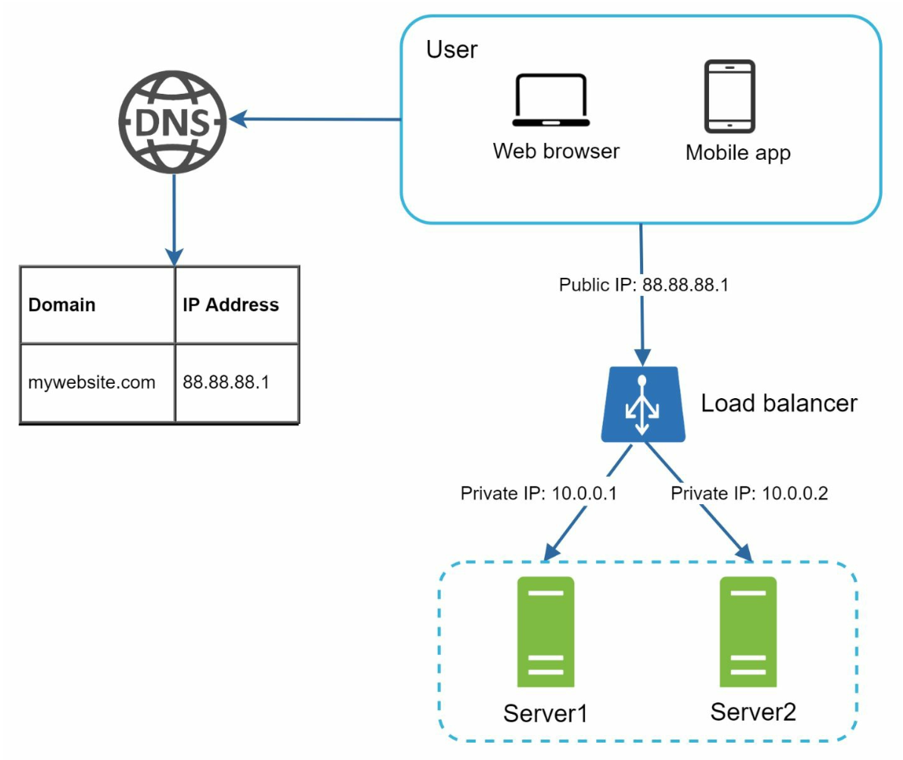
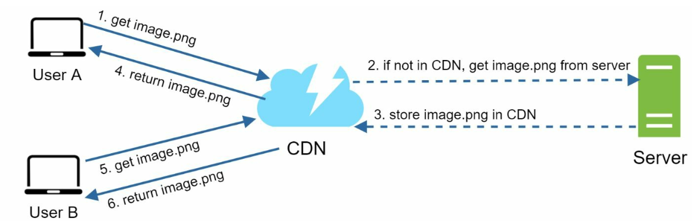
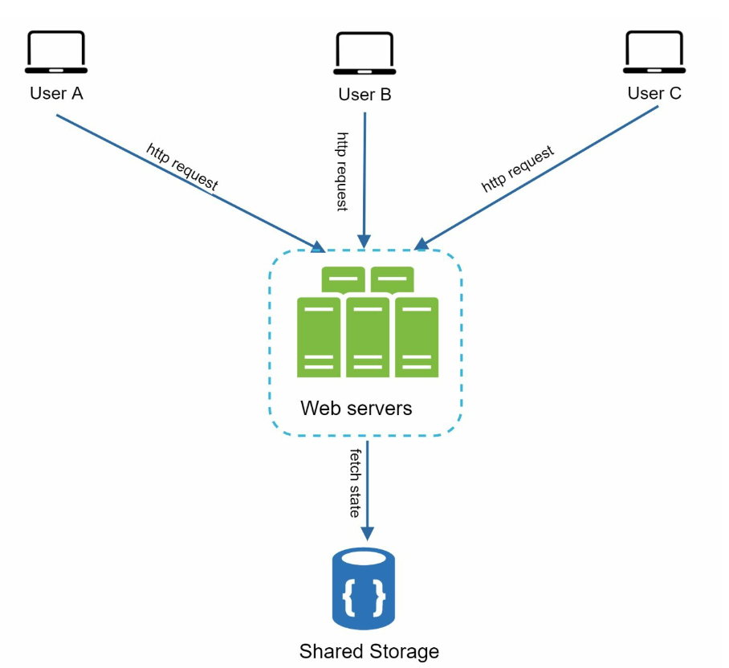
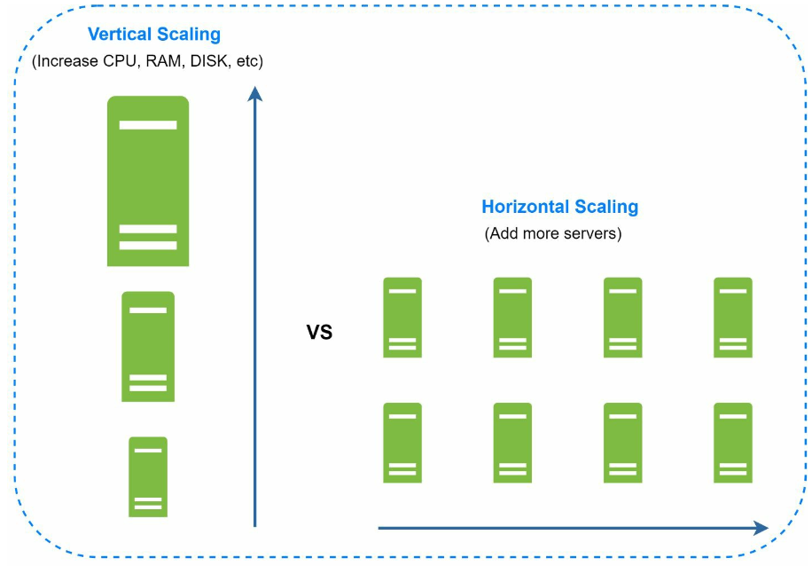

# 第 1 章：从零扩展到百万用户 (Scale from Zero to Millions of Users)

## 引言 (Introduction)
将系统扩展到支持数百万用户是一段复杂而反复迭代的旅程，需要不断打磨和优化。本章概述了如何从单机服务器起步，一步步扩展架构以承载数百万用户。

---

## 第 1 节：单机服务器架构 (Single Server Setup)
起初，所有组件（Web 应用、数据库、缓存）都运行在同一台服务器上。

   

### 请求流程 (Request Flow)
1. 用户通过域名（如 `api.mysite.com`）访问应用，DNS 将域名解析为 IP 地址。
2. Web 服务器的 IP 地址被返回给浏览器或移动 App。
3. HTTP 请求发送到 Web 服务器，服务器返回 HTML 或 JSON 响应。

### 流量来源 (Traffic Sources)
1. **Web 应用 (Web Applications)：** 使用服务端语言（如 Python、Java）编写业务逻辑，使用客户端语言（如 JavaScript、HTML）编写展示层。
2. **移动应用 (Mobile Applications)：** 使用 HTTP 和 JSON 与 Web 服务器通信，进行轻量级数据交换。

---

## 第 2 节：数据库分离 (Database Separation)
随着用户量增长，将数据库迁移到专用服务器，以便 Web 层和数据库层可以独立扩展。

   

### 数据库选型 (Database Choices)

1. **关系型数据库 (Relational Databases，SQL)：** 结构化数据存储在表中。例如：MySQL、PostgreSQL。
2. **非关系型数据库 (Non-Relational Databases，NoSQL)：** 适用于非结构化数据或低延迟需求。类型包括：
   - 键值存储 (Key-Value Stores)
   - 图数据库 (Graph Databases)
   - 列式存储 (Column Stores)
   - 文档存储 (Document Stores)

- 在以下情况下，非关系型数据库可能是更合适的选择：
   - 应用需要超低延迟。
   - 数据是非结构化的，或者没有关系型数据。
   - 只需要序列化和反序列化数据（JSON、XML、YAML 等）。
   - 需要存储海量数据。

---

## 第 3 节：垂直扩展 vs 水平扩展 (Vertical vs Horizontal Scaling)
### 垂直扩展 (Vertical Scaling)
- 给现有服务器增加更多资源（CPU、内存）。
- 受硬件限制，且缺乏冗余。

### 水平扩展 (Horizontal Scaling)
- 向集群中增加更多服务器，更适合大规模系统。
- 使用负载均衡器 (Load Balancer) 在各服务器之间分配请求。
---

## 第 4 节：负载均衡器 (Load Balancer)

   

**负载均衡器 (load balancer)** 将流量分发到多台服务器上。好处包括：
1. 冗余：如果一台服务器宕机，流量会被重新路由。
   -  如果服务器 1 宕机，所有流量将被路由到服务器 2。
2. 可扩展性：可以轻松添加服务器来应对流量高峰。
   -  如果网站流量快速增长，可以添加后续服务器来处理新增的流量。

---

## 第 5 节：数据库复制 (Database Replication)

   

### 主从模型 (Master-Slave Model)
- **主库 (Master Database)：** 处理写操作。
   - 所有修改数据的命令（如 insert、delete、update）都必须发送到主库。
- **从库 (Slave Databases)：** 处理读操作，提升性能和可靠性。
   - 大多数应用中读操作与写操作的比例更高；因此系统中从库的数量通常多于主库。

### 好处 (Benefits)
1. 通过并行读操作提升性能。
2. 通过冗余实现高可用性和数据可靠性。

### 故障处理 (Failure Handling)
- 如果只有一个从库可用且它宕机了，读操作将暂时被导向主库。
- 如果有多个从库可用，读操作会被重定向到其他健康的从库，并用新服务器替换旧服务器。
-  如果主库宕机，某个从库将被提升为新的主库。
- 在生产系统中，被选中的从库可能不是最新的，因此需要通过运行数据恢复脚本来更新数据（多主 (multi-masters) 和循环复制 (circular replication) 等方法可能有所帮助）。

---

## 第 6 节：缓存 (Caching)
**缓存 (cache)** 将频繁访问的数据存储在内存中，以降低数据库负载。缓存层是一个临时的数据存储层，速度远快于数据库。

   

### 缓存的考量 (Caching considerations)
1. **使用场景 (Use case)**：当数据被频繁读取但很少修改时，考虑使用缓存。
2. **过期策略 (Expiration Policies)：** 缓存数据过期后会被从缓存中删除。如果没有过期策略，缓存数据将永久存储在内存中。
3. **一致性 (Consistency)：** 这意味着保持数据存储和缓存之间的同步。不一致可能发生，是因为对数据存储和缓存的修改操作不在同一个事务中。
4. **故障缓解 (Mitigating failures)**：单个缓存服务器代表潜在的单点故障 (SPOF)，建议在不同的数据中心部署多个缓存服务器以避免单点故障。
5. **淘汰策略 (Eviction Policies)：** 当缓存满了，需要淘汰条目以释放内存。LRU 是最流行的缓存淘汰策略。

---

## 第 7 节：内容分发网络 (Content Delivery Network，CDN)
**CDN** 通过在地理上分散的服务器上缓存静态内容（图片、CSS、JavaScript）来加快加载速度。

   

### 工作流程 (Workflow)
1. 用户从最近的 CDN 服务器请求内容。
2. 如果该内容不可用，则从源站服务器获取并缓存。

### CDN 的考量 (CDN considerations)
1. **成本 (Cost)：** CDN 由第三方提供商运营，会对进出 CDN 的数据传输收费。
2. **缓存过期 (Cache Expiry)：** 缓存过期时间既不能太长，也不能太短。
3. **CDN 降级 (CDN fallback)：** 如果 CDN 出现临时故障，客户端应能检测到问题并转而从源站请求资源。
4. **文件失效 (Invalidating files)：** 如果文件被更新，应使缓存失效，指向更新后的文件。

---

## 第 8 节：无状态 Web 层 (Stateless Web Tier)
将会话数据移到共享数据存储后，Web 服务器就变成无状态的。这带来了：
1. 更容易水平扩展。
2. 可以根据流量自动扩缩容。

   

---

## 第 9 节：多数据中心架构 (Multi-Data Center Setup)
跨多个数据中心部署可提升可用性并降低延迟。策略包括：

   

1. **GeoDNS 路由 (GeoDNS Routing)：** 将用户引导到最近的数据中心。
2. **数据复制 (Data Replication)：** 在各数据中心之间同步数据，防止不一致。

### 关键考量 (Key considerations)
- **流量重定向 (Traffic redirection)：** 需要有效的工具将流量导向正确的数据中心。
- **数据同步 (Data synchronization)：** 常见策略是在多个数据中心之间复制数据。
- **测试与部署 (Test and deployment)：** 自动化部署工具对于在所有数据中心保持服务一致至关重要。

---

## 第 10 节：消息队列 (Message Queue)
**消息队列 (message queue)** 是一个持久化组件，存储在内存中，支持异步通信。它作为缓冲区，分发异步请求。

   

- 输入服务（称为生产者/发布者 (producers/publishers)）创建消息，并发布到消息队列。
- 其他服务（称为消费者/订阅者 (consumers/subscribers)）连接到队列，并执行消息定义的操作。

---

## 第 11 节：日志、指标与自动化 (Logging, Metrics, and Automation)

   

### 重要性 (Importance)
1. **日志 (Logging)：** 追踪错误和系统健康状况。
2. **指标 (Metrics)：** 提供性能和用户活动的洞察。
3. **自动化 (Automation)：** 简化测试、部署和扩展。

---

## 第 12 节：数据库扩展 (Database Scaling)
### 垂直扩展 (Vertical Scaling)
- 增加硬件资源，但存在物理限制和成本限制。
- 有多个缺点：
   -  单点故障的风险更大。
   -  垂直扩展的总体成本很高。

### 水平扩展 (Horizontal Scaling，分片 / Sharding)

   

- 使用键（如 `user_id`）将数据分散到多个分片上。
   - 分片 (Sharding) 将大型数据库拆分成更小、更易管理的部分，称为分片 (shards)。
   - 每个分片共享相同的 schema，但每个分片上的实际数据是该分片独有的。
-  实现分片策略时，分片键 (sharding key) 至关重要。选择分片键时，重要的是选择能均匀分布数据的键。

#### 挑战 (Challenges)
1. **数据重新分片 (Resharding data)：** 在以下情况下需要重新分片：
   - 单个分片因快速增长而无法再容纳更多数据。
   - 由于数据分布不均，某些分片可能比其他分片更快出现分片耗尽。
   - 一致性哈希 (Consistent Hashing) 用于解决这些问题。

2. **名人问题 (Celebrity problem)：** 对特定分片的过度访问可能导致服务器过载。
   - 为解决这个问题，我们可能需要为每个名人分配一个单独的分片。

3. **Join 与反范式化 (Join and de-normalization)：** 一旦数据库在多台服务器上分片，跨分片执行 Join 操作就变得困难。
   -  常见的变通方法是反范式化数据库，以便查询可以在单个表中完成。

---

## 结论 (Conclusion)
### 要点回顾 (Key Takeaways)
1. 保持 Web 层无状态。
2. 在每一层都构建冗余。
3. 使用缓存和 CDN 优化性能。
4. 使用分片扩展数据层。
5. 解耦组件以提高灵活性。

本章为构建可处理数百万用户的可扩展系统打下了坚实基础。
