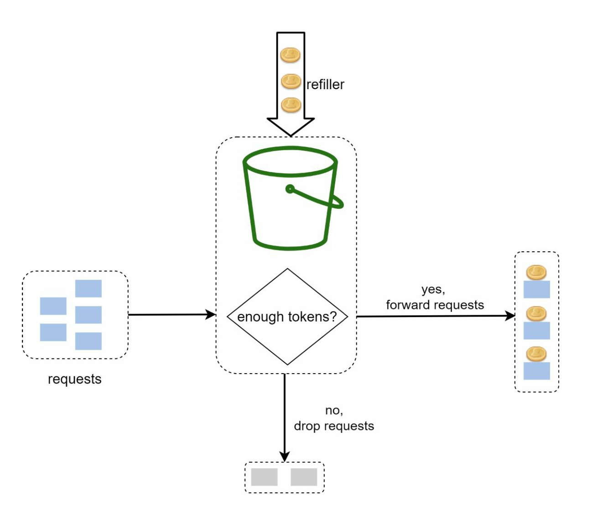
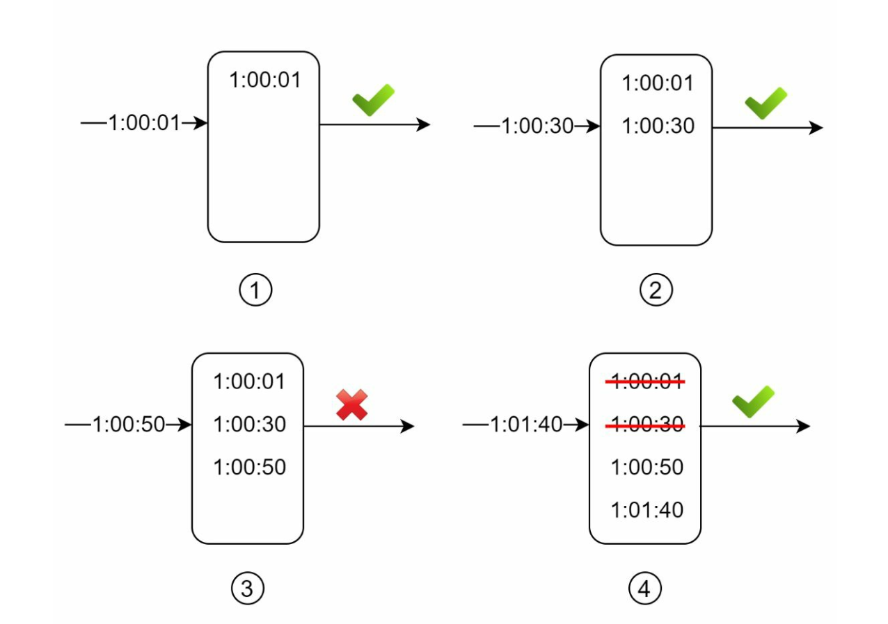

# 第 4 章：设计限流器 (Design a Rate Limiter)

## 引言 (Introduction)
本章探讨限流器 (rate limiter) 的设计与实现——一种用于控制客户端或服务发送的流量速率的系统组件。限流器对于防止滥用、降低成本以及保障服务器资源稳定至关重要。其应用场景包括限制发帖、账号注册和奖励领取等。

## 限流的好处 (Benefits of Rate Limiting)
- **防止 DoS 攻击 (Preventing DoS Attacks)：** 阻止过量调用，避免资源耗尽。
- **降低成本 (Cost Reduction)：** 限制不必要的请求，减少服务器开销。
- **防止过载 (Preventing Overloads)：** 过滤掉过多的请求，稳定服务器性能。

## 第 1 步：理解问题 (Understanding the Problem)
### 关键功能 (Key Features)
- 服务端 API 限流器。
- 支持多条限流规则。
- 在分布式环境中处理大规模系统。
- 可以是独立服务，也可以是应用层代码。
- 被限流时通知用户。

### 需求 (Requirements)
- 准确的请求限流。
- 最小延迟。
- 低内存占用。
- 分布式能力。
- 清晰的异常处理。
- 高容错。

## 第 2 步：高层设计 (High-Level Design)
### 放置位置选项 (Placement Options)

    

1. **客户端实现 (Client-Side Implementation)：** 因可能被滥用而不可靠。
2. **服务端实现 (Server-Side Implementation)：** 可控性和可靠性更好，为首选。
3. **中间件（API 网关）(Middleware (API Gateway))：** 集期限流的灵活选项。

### 放置位置指南 (Guidelines for Placement)
- 评估当前技术栈，选择高效的选项。
- 根据业务需求选择合适的算法。
- 如果使用微服务，使用 API 网关。
- 如果资源有限，选择商业解决方案。

## 第 3 步：限流算法 (Rate Limiting Algorithms)
### 1. 令牌桶 (Token Bucket)

  

- **描述 (Description)：** 以固定速率向桶中添加令牌；每个请求消耗一个令牌。
- **参数 (Parameters)：** 桶大小和补充速率。
- **优点 (Pros)：** 易于实现、内存高效、支持突发流量。
- **缺点 (Cons)：** 需要仔细调参。

### 2. 漏桶 (Leaking Bucket)

  

- **描述 (Description)：** 使用 FIFO 队列以固定速率处理请求。
- **优点 (Pros)：** 内存高效、流出速率稳定。
- **缺点 (Cons)：** 突发流量可能延迟后到的请求。
  

  示例：https://github.com/uber-go/ratelimit

### 3. 固定窗口计数器 (Fixed Window Counter)

  

- **描述 (Description)：** 将时间划分为固定区间，用计数器限制请求。
- **优点 (Pros)：** 简单，在特定用例下高效。
- **缺点 (Cons)：** 窗口边缘的流量高峰可能超出限额。

- 在时间窗口边缘的突发流量可能导致通过的请求超过允许的配额。

  

### 4. 滑动窗口日志 (Sliding Window Log)

  

- **描述 (Description)：** 记录时间戳，实现滚动时间窗口。
- **优点 (Pros)：** 限流精确。
- **缺点 (Cons)：** 内存消耗高。
  

### 5. 滑动窗口计数器 (Sliding Window Counter)

  

- **描述 (Description)：** 结合固定窗口和滑动日志的方法，平滑流量高峰。
- **优点 (Pros)：** 内存高效，能处理突发流量。
- **缺点 (Cons)：** 是近似值，可能不是严格精确。
  

## 高层架构 (High-Level Architecture)

  

- **数据存储 (Data Storage)：** 使用内存缓存（如 Redis）进行快速计数器操作。
- **步骤 (Steps)：**
  1. 客户端向中间件发送请求。
  2. 中间件检查 Redis 中的计数器。
  3. 根据限额决定处理或拒绝请求。

## 高级考量 (Advanced Considerations)
### 分布式环境 (Distributed Environments)
- **挑战 (Challenges)：** 竞态条件、同步问题。
- **解决方案 (Solutions)：** 使用锁、Redis 中的 Lua 脚本或有序集合 (sorted sets)。使用中心化数据存储做同步。

### 性能优化 (Performance Optimizations)
- 多数据中心部署以降低延迟。
- 使用最终一致性模型进行同步。

### 监控 (Monitoring)
- 定期做数据分析，确保算法有效并调整规则。
