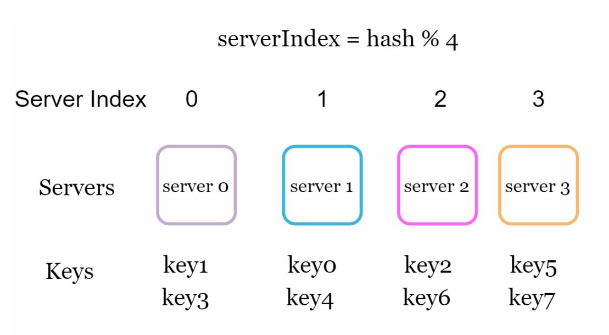

# 第 5 章：设计一致性哈希 (Design Consistent Hashing)

## 引言 (Introduction)
本章探讨一致性哈希 (consistent hashing)，这是一种实现水平扩展的关键技术，通过将请求和数据高效地分散到各服务器。它在服务器增减时最小化数据重新分配，并保证数据均匀分布，以缓解服务器热点等问题。

## 重新哈希问题 (The Rehashing Problem)
### 说明 (Explanation)
在传统哈希方法（如 `serverIndex = hash(key) % N`）中，当服务器数量变化时，数据重新分配会成为问题。例如：
- 删除一台服务器会导致大多数键被重新分配，引发缓存未命中。
- 添加一台服务器会导致不必要的键重新分配。

  

- 当服务器池大小固定时，这种方法是有效的。然而，添加新服务器或移除现有服务器时会产生问题。

  

### 关键问题 (Key Issue)
服务器数量变化时大多数键被重新分配，造成低效和过载。

## 一致性哈希 (Consistent Hashing)
### 定义 (Definition)
一致性哈希 (Consistent hashing) 保证在服务器增减时，只有少部分键被重新映射。这最小化了中断并增强了可扩展性。

### 关键概念 (Key Concepts)
1. **哈希空间与哈希环 (Hash Space and Ring)：** 哈希空间形成一个连续的环，哈希值分布在 `0` 到 `2^160-1` 之间（例如使用 SHA-1 这样的哈希函数）。把两端连接起来就得到一个环。
    

    
    

- 使用相同的哈希函数 f，根据服务器 IP 或名称将服务器映射到环上。

    

    
    

1. **服务器查找 (Server Lookup)**
- 键的归属服务器通过在环上顺时针遍历，直到找到一台服务器来确定。

  

  
  

2. **添加和移除服务器 (Adding and Removing Servers)**
- 添加服务器只会重新分配附近的键。只有少部分键被重新分配到新服务器。

  

  
  

- 移除服务器只影响其范围内的键。只有被移除服务器上的键会被重新分配给顺时针方向的下一台服务器。

  

  
  

## 挑战与解决方案 (Challenges and Solutions)
### 基本方法的两个问题 (Two Issues in Basic Approach)
1. **分区大小不均 (Uneven Partition Sizes)：** 各服务器的数据分区可能大小不一。
2. **键分布不均 (Non-uniform Key Distribution)：** 某些服务器可能分到显著多于其他服务器的键。

### 解决方案：虚拟节点 (Solution: Virtual Nodes)
- 每台服务器在环上用多个均匀分布的虚拟节点 (virtual nodes) 来表示。
- 虚拟节点改善键的分布并均衡负载。随着虚拟节点数量增加，键的分布会变得更均衡。这是因为虚拟节点越多，标准差越小，从而带来均衡的数据分布。

  

  
  

## 受影响的键 (Affected Keys)
当服务器被添加或移除时：
- **添加服务器 (Added Server)：** 受影响的键是新服务器与其前驱之间的键。
  在下面的示例中，服务器 4 被添加到环上。受影响的范围从 s4（新添加的节点）开始，沿环逆时针移动直到找到一台服务器（s3）。因此，位于 s3 和 s4 之间的键需要被重新分配到 s4。

  

  
  

- **移除服务器 (Removed Server)：** 受影响的键是被移除服务器与其前驱之间的键。在下面的示例中，当一台服务器（s1）被移除时，受影响的范围从 s1（被移除的节点）开始，沿环逆时针移动直到找到一台服务器（s0）。因此，位于 s0 和 s1 之间的键必须被重新分配到 s2。

  

  
  

## 一致性哈希的好处 (Benefits of Consistent Hashing)
- **最小化重新分配 (Minimized Redistribution)：** 只有少部分键被重新分配。
- **可扩展性 (Scalability)：** 支持水平扩展。
- **缓解热点 (Mitigates Hotspots)：** 均衡数据分布，避免服务器过载。

## 实际应用 (Real-World Applications)
- Amazon Dynamo DB
- Apache Cassandra
- Discord
- Akamai CDN
- Maglev Load Balancer
