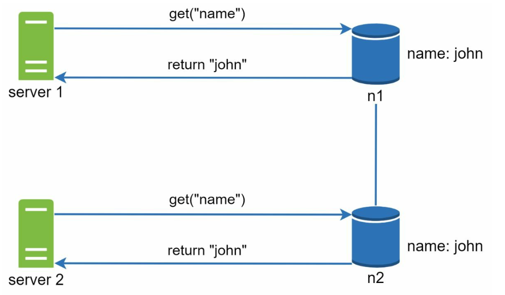

# 第 6 章：设计键值存储 (Design a Key-Value Store)

## 引言 (Introduction)
**键值存储 (key-value store)** 是一种非关系型数据库，数据以键值对的形式存储。每个键是唯一的，值通过这些键来访问。本章详细介绍如何设计一个可扩展、高可用的分布式键值存储，支持如下操作：
- `put(key, value)` 用于插入数据。
- `get(key)` 用于读取数据。

### 设计特点 (Characteristics of the Design)
- 小型键值对（<10 KB）。
- 支持大数据量，具有高可用性和可扩展性。
- 自动扩展和可调一致性。
- 低延迟。

---

## 单机键值存储 (Single Server Key-Value Store)
### 实现 (Implementation)
- 使用**哈希表 (hash table)** 在内存中存储键值对。
- 优化手段：
  - 数据压缩。
  - 将不常访问的数据存到磁盘。

### 局限 (Limitation)
单台服务器的内存有限，需要采用**分布式方案**来实现可扩展性。

---

## 分布式键值存储 (Distributed Key-Value Store)
**分布式键值存储 (distributed key-value store)** 将数据分区存放在多台服务器上，必须处理 **CAP 定理** 所概述的权衡。

### CAP 定理 (CAP Theorem)
1. **一致性 (Consistency)：** 所有客户端同时看到相同的数据。
2. **可用性 (Availability)：** 即使某些节点宕机，系统也响应每个请求。
3. **分区容忍性 (Partition Tolerance)：** 尽管发生网络分区，系统仍继续运行。

**权衡 (Trade-off)：** 根据 CAP 定理，只能同时实现其中两个保证。

  

#### 系统类型 (System Types):
- **CP 系统 (CP Systems)：** 保证一致性和分区容忍性，牺牲可用性（例如银行系统）。
- **AP 系统 (AP Systems)：** 保证可用性和分区容忍性，牺牲一致性（例如最终一致性）。
- **CA 系统 (CA Systems)：** 保证一致性和可用性，牺牲分区容忍性。

    **由于网络故障不可避免，分布式系统必须容忍网络分区。因此，CA 系统在现实应用中不可能存在。**

    在分布式系统中，分区是不可避免的。当分区发生时，我们必须在一致性和可用性之间做选择。例如，如果节点 n3 宕机，
    写入节点 n1 或 n2 的任何数据都无法传播到 n3。反过来，如果数据写入了 n3 但还没有传播到 n1 和 n2，节点 n1 和 n2 上的数据就是陈旧的。

    

    
    

    
- 如果选择 CP 系统，必须阻塞对 n1 和 n2 的所有写操作，以避免数据不一致。
- 如果选择 AP 系统，系统继续接受读请求，即使可能返回陈旧数据。
对于写操作，n1 和 n2 继续接受写入，
网络分区解决后数据会被同步到 n3。

---

## 系统组件 (System Components)
### 1. 数据分区 (Data Partitioning)
- **技术 (Technique)：** 使用一致性哈希 (Consistent Hashing) 将数据均匀分布到多台服务器。
- **优点 (Advantages)：**
  - 服务器增减时自动扩展。
  - 通过虚拟节点支持异构 (Heterogeneity)。服务器的虚拟节点数量与服务器容量成正比。

### 2. 数据复制 (Data Replication)
- 在 `N` 台服务器上复制数据以实现高可用。
- 这 N 台服务器通过从该服务器位置开始沿环顺时针行走，选取环上的前 N 台服务器来存放数据副本。将副本放在不同的数据中心以提高可靠性（以防虚拟节点）。

    

    
    

### 3. 一致性 (Consistency)
由于数据在多个节点上复制，必须在副本之间同步。
- **法定人数共识 (Quorum Consensus)：**
  - `N`：副本总数。
  - `W`：写法定人数 (Write quorum size)。一次写操作被认为成功的条件是：得到 W 个副本的确认。
  - `R`：读法定人数 (Read quorum size)。一次读操作被认为成功的条件是：至少等待 R 个副本的响应。
  - **规则 (Rule)：** `W + R > N` 保证强一致性。
  - W、R 和 N 的配置是延迟与一致性之间的典型权衡。

    

    
    

    
    - 如果 R = 1 且 W = N，系统针对快速读做了优化。
    - 如果 W = 1 且 R = N，系统针对快速写做了优化。
    - 如果 W + R > N，保证强一致性（通常 N = 3，W = R = 2）。
    - 如果 W + R <= N，不能保证强一致性。

- **模型 (Models)**：
  - **强一致性 (Strong Consistency)：** 读操作返回的值对应最近一次写入数据项的结果。
  - **弱一致性 (Weak Consistency)：** 后续的读操作可能看不到最新的值。
  - **最终一致性 (Eventual Consistency)：** 给定足够的时间，所有更新都会传播，所有副本都是一致的。

### 4. 不一致解决 (Inconsistency Resolution)
复制带来高可用，但会导致副本之间不一致。使用版本 (versioning) 和向量锁来解决不一致问题。
- **版本控制 (Versioning):**
    - 使用**向量时钟 (vector clocks)** 跟踪数据版本并解决冲突。
    - 版本控制意味着把每次数据修改都视为数据的一个新的不可变版本。
        

        
        
        

    
    - 服务器 1 修改了名称，服务器 2 也修改了名称。这两个修改是同时进行的。现在，我们有了冲突的值，称为版本 v1 和 v2。

- **向量时钟 (Vector Clock)**
    1. **设置 (Setup)**：向量时钟是一个与数据项关联的 [server, version] 对。它可用于检查一个版本是否先于、后于另一个版本，或与之冲突。
        - 假设向量时钟表示为 D([S1, v1], [S2, v2], …, [Sn, vn])，如果数据项 D 被写入服务器
        Si，系统必须执行以下任务之一。
        - 其中：`D` 是数据项。`Si` 是服务器标识。`vi` 是服务器 `Si` 上数据的版本计数器。

    2. **更新向量时钟 (Updating the Vector Clock)：** 当数据项在某服务器上被修改时：
        - 如果该服务器已存在于向量时钟中，其版本计数器递增。
        - 否则，向向量时钟添加一个新条目。

    3. **冲突检测 (Conflict Detection)：**
        - **无冲突 (No Conflict)：** 如果 X 中的所有计数器都小于等于 Y 中的对应计数器，则版本 X 是版本 Y 的祖先。
        - **存在冲突 (Conflict Exists)：** 如果 Y 中至少有一个计数器小于 X 中的对应计数器，则两个版本是兄弟版本。

    4. **冲突解决 (Conflict Resolution)：** 当检测到冲突（兄弟版本）时，系统依赖特定于应用的逻辑或客户端介入来调和数据。

        

        
        

- **挑战 (Challenges)：**
  - 增加了客户端的复杂性。
  - 经过多次更新后向量时钟可能变大，需要裁剪策略来限制其大小。

### 5. 处理故障 (Handling Failures)

#### a. 故障检测 (Failure Detection)
仅凭另一台服务器说某服务器宕机，就相信它是不足够的。通常需要至少两个独立的信息源来标记一台服务器宕机。
- **Gossip 协议 (Gossip Protocol)：**
    

        
    

    - 每个节点维护成员 ID 和心跳计数器。
    - 每个节点定期递增自己的心跳计数器。
    - 每个节点定期向一组随机节点发送心跳。
    - 如果心跳在超过预定义的时间段内没有增长，则该成员被认为已离线。

#### b. 临时故障 (Temporary Failures)
- **宽松法定人数 (Sloppy Quorum)：** 临时使用健康节点维持运行。
        

        
        

    - 检测到故障后，系统需要部署某些机制来保证可用性。
    - 系统不强制要求满足法定人数，而是在哈希环上选择前 W 个健康服务器做写、前 R 个
    健康服务器做读。
    - 离线服务器被忽略。如果某服务器不可用，另一台服务器会临时处理请求。

- **暗示移交 (Hinted Handoff)：** 离线服务器恢复后补上缺失的变更。
    - 当宕机的服务器恢复后，变更会被推回以实现数据一致性。

#### c. 永久故障 (Permanent Failures)
- 使用 **Merkle 树 (Merkle Trees)** 在副本之间高效同步。
    **Merkle 树 (Merkle Tree)**（或哈希树，hash tree）是一种数据结构，用于在永久故障期间高效检测和解决副本之间的不一致。

- 工作原理 (Working)
    1. **结构 (Structure)：**
        - **叶子节点 (Leaf Nodes)** 存储单个数据块的哈希。
        - **非叶子节点 (Non-Leaf Nodes)** 存储其子节点的哈希。
        - **根哈希 (root hash)** 代表树中所有数据的组合状态。

    2. **构建 Merkle 树 (Building a Merkle Tree)：**
        - **步骤 1 (Step 1)：** 将键空间划分为桶 (buckets)。
            
            

        - **步骤 2 (Step 2)：** 使用均匀哈希对桶中的每个键做哈希。

            

        - **步骤 3 (Step 3)：** 为每个桶创建一个哈希。
        
            

        - **步骤 4 (Step 4)：** 合并各桶的哈希以计算更高层的哈希，最终得到根哈希。

            

    3. **同步 (Synchronization)：**
        - 同步两个副本：
            - 比较它们的根哈希。
            - 如果根哈希相同，则副本一致。
            - 如果根哈希不同，递归比较子节点哈希以定位不一致的桶。
        - 只同步不一致的数据。

- 优点 (Advantages)
    - **高效 (Efficiency)：** 只同步不一致的数据，减少数据传输。
    - **可扩展 (Scalability)：** 对大数据集有效，同步开销小。
    - **可靠 (Reliability)：** 保证副本间数据一致。

### 6. 处理数据中心宕机 (Handling Data Center Outages)
- 在多个数据中心复制数据，确保宕机期间可用。

---

## 写路径与读路径 (Write and Read Paths)
### 1. 写路径（基于 Cassandra 架构）(Write Path (Based on Cassandra architecture))

    

- 将写入持久化到**提交日志 (commit log)**。
- 把数据保存到**内存缓存 (memory cache)**。
- 当缓存满时，把数据刷盘到磁盘上的 **SSTable**（排序字符串表，Sorted String Table）。

   

### 2. 读路径 (Read Path)

    
    

- 检查**内存缓存 (memory cache)** 中是否有数据。
- 如果没有，使用**布隆过滤器 (Bloom Filter)** 在 SSTable 中定位数据。
- 取回并返回数据。

---

## 最终架构 (Final Architecture)

-  客户端通过简单 API 与键值存储通信：get(key) 和 put(key, value)。
- 协调者 (coordinator) 是充当客户端与键值存储之间代理的节点。
- 节点使用一致性哈希分布在环上。
- 系统完全去中心化，因此节点的添加和移动可以自动化。
- 数据在多个节点上复制。
- 不存在单点故障，因为每个节点承担相同的职责。
