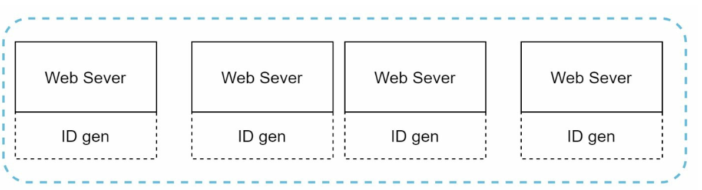
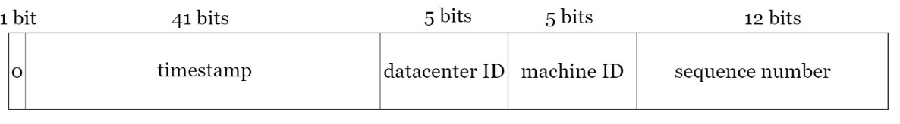
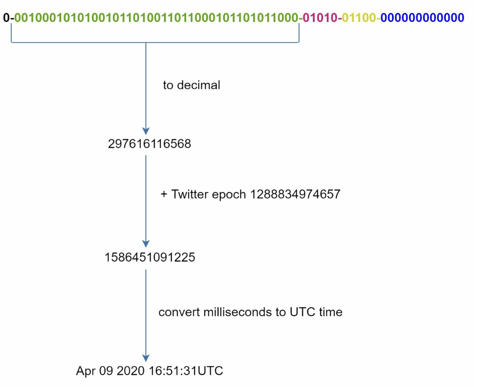

# 第 7 章：在分布式系统中设计唯一 ID 生成器 (Design a Unique ID Generator in Distributed Systems)

## 简介
本章探讨在分布式系统中设计**唯一 ID 生成器 (unique ID generator)** 的挑战。传统的自增主键在分布式环境中由于扩展性和同步难题而不适用。重点是创建满足以下要求的唯一、可排序的 64 位数值 ID：
- ID 必须**唯一**且按**日期有序**。
- ID 必须容纳于 **64 位**。
- 系统每秒应生成 **超过 10,000 个 ID**。

---

## 步骤 1：理解问题
### 基本需求
- ID 必须唯一且为数值型，并容纳于 64 位。
- ID 随时间递增，但不严格按 `+1` 递增。
- ID 应能按日期排序。
- 系统必须支持高吞吐（10,000 ID/秒）。

---

## 步骤 2：高层次设计方案
### 1. 多主复制 (Multi-Master Replication)
- **方案：** 使用数据库 `auto_increment`，按步长递增（例如 k 台服务器时步长为 `+k`）。

    

    
    

- **缺点：**
  - 难以跨数据中心扩展。
  - ID 不总是随时间递增。
  - 增加或移除服务器时存在扩展问题。

### 2. UUID（通用唯一标识符）
- **方案：**
    - 在每台服务器上使用 UUID 独立生成 128 位唯一标识符。
    - 各服务器可独立生成 UUID，无需相互协调

        

        
        

- **优点：**
  - 服务器之间无需协调。
  - 易于随 Web 服务器扩展。
- **缺点：**
  - 超出 64 位要求。
  - ID 不能按时间排序，且可能为非数值型。

### 3. 票据服务器 (Ticket Server)
- **方案：** 使用集中式数据库服务器递增并分配 ID。

    

    
    

- **优点：**
  - 小规模系统实现简单。
  - 生成数值型 ID。
- **缺点：**
  - 单点故障。
  - 多服务器部署存在同步挑战。

### 4. Twitter Snowflake 方案
- **方案：**

    

      
    

    

      
    

    - 将 ID 划分为多个段，以保证唯一性和可扩展性。
    - **符号位 (1 位)：** 恒为 `0`，可用于区分有符号数和无符号数。
    - **时间戳 (41 位)：** 自自定义纪元以来的毫秒数（Twitter 默认值为 `1288834974657`，即 2010 年 11 月 4 日 01:42:54 UTC）。保证 ID 按时间有序。
    - **数据中心 ID (5 位)：** 标识最多 `2^5 = 32` 个数据中心。
    - **机器 ID (5 位)：** 标识每个数据中心内最多 `2^5 = 32` 台机器。
    - **序列号 (12 位)：** 记录同一毫秒内一台机器生成的 ID，同一毫秒支持最多 `2^12 = 4096` 个 ID。序列号每毫秒重置为 `0`。

- **优点：**
    - **可扩展性：** 在多台服务器间每秒处理 10,000+ 个 ID。
    - **时间有序：** 保证 ID 可按时间排序。
    - **去中心化：** 无单点故障。

## 步骤 4：其他考量
### 1. 时钟同步
- **挑战：** ID 生成假设各服务器时钟同步。
- **解决方案：** 使用**网络时间协议 (NTP)** 最小化时钟漂移。

### 2. 段长度调优
- 根据使用场景调整各段大小（例如减少序列号位数、增加时间戳位数）。

### 3. 高可用
- ID 生成器是关键任务组件，必须具备容错能力。
- 考虑冗余和故障转移机制。
