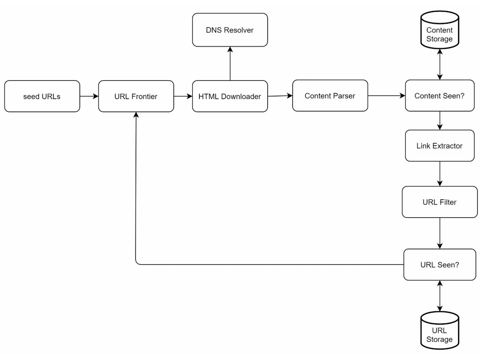
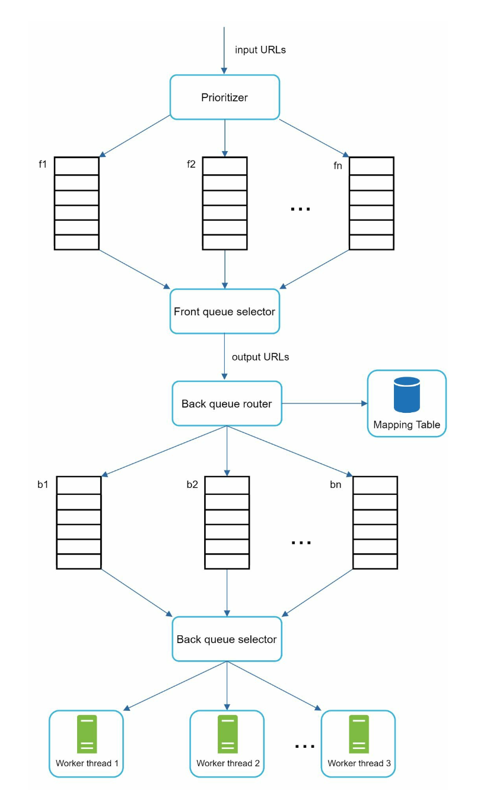

# 第 9 章：设计网络爬虫 (Design a Web Crawler)

## 简介
**网络爬虫 (web crawler)**，又称蜘蛛 (spider) 或机器人 (robot)，用于发现和收集网页、图片、视频等网络内容。本章聚焦于为**搜索引擎索引**设计可扩展的网络爬虫。

### 网络爬虫的应用
1. **搜索引擎索引：** 收集网页以创建可搜索的索引（例如 Googlebot）。
2. **网页归档：** 保存网页数据以备未来使用（例如美国国会图书馆）。
3. **网页挖掘：** 从网页数据中提取知识（例如股东报告的财务分析）。
4. **网页监控：** 检测版权或商标侵权。

### 设计挑战
一个好的网络爬虫必须应对：
- **可扩展性：** 利用并行化处理数十亿页面。
- **健壮性：** 处理糟糕的 HTML、崩溃和恶意链接。
- **礼貌性：** 避免用过多请求压垮服务器。
- **可扩展性（功能）：** 以最小改动支持新的内容类型。

---

## 步骤 1：理解问题

### 需求
1. 每月爬取 **10 亿个网页**（400 页/秒，峰值 800 QPS）。
2. 只收集 **HTML 内容**。
3. 跟踪新增和更新的页面。
4. 忽略重复内容。
5. 爬取数据存储 **5 年**，约需要 30 PB 存储空间。

---

## 步骤 2：高层设计

### 组件

1. **种子 URL (Seed URLs)：** 爬虫的起点。
    - 起点选择要有策略，好的起点能让爬虫遍历尽可能多的链接。
    - 可按不同热门网站的地域划分，或按主题划分。
    - 策略：按地域或主题分类（例如体育、医疗）。

2. **URL 边界 (URL Frontier)：** 存储待下载的 URL。
   - 实现为 **FIFO 队列**。

3. **HTML 下载器 (HTML Downloader)：** 从 URL 边界提供的 URL 下载网页。

4. **DNS 解析器 (DNS Resolver)：** 将 URL 转换为 IP 地址。

5. **内容解析器 (Content Parser)：** 校验并解析网页。
   - 丢弃格式错误的页面。

6. **内容是否已见 (Content Seen?)：** 用哈希比对检查重复内容（比较两个网页的哈希值）。

7. **内容存储 (Content Storage)：** 将 HTML 页面存到磁盘（热门内容存内存以降低延迟）。

8. **URL 提取器 (URL Extractor)：** 从解析后的页面中提取新链接。

9. **URL 过滤器 (URL Filter)：** 排除黑名单或错误 URL。

10. **URL 是否已见 (URL Seen?)：** 记录已访问的 URL 以避免重复。

11. **URL 存储 (URL Storage)：** 存储已访问过的 URL。

---

### 工作流程
1. 将**种子 URL** 加入 URL 边界。
2. **HTML 下载器**抓取 URL，并经 DNS 解析器解析其 IP。
3. **内容解析器**校验内容，并传给“内容是否已见”组件。
4. 若内容为新内容，经 **URL 提取器**提取链接。
5. 过滤并将唯一链接加入 URL 边界。

---

## 步骤 3：关键组件深挖
### DFS/BFS
-  可将 Web 看作有向图：网页是节点，超链接（URL）是边。
-  图的深度可能很深，DFS 并不理想，因此通常使用 BFS 做图遍历。
-  标准 BFS 不考虑 URL 的优先级，并非每个页面的质量和重要性都相同。

### URL 边界
- **礼貌性：**
    - 保证同一时刻对同一主机只有一个请求。两次下载任务之间加延迟。
    - 使用从主机名到队列和工作（下载）线程的映射。
    - 每个下载线程拥有独立的 FIFO 队列，只从该队列下载 URL。

        

    - **队列路由器 (Queue router)：** 保证每个队列（b1、b2、… bn）只包含来自同一主机的 URL。
    - **映射表 (Mapping table)：** 将每个主机映射到一个队列。
    - **队列选择器 (Queue selector)：** 每个工作线程映射到一个 FIFO 队列，只从该队列下载 URL。队列选择逻辑由队列选择器完成。
    - **工作线程 1 到 N：** 工作线程从同一主机顺序下载网页。两次下载任务之间可以加延迟。

- **优先级：**
    - 为重要页面赋予更高优先级（例如按 PageRank 或更新频率）。

        

    - **优先级器 (Prioritizer)：** 接收 URL 作为输入并计算优先级。
    - **队列 f1 到 fn：** 每个队列有指定的优先级。高优先级队列被选中的概率更高。
    - **队列选择器 (Queue selector)：** 随机选择队列，偏向高优先级队列。
    - **前置队列 (Front queues)：** 管理优先级
    - **后置队列 (Back queues)：** 管理礼貌性

- **新鲜度：** 根据更新历史或重要性重新爬取。

### HTML 下载器
- **遵守 robots.txt：** 尊重 robots.txt 文件中的规则。
- **性能优化：**
  1. 用多台服务器做分布式爬取。
  2. 使用 **DNS 缓存**避免重复解析。
  3. 按地域分布爬取服务器以加快下载。
  4. 使用较短的超时时间，避开慢速或无响应的服务器。

### 健壮性
1. **一致性哈希：** 在服务器间有效分担负载。
2. **错误处理：** 防止异常导致系统崩溃。
3. **数据校验：** 保证内容完整性。

### 可扩展性（功能）
- 为新的内容类型添加模块（例如 PNG 下载器、网页监控器）。
- 示例：接入一个监控网页内容版权违规的模块。

    
---

### 避免问题内容
1. **重复内容：** 用哈希比对检测。
2. **蜘蛛陷阱：** 用 URL 长度限制等技术避免无限循环。
3. **数据噪声：** 过滤广告或垃圾等无关内容。

---

## 步骤 4：总结
### 关键要点
1. 网络爬虫必须在可扩展性、健壮性、礼貌性和可扩展性（功能）之间取得平衡。
2. **礼貌性**防止服务器过载，**优先级**保证重要页面优先被爬取。
3. 高效的存储和错误处理对大规模爬取至关重要。

### 其他考量
- **服务端渲染：** 处理由 JavaScript 或 AJAX 生成的动态内容。
- **反垃圾措施：** 排除低质量或无关页面。
- **数据库分片：** 用复制和分片扩展数据层。
- **水平扩展：** 用无状态服务器高效扩展爬取任务。
- **数据分析：** 收集并分析数据以获得洞察。
