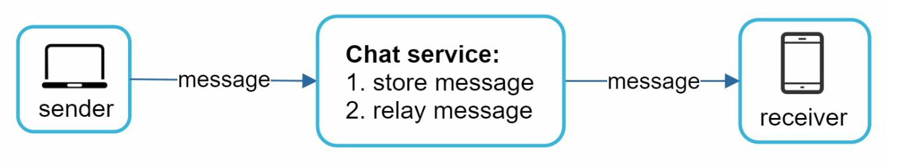
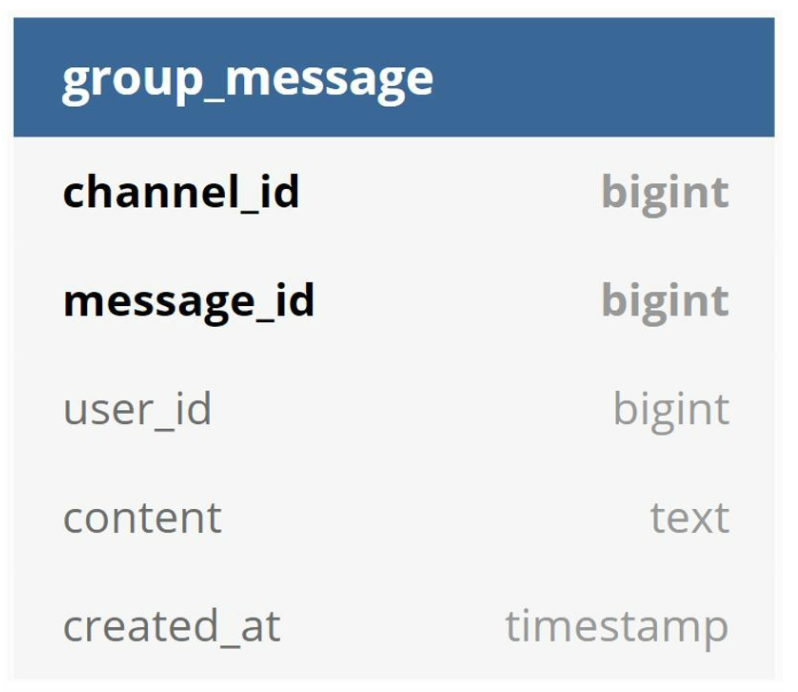

# 第 12 章：设计聊天系统 (Design a Chat System)

## 简介
**聊天系统 (chat system)** 支持用户之间的实时消息。本章聚焦于设计一个聊天应用，包含：
- **一对一聊天**
- **群聊（最多 100 人）**
- **在线状态指示**
- **多设备支持**
- **推送通知**

系统目标为 **5000 万日活跃用户 (DAU)**，聊天记录永久存储。

---

## 步骤 1：理解问题

### 需求
1. **功能：**
   - 一对一聊天和群聊（最多 100 人）。
   - 文本消息（最多 100,000 字符）。
   - 在线/离线状态指示。
   - 支持多设备。
   - 推送通知。
2. **规模：** 按 5000 万 DAU 设计。
3. **存储：** 聊天记录永久保存。

---

## 步骤 2：高层设计

### 通信协议
1. **发送方：** 用 HTTP 发送消息，利用持久连接提高效率。

      

      
      

2. **接收方：**
   - **轮询 (Polling)：**
      - 客户端定期询问服务器是否有消息。
      - 因频繁的冗余请求而低效。

         

   - **长轮询 (Long Polling)：**
      - 保持连接打开直到消息到达。
      - 对不活跃用户低效。

         

   - **WebSocket：**
      - 双向持久连接，支持实时通信，用于消息的发送和接收。
      - 使用 WebSockets (ws) 协议发送和接收消息。

         

---

### 组件

   
   

1. **无状态服务：**
   - 处理注册、登录和用户资料管理。
   - 集成服务发现，为客户端推荐最合适的聊天服务器。
2. **有状态服务：**
   - 聊天服务器维护持久的 WebSocket 连接。
   - 负责消息投递和同步。
3. **第三方集成：**
   - 推送通知服务提醒用户新消息。
   - 通知实现参考通知系统章节。

---
### 设计

客户端与聊天服务器保持持久的 WebSocket 连接，实现实时消息。

      

- 聊天服务器负责消息的发送/接收。
- 在线状态服务器管理在线/离线状态。
- API 服务器处理一切事务，包括用户登录、注册、修改资料等。
- 通知服务器发送推送通知。
- 最后，键值存储用于保存聊天记录。选择键值存储作为聊天记录数据库的原因如下：
   - 易于水平扩展。
   - 键值存储访问数据的延迟非常低。
   - 关系型数据库不擅长处理长尾数据。当索引变大时，随机访问开销很大。
   - 其他经过验证的可靠聊天应用也采用键值存储，例如 Facebook Messenger 和 Discord。

以下是一对一聊天和群聊的数据模型。
   - 主键是消息 ID，用于确定消息顺序。
   - 群聊的复合主键是 (channel_id, message_id)。
      - ID 可用 Snowflake 等全局 64 位序列号生成器生成。
      - 更好的做法是使用本地序列号生成器。本地是指 ID 只在群内唯一。
      - 本地 ID 可行的原因是：在一对一频道或群频道内维护消息顺序就足够了。

      
      

## 步骤 3：设计深挖

### 服务发现

   

- 服务发现的主要作用是根据地理位置、服务器容量等条件，为客户端推荐最合适的聊天服务器。
- 使用 **Apache Zookeeper** 按地理位置、服务器容量等条件分配聊天服务器。
- 保证高效的负载分布并最小化延迟。

### 消息流程
#### 一对一聊天

1. 用户 A 向聊天服务器 1 发送消息。
2. 聊天服务器 1 分配唯一消息 ID 并将消息存入键值存储。
3. 若用户 B 在线，消息被转发到聊天服务器 2，保持持久的 WebSocket 连接。
4. 若用户 B 离线，则发送推送通知。

#### 群聊

   

- 消息被复制到群内每个接收者的个人收件箱。
- 简化了同步，但对大群开销很大。
- 在接收端，一个接收者可以收到来自多个用户的消息。每个接收者有一个收件箱（消息同步队列），其中包含来自不同发送者的消息。

---

#### 消息同步

很多用户有多台设备，需要在设备间同步消息。每台设备维护一个变量 cur_max_message_id，记录该设备上最新的消息 ID。同时满足以下两个条件的消息被视为新消息：

   

- 接收者 ID 等于当前登录的用户 ID。
- 键值存储中的消息 ID 大于 cur_max_message_id

---

### 在线状态
1. **心跳机制：**
   

      
   

   - 客户端定期向在线状态服务器发送心跳，表示在线。
   - 若超过阈值（例如 x = 30）未收到心跳，用户被标记为离线。

2. **扩散模型：**

   

      
   

   - 在线状态更新用发布-订阅模型推送给好友，每对好友之间维护一个频道。
   - 当用户 A 的在线状态变化时，事件被发布到三个频道：频道 A-B、A-C 和 A-D。
   - 这三个频道分别被用户 B、C、D 订阅，从而收到在线状态更新。
   - 上述设计对小规模用户群有效。

---

## 其他考量
### 扩展性
- **水平扩展：** 随用户数增长增加服务器。
- **负载均衡：** 将流量均匀分布到各服务器。
- **缓存：** 降低数据库负载并改善延迟。

### 错误处理
- **重试机制：** 用重试和排队处理消息投递失败。
- **服务器故障：** 用服务发现分配新服务器应对故障。

### 未来扩展
1. **媒体支持：** 增加照片、视频处理，包括压缩和云存储。
2. **端到端加密：** 保证消息隐私。
3. **客户端缓存：** 减少数据传输以获得更好性能。
4. **改善加载速度：** 使用地理分布式的缓存网络。
