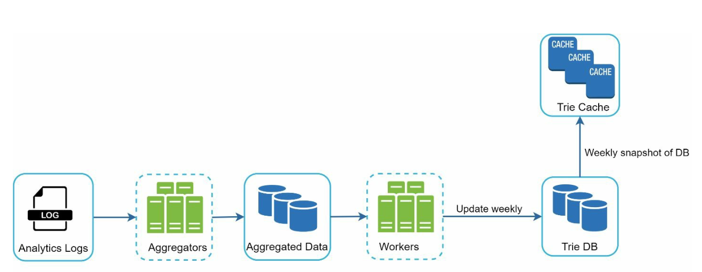

# 第 13 章：设计搜索自动补全系统 (Design a Search Autocomplete System)

## 简介
自动补全 (Autocomplete)，也称即时搜索 (typeahead) 或增量搜索 (incremental search)，在用户于搜索框输入时实时提供建议。系统必须基于历史查询数据，高效地返回按相关性和热度排序的前 k 个建议。

### 关键特性
- 建议最多 **5 条自动补全结果**。
- 基于**查询热度**（频率）。
- 仅支持**小写英文字母**。
- 响应快（<100 毫秒）且可扩展。

---

## 步骤 1：理解问题

### 需求
1. **实时建议：** 用户输入时显示相关匹配。
2. **Top-k 结果：** 按热度排序返回最多 5 条结果。
3. **可扩展性：** 支持 **1000 万 DAU**，峰值 QPS 为 **48,000**。
4. **高可用：** 故障时不宕机。
5. **数据增长：** 新增查询数据每日存储增长 **0.4 GB**。

---

## 步骤 2：高层设计
在高层设计中，系统拆分为两个服务：
1. **数据收集服务：**
    - 收集用户查询并实时聚合，做频率分析。
    - 对大数据集实时处理并不现实；但它是一个好的起点

2. **查询服务：** 根据用户输入提供 top-k 建议。

---

### 数据收集服务

    

- 从分析日志聚合查询数据，更新频率表。
- 每周处理历史数据以构建**字典树 (trie)**（前缀树）。

### 查询服务

    
    

- 使用数据收集服务的频率表。
- 处理用户输入，用 Trie 从频率表中检索 top-k 建议。
- 用缓存和高效数据结构优化快速查找。
- 例如当用户在搜索框输入“tw”时，显示搜索量最高的前 5 个查询。

---

## 步骤 3：设计深挖

### Trie 数据结构
**字典树 (trie)** 是一种树形数据结构，用于高效地存储和检索查询字符串。

#### 关键特性
1. **紧凑存储：** 按层级表示前缀，最小化冗余。
2. **频率信息：** 在每个节点存储查询的热度。

4. **获取搜索量 top k 查询的步骤**
   

      
   

    - 找到前缀
    - 从前缀节点遍历子树，获取所有有效子节点
    - 对子节点排序并取 top k

3. **优化：**
   - 在每个节点缓存 top-k 查询，加速检索，避免遍历整棵 Trie。

        

   - 限制前缀长度以缩小搜索空间，因为用户很少输入很长的搜索词（比如 50 个字符）。

#### Trie 操作
1. **创建：**
    - 用聚合后的查询数据每周构建。
    - 数据源来自分析日志/数据库 (Analytics Log/DB)。
2. **更新：** 很少实时更新；每周更新替换旧数据。
3. **删除：**
      

         
      

    - 过滤器移除不需要或有害的建议（例如仇恨言论）。
    - 过滤层让我们可以根据不同的过滤规则灵活地移除结果。
    - 不需要的建议会被异步地从数据库中物理删除。

---

### 查询处理流程
1. **前缀搜索：**
   - 定位与用户输入对应的前缀节点。
   - 遍历子树收集有效建议。
2. **Top-k 排序：**
   - 在每个节点缓存 top-k 建议，最小化排序开销。
3. **响应构造：**
   - 用缓存数据构造结果，保证快速响应。

---

### 优化
1. **每个节点缓存：**
   - 存储 top-k 查询，避免重复遍历。
2. **限制前缀长度：**
   - 将前缀长度限制为较小的值（例如 50 个字符）以加快查找。
3. **AJAX 请求：**
   - 用轻量异步请求实现实时响应。
4. **浏览器缓存：**
   - 将高频搜索词的自动补全结果存入浏览器缓存。

---

### 数据收集流水线
在高层设计中，用户每输入一次搜索查询，数据就实时更新。这种做法并不现实。
- 用户每天可能输入数十亿次查询。每次查询都更新 Trie 不可行。
- Trie 构建完成后，热门建议变化不大。

#### 更新后的设计

   

1. **分析日志：**
   - 以日志形式存储原始查询数据，用于每周聚合。
   - 日志只追加、不建索引
2. **聚合器：**
   - 将日志处理成频率表，适合构建 Trie。
   - 对 Twitter 等实时应用，用更短的时间间隔聚合数据。
   - 对其他场景，低频聚合即可，比如每周一次就够了。
3. **工作进程：**
   - 异步服务器重建 Trie 并存入持久化存储。
4. **存储选项：**
    - **Trie 缓存**：Trie 缓存是分布式缓存系统，将 Trie 保存在内存中以实现快速读取。
    - **Trie 数据库**
        1. **文档存储（例如 MongoDB）**：由于每周构建一次新 Trie，可以定期对其做快照、序列化，并将序列化数据存入 MongoDB 等数据库
        2. **键值存储：**
            - 将前缀映射到节点数据，实现快速访问。
            - Trie 中的每个前缀映射为哈希表中的一个键。
            - 每个 Trie 节点的数据映射为哈希表中的一个值。

                
---

### 扩展性
1. **分片：**
   - 按前缀范围将 Trie 节点分布到各服务器（例如 `a-m`、`n-z`）。
   - 在前缀内部进一步分片以均衡不均匀分布（例如 `aa-ag`、`ah-an`）。
2. **负载均衡：**
   

      
   

   - 用分片映射管理器将请求路由到合适的服务器。

---

## 步骤 4：高级特性

### 多语言支持
1. **Unicode 字符：** 用 Unicode 支持非英语语言。
2. **按国家建 Trie：** 为不同国家或地区构建独立的 Trie。

### 热门查询
- 通过动态更新 Trie 节点或给近期查询更高权重，处理实时事件。
