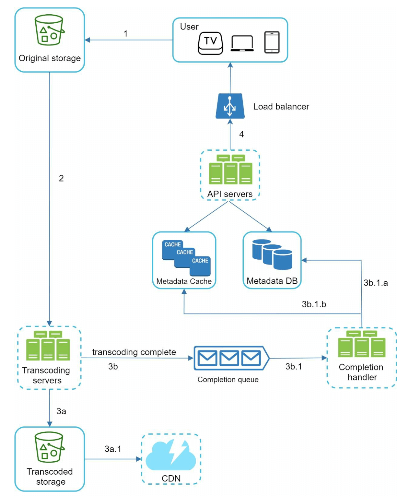
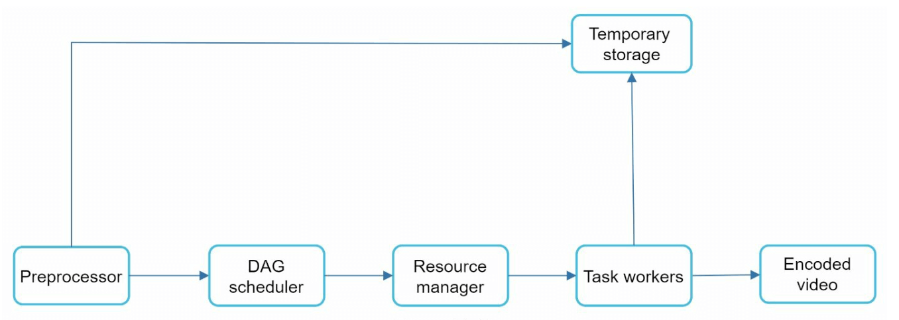
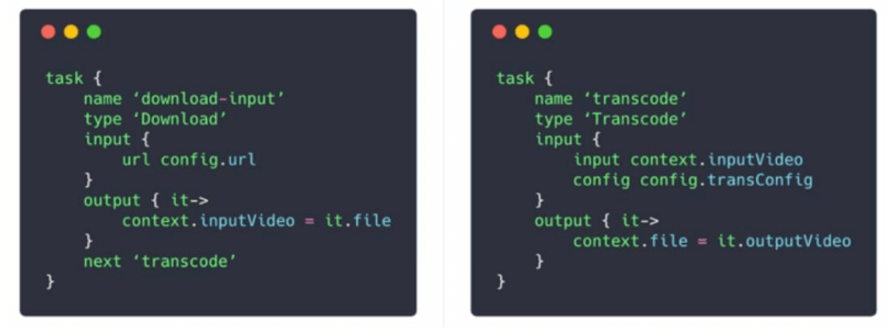
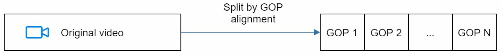

# 第 14 章：设计 YouTube (Design YouTube)

## 简介
YouTube 是一个大规模视频流媒体平台，支持视频上传、播放以及各种交互功能。本章重点是设计一个可扩展的视频流媒体系统，具备以下核心特性：
- **快速视频上传**
- **流畅的视频播放**
- **支持切换视频清晰度**
- **低基础设施成本**
- **高可用性和高可靠性**

### 关键统计数据（2020 年）
- **20 亿月活跃用户**
- **每天播放 50 亿个视频**
- **37% 的移动互联网流量来自 YouTube**
- 支持 **80 种语言**
- 2019 年广告收入 **151 亿美元**

---

## 第一步：理解问题与范围

### 核心功能
1. 上传视频
2. 观看视频

### 支持的平台
- 移动应用、网页浏览器和智能电视

### 假设条件
- **日活跃用户（DAU，Daily Active Users）：** 500 万
- **平均视频大小：** 300 MB
- **上传限制：** 每个视频最大 1 GB
- **每日存储需求：** 150 TB
- **CDN 成本：** 500 万 * 5 个视频 * 0.3GB * $0.02 = $150,000/天（以 Amazon CloudFront 为例）

---

## 第二步：高层设计

### 组件

    

1. **客户端 (Client)：** 智能手机、电脑、电视等设备。
2. **CDN（内容分发网络，Content Delivery Network）：** 存储并分发视频。
3. **API 服务器 (API Servers)：** 处理除视频流之外的所有用户交互（例如上传、元数据更新）。
4. **元数据库 (Metadata Database)：** 存储视频元数据（例如标题、描述、大小）。
5. **源存储 (Original Storage)：** 用于存放上传视频的 Blob 存储。
6. **转码服务器 (Transcoding Servers)：** 将视频转换成多种分辨率和格式。
7. **转码后存储 (Transcoded Storage)：** 用于存放转码后视频的 Blob 存储。

---

### 核心流程
#### 1. 视频上传流程
- **并行处理：**
  1. 将视频上传到源存储。
  2. 在数据库中更新视频元数据。

- **视频上传（步骤）：**

    

        
    

    - [1] 视频上传到 Blob 存储。
    - [2] 转码服务器将视频转换为多种格式。
    - [3] 一旦转码完成，以下两步并行执行。
        - [3a] 转码后的视频发送到转码后存储。
        - [3b] 转码完成事件加入完成队列 (completion queue)。
    - [3a.1] 视频分发到 CDN。
    - [3b.1] 完成处理器 (completion handlers) 更新元数据并通知用户。

- **元数据上传（步骤）：**

    

        
    

    - 客户端并行发送更新视频元数据的请求。
    - 请求中包含视频元数据，包括文件名、大小、格式等。

#### 2. 视频播放流程

  

- 视频直接从 CDN 通过边缘服务器进行流式传输，以最小化延迟。
- 一些流行的流媒体协议包括 MPEG_DASH、Apple HLS、Adobe HDS。
- *不同流媒体协议支持的视频编码和播放器各不相同。*

---

## 第三步：深入设计

### 视频转码
#### 重要性
1. 原始视频占用大量存储空间。转码可以减少存储空间占用。
2. 确保在各种设备和浏览器上的兼容性。
3. 根据网络状况自适应调整视频清晰度。

#### 组件
- **容器 (Container)：** 封装视频、音频和元数据（例如 MP4、AVI）。
- **编解码器 (Codecs)：** 压缩与解压缩算法（例如 H.264、VP9）。

#### 有向无环图（DAG，Directed Acyclic Graph）模型

    

- 视频转码计算开销大、耗时长。
- DAG 模型定义了编码、缩略图生成、水印添加等任务。
- 支持视频处理的高度并行化。

- 原始视频被拆分为视频、音频和元数据。
    - 视频编码：视频被转换成不同的分辨率、编解码器、码率。
    - 缩略图：可由用户上传，或由系统自动生成。
    - 水印：在视频上叠加的图片水印，包含视频的标识信息。

---

### 视频转码架构

1. **预处理器 (Preprocessor)：** 将视频切分成更小的片段（GOP 对齐）。它承担 4 项职责。

    

        
    

    - 视频切分：视频流按 GOP（图像组，Group of Pictures）对齐切分成更小的片段。
    - 针对老版本客户端，按 GOP 对齐切分视频。
    - 根据客户端程序员编写的配置文件生成 DAG。
    - 将 GOP 和元数据存入临时存储；若编码失败，系统可利用持久化数据进行重试。

2. **DAG 调度器 (DAG Scheduler)：** 将任务组织成顺序或并行的多个阶段。
    

        
    

    - 将 DAG 图拆分成各阶段的任务，放入资源管理器的任务队列。
    - 阶段 1：视频、音频和元数据。
    - 视频文件在阶段 2 被进一步拆成两个任务：视频编码和缩略图。

3. **资源管理器 (Resource Manager)：** 负责管理资源分配的效率。它包含 3 个队列和 1 个任务调度器。
    

        
    

    - 任务队列 (task queue)：存放待执行任务的优先队列。
    - 工作节点队列 (worker queue)：存放工作节点利用率信息的优先队列。
    - 运行队列 (running queue)：存放当前正在运行的任务及执行这些任务的工作节点。
    - 任务调度器 (task scheduler)：挑选最优的任务/工作节点组合，并指示选中的任务工作节点执行作业。

4. **任务工作节点 (Task Workers)：** 执行转码和其他操作。
    

        
   

    - 不同的任务工作节点可能运行不同的任务

5. **临时存储 (Temporary Storage)：** 存储用于重试的中间数据。
    - 存储系统的选型取决于数据类型、数据量、访问频率、数据生命周期等因素。
6. **输出 (Output)：** 已可分发的转码后视频。

---

## 系统优化

### 速度优化
1. **并行视频上传：** 将视频切分成更小的片段，实现更快、可断点续传的上传。

    

2. **分布式上传中心：** 利用靠近用户的 CDN 作为上传枢纽。
3. **并行处理：** 使用消息队列 (message queues) 解耦各模块，实现高度并行。

    
    

### 安全优化
1. **预签名 URL (Pre-Signed URLs)：** 将视频上传限制在授权用户范围内。

    

2. **视频保护：**
   - **DRM 系统**（例如 Apple FairPlay、Google Widevine）。
   - **AES 加密。**
   - **水印。**

### 成本优化
1. 只通过 CDN 分发热门视频；不热门的视频从高容量服务器分发。
2. 对很少被访问的视频按需编码。
3. 根据热度对视频做区域化分发。
4. 自建 CDN 并与 ISP 合作，降低带宽成本。

---

## 错误处理
### 可恢复错误
- 重试失败的上传、转码或资源分配任务。

### 不可恢复错误
- 停止处理格式错误的视频，并返回错误码。
