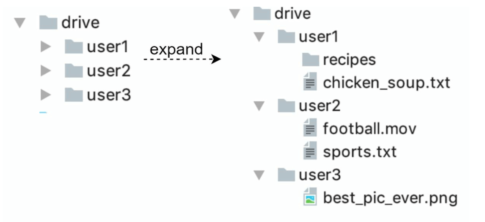
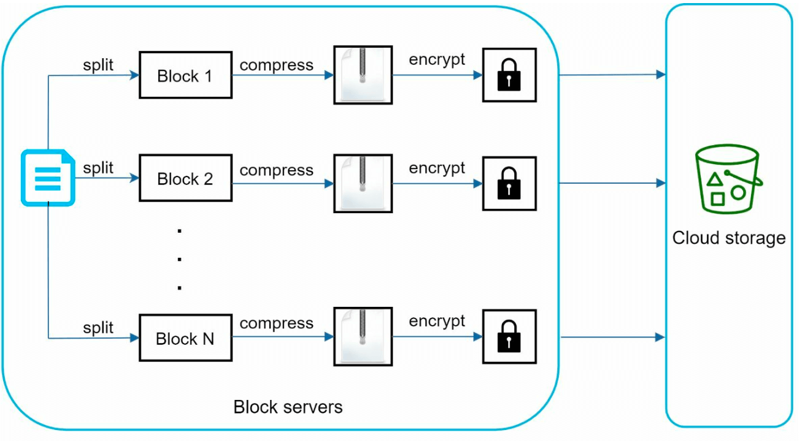

# 第 15 章：设计 Google Drive

## 简介
Google Drive 是一项基于云的文件存储与同步服务，用户可以从各种设备存储、访问和分享文件。本章讨论如何设计一个具备以下特性的可扩展系统：
- **文件上传与下载**
- **跨设备文件同步**
- **文件分享**
- **文件版本历史**
- **针对编辑、删除和分享的通知**

---

## 第一步：理解问题

### 关键需求
#### 功能需求：
- 上传和下载文件。
- 跨多台设备同步文件。
- 维护文件版本。
- 支持带权限控制的文件分享。
- 在文件被编辑、删除和分享时发送通知。

#### 非功能需求：
- **可靠性 (Reliability)：** 不允许丢失数据。
- **同步速度快：** 避免用户因同步延迟而不耐烦。
- **带宽效率：** 最小化不必要的数据传输。
- **可扩展性：** 支持 1000 万日活跃用户（DAU）。
- **高可用性：** 在服务器故障或网络问题时依然平稳运行。

### 约束与假设
- 用户获得 **10 GB 免费空间**。
- 最大文件大小：**10 GB**。
- 平均文件上传大小：**500 KB**。
- 上传频率：**每个用户每天上传 2 个文件**。
- 总存储需求：**500 PB**。

---

## 第二步：高层设计
### 单机部署
基础架构包括：
1. **Web 服务器：** 处理上传和下载。
2. **元数据库：** 用于跟踪元数据，如用户数据、登录信息、文件信息。
3. **存储目录：** 按命名空间 (namespaces) 组织存放文件。

    

- 搭建一台 Web 服务器，并设置一个名为 drive/ 的目录作为根目录来存放上传的文件。
- 在 drive/ 目录下，有一组名为命名空间的目录。
- 每个命名空间包含该用户的所有上传文件。
- 每个文件或文件夹都可以通过命名空间和相对路径拼接后唯一标识。

这个设计只是一个起点，无法满足扩展需求。

#### API
1. **上传文件到 Google Drive：** 支持两种上传方式
    - 简单上传 (Simple upload)：文件较小时使用。
    - 可续传上传 (Resumable upload)：
        - 接口：https://api.example.com/files/upload?uploadType=resumable
        - 先发送初始请求以获取可续传 URL。
        - 上传数据并监控上传状态。
        - 如果上传中断，恢复上传。
2. **从 Google Drive 下载文件：** 下载文件
    - 接口：https://api.example.com/files/download
3. **获取文件版本：**
    - 接口：https://api.example.com/files/list_revisions

### 迁移到分布式系统

#### 改进点：
1. **分片 (Sharding)：** 按 `user_id` 将存储拆分到多台服务器上。
2. **Amazon S3：** 使用 S3 实现可扩展、冗余的文件存储，并支持跨区域复制。

    

3. **负载均衡器：** 将流量分发到多台 Web 服务器。
4. **元数据库复制：** 通过数据库分片与复制保证可用性。

#### 同步冲突：
对于 Google Drive 这样的大型存储系统，同步冲突时有发生。当两个用户同时修改同一个文件或文件夹时，就会产生冲突。

- 在示例中，用户 1 和用户 2 试图同时更新同一个文件，但系统先处理了用户 1 的文件。
- 用户 1 的更新操作成功，用户 2 收到同步冲突。
- 系统会呈现该文件的两个副本：用户 2 的本地副本和服务器上的最新版本。
- 用户 2 可以选择合并两个文件，或用一个版本覆盖另一个版本。

### 改进后的设计

1. **用户交互 (User Interaction)：** 用户通过浏览器或移动应用访问系统。

2. **块服务器 (Block Servers)：**
   - 文件被切分成 **4 MB 块**（最大大小），并分配唯一的哈希值。
   - 各块独立存储在云存储中（例如 Amazon S3）。
   - 文件重组时按特定顺序拼接各块。

3. **云存储 (Cloud Storage)：** 块存储在云存储中，保证可扩展性和冗余。

4. **冷存储 (Cold Storage)：** 不活跃的文件移到冷存储以降低成本。

5. **负载均衡器 (Load Balancer)：** 将请求均匀分发到各 API 服务器，保证高效运行。

6. **API 服务器 (API Servers)：**
   - 处理用户认证、个人信息管理以及文件元数据更新。
   - 管理所有非上传类的工作流。

7. **元数据库与缓存 (Metadata Database and Cache)：**
   - 存储用户、文件、块和版本的元数据。
   - 频繁访问的元数据被缓存以加快读取。

8. **通知服务 (Notification Service)：**
   - 一个**发布/订阅 (publisher/subscriber)** 系统，用于通知客户端文件变更（新增、编辑、删除）。
   - 确保客户端能够拉取最新更新。

9. **离线备份队列 (Offline Backup Queue)：** 临时存放离线客户端的文件变更信息，待其上线后同步。

---

## 第三步：深入设计

### 元数据库
下面展示的只是一个高度简化的版本，只包含最重要的表和字段。
#### 表结构设计：
- **用户表 (User Table)：** 存储用户资料和偏好设置。
- **文件表 (File Table)：** 维护文件元数据（例如大小、名称、路径）。
- **块表 (Block Table)：** 跟踪文件块，用于重组文件。
- **文件版本表 (File Version Table)：** 存储文件的修订历史。

---

### 文件上传流程

1. **文件上传：**
   - 文件由块服务器切分成块、压缩并加密。
   - 块上传到块服务器并存入 S3。
2. **元数据上传：**
   - 客户端向 API 服务器发送元数据。
   - 元数据存入数据库，状态为 `pending`。
3. **完成：**
   - S3 触发回调，将文件状态更新为 `uploaded`。
   - 通知服务告知相关用户。

---

### 文件同步
1. **增量同步 (Delta Sync)：** 只传输修改过的块，而不是整个文件。

    

    
    

2. **压缩：** 根据文件类型使用不同的压缩算法对块进行压缩。
3. **冲突解决：**
   - 先处理的版本获胜。
   - 冲突版本单独保存，交由用户处理。

---

### 文件下载流程
当文件在别处被新增或编辑时，会触发下载流程。客户端有两种方式得知：
- 如果客户端 A 在文件被其他客户端修改时在线，通知服务会告知客户端 A。
- 如果客户端 A 在文件被其他客户端修改时离线，数据会存入缓存。离线客户端重新上线后拉取最新变更。

客户端得知文件变更后，先通过 API 服务器请求元数据，然后下载各块来重组文件。

1. **触发：** 通知服务告知客户端文件有更新。
2. **获取元数据：** 客户端通过 API 获取更新后的元数据。
3. **下载块：** 客户端从块服务器下载更新的块，并重组文件。

---

### 通知服务
1. **作用：** 让客户端及时了解文件变更。
2. **机制：** 使用**长轮询 (long polling)** 实现异步通知。
3. **示例：** 当文件被新增、编辑或删除时，向所有相关客户端推送通知。

---

### 存储优化
1. **去重 (De-duplication)：** 在账号级别使用基于哈希的比较去除重复块。
2. **版本策略：**
   - 限制保存的版本数量。
   - 对经常编辑的文件，优先保留近期版本。
3. **冷存储：** 将很少访问的文件移到更便宜的存储方案（例如 Amazon S3 Glacier）。

---

### 故障处理
1. **负载均衡器故障：** 备用负载均衡器接管。
2. **块服务器故障：** 待处理任务重新分配给其他服务器。
3. **元数据库故障：**
   - 将从节点提升为主节点。
   - 将流量重定向到其余副本。
4. **云存储故障：** 使用跨区域复制获取不可用的文件。
5. **通知服务故障：** 客户端重连到备用服务器。
