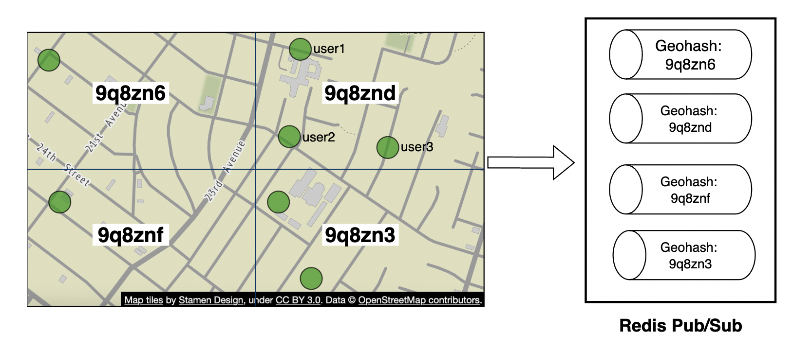

# 第 17 章：附近的朋友 (Nearby Friends)

## 简介

本章重点是设计一个可扩展的后端，支撑一款应用：用户可以分享自己的位置，并发现**附近**的朋友。

与地理位置邻近服务那一章的主要区别是：在这个问题里，**位置在不断变化**，而在那一章中，商家地址基本是固定不变的。

---

## 第一步：理解问题并明确设计范围

可以在面试中用这些问题来引导：
 * C: 地理上多近算作“附近”？
 * I: 5 英里，这个数值应该可配置
 * C: 距离是按直线距离计算，还是要考虑朋友之间隔着一条河之类的情况？
 * I: 可以，按直线距离计算是合理的假设
 * C: 这个应用有多少用户？
 * I: 10 亿用户，其中 10% 使用附近朋友功能
 * C: 需要存储位置历史吗？
 * I: 需要，例如对机器学习可能有价值
 * C: 能否假设不活跃的朋友 10 分钟后就从这个功能中消失？
 * I: 可以
 * C: 需要考虑 GDPR 等合规问题吗？
 * I: 不需要，为了简化起见

### **功能需求**

 * 用户能在手机应用上看到附近的朋友。每个朋友都带有距离和时间戳，表明位置的更新时间
 * 附近朋友列表应该每隔几秒更新一次

### **非功能需求**

- **低延迟**：及时收到位置更新很重要，不能延迟太多
- **可靠性 (Reliability)**：偶尔丢失几个数据点可以接受，但系统整体上应保持可用
- **最终一致性 (Eventual consistency)**：位置数据存储不需要强一致性，不同副本之间几秒钟的延迟可以接受

### **粗略估算 (Back-of-the-envelope)**

一些用于判断潜在规模的估算：
 * 附近朋友指 5 英里半径内的朋友
 * 位置刷新间隔为 30 秒。人类步行速度很慢，没必要太频繁地更新位置。
 * 平均每天有 1 亿用户使用该功能，其中 10% 同时在线，即 1000 万
 * 平均每位用户有 400 个朋友，这些朋友都使用附近朋友功能
 * 应用每页展示 20 个附近朋友
 * **位置更新 QPS** = 1000 万 / 30 == 每秒约 334k 次更新

---

## 第二步：提出高层设计并达成共识

在讨论 API 和数据模型设计之前，我们先研究要用的通信协议，因为它不如传统的请求-响应通信模型那么常见。

### **高层设计**

从高层来看，我们需要在对等节点之间建立有效的消息传递。这可以用点对点协议实现，但对一个连接不稳定、功耗受限的移动应用来说并不实际。

更实际的方法是使用一个共享后端，作为扇出 (fan-out) 机制，把消息推送给你想触达的朋友：

    

这个后端做什么？
 * 接收所有活跃用户的位置更新
 * 对每次位置更新，找到所有应该收到它的活跃用户，并转发给他们
 * 如果朋友之间的距离超过配置的阈值，就不转发位置数据

听起来很简单，但挑战在于如何把系统设计到我们所需的规模。

我们先从一个更简单的设计入手，再在深入设计中讨论更高级的方案：

    

- **负载均衡器**：把流量分发到 REST API 服务器以及双向 WebSocket 服务器
- **REST API 服务器**：处理辅助任务，例如管理好友、更新个人信息等
- **WebSocket 服务器**：有状态服务器，把位置更新请求转发给相应的客户端。同时负责在初始化时为手机客户端播种附近朋友的位置数据（后面会详细讨论）
- **Redis 位置缓存**：存储每个活跃用户的最新位置数据。缓存中的每条记录都设置了 TTL。TTL 过期后，用户不再活跃，其数据会从缓存中删除
- **用户数据库**：存储用户和好友关系数据。可以用关系型数据库，也可以用 NoSQL 数据库
- **位置历史数据库**：存储用户位置数据的历史，不一定直接用在附近朋友功能中，而是用于跟踪历史数据以供分析
- **Redis 发布订阅 (pubsub)**：用作轻量级消息总线，为每个用户通道 (user channel) 开设不同的主题，用于推送位置更新

    

在上例中，WebSocket 服务器订阅连接到它的各用户的通道，一旦收到位置更新就转发给相应的用户。

### **周期性位置更新**

周期性位置更新的流程如下：

    

 * 手机客户端向负载均衡器发送位置更新
 * 负载均衡器把位置更新转发到该客户端的 WebSocket 服务器持久连接上
 * WebSocket 服务器把位置数据保存到位置历史数据库
 * 位置数据更新到位置缓存中。WebSocket 服务器还在内存中保存该用户的位置数据，用于后续的距离计算
 * WebSocket 服务器通过 Redis 发布订阅把位置数据发布到该用户的通道
 * Redis 发布订阅把位置更新广播给该用户通道的所有订阅者，即负责该用户朋友们的服务器
 * 订阅了的 WebSocket 服务器收到位置更新，计算应把更新发送给哪些用户，然后发送出去

这是同一流程的更详细版本：

    

平均而言，一个用户有 400 个朋友，其中 10% 同时在线，所以平均每次要转发 40 条位置更新。

### **API 设计**

需要支持的 WebSocket 例程：
 * 周期性位置更新——用户向 WebSocket 服务器发送位置数据
 * 客户端接收位置更新——服务器发送朋友的位置数据和时间戳
 * WebSocket 客户端初始化——客户端发送用户位置，服务器返回附近朋友的位置数据
 * 订阅新朋友——WebSocket 服务器发送一个朋友 ID，手机客户端据此跟踪，例如该朋友首次上线时
 * 取消订阅朋友——WebSocket 服务器发送一个朋友 ID，手机客户端据此取消订阅，例如该朋友下线时

HTTP API——用于辅助职责的传统请求/响应接口。

### **数据模型**

 * 位置缓存存储 `user_id` 到 `lat,long,timestamp` 的映射。Redis 是这个缓存的理想选择，因为我们只关心当前位置，而且它支持我们需要的 TTL 淘汰。
 * 位置历史表存储同样的数据，但放在关系型表中，包含上面提到的四个列。Cassandra 适合存这类数据，因为它针对写密集型负载做了优化。

---

## 第三步：深入设计

接下来讨论如何扩展高层设计，使其能工作在我们目标的规模上。

### **各组件的扩展性如何？**

- **API 服务器**：可以通过自动扩缩容组和复制服务器实例轻松扩展
- **WebSocket 服务器**：可以轻松横向扩展 ws 服务器，但下线服务器时要优雅关闭现有连接。例如可以先在负载均衡器中把服务器标记为“排水中 (draining)”，不再向其发送新连接，然后再最终从服务器池中移除
- **客户端初始化**：客户端首次连接服务器时，获取该用户的好友列表，订阅他们在 Redis 发布订阅上的通道，从缓存中获取他们的位置，最后转发给客户端
- **用户数据库**：可以按 user_id 分片。也可以通过专用服务和 API 暴露用户/好友数据，由专门的团队维护
- **位置缓存**：可以启动多个 Redis 节点轻松分片缓存。另外，TTL 限制了同一时刻可能占用的最大内存。但我们仍需处理大量写入负载
- **Redis 发布订阅服务器**：我们利用了一个特性——已初始化但未使用的通道不消耗内存。因此可以为所有使用附近朋友功能的用户预分配通道，避免例如用户上线时临时新建通道并通知活跃 WebSocket 服务器的麻烦

### **对 Redis 发布订阅组件的扩展性深入分析**

维护所有发布订阅通道大约需要 200GB 内存。可以用 2 台各 100GB 的 Redis 服务器实现。

但考虑到每秒需要推送约 1400 万条位置更新，假设单台服务器每秒能处理约 10 万次推送，我们至少需要 140 台 Redis 服务器才能扛住这么大的负载。

因此，我们需要一个分布式的 Redis 服务器集群来处理这种高强度的 CPU 负载。

为了支撑分布式 Redis 集群，我们需要一个服务发现 (service discovery) 组件，例如 ZooKeeper 或 etcd，来跟踪哪些服务器还活着。

服务发现组件中需要编码的数据如下：

    

WebSocket 服务器用这份从 ZooKeeper 获取的编码数据，确定某个通道位于哪台服务器。为了高效，可以把哈希环 (hash ring) 数据缓存在每台 WebSocket 服务器的内存中。

扩容或缩容服务器集群时，可以设置一个每日任务，根据历史流量数据按需扩缩容。也可以超配集群以应对流量尖峰。

Redis 集群可以看作有状态存储服务器，因为通道维护了一些状态，而且订阅者需要协同切换到新扩容的集群节点。

扩容操作中要注意一些潜在问题：
 * 由于通道被搬来搬去，WebSocket 服务器会发出大量重新订阅请求
 * 操作期间客户端可能错过一些位置更新，这在这个问题里可以接受，但我们仍应尽量避免。考虑在每天流量最低点做这种操作。
 * 可以利用一致性哈希 (consistent hashing)，在增减服务器时最小化被搬移的通道数量

    

### **添加/删除朋友**

每当添加/删除朋友，负责受影响用户的 WebSocket 服务器需要订阅/取消订阅该朋友的通道。

由于“附近朋友”功能是更大应用的一部分，我们可以假设：每当这些事件发生时，手机客户端可以注册回调，客户端会向 WebSocket 服务器发送消息来执行相应操作。

### **好友很多的用户**

可以对好友总数设置上限，例如 Facebook 的好友上限是 5000。

处理“大户”用户的 WebSocket 服务器负载会更高，但只要 WebSocket 服务器数量足够，就没问题。

### **附近的陌生人**

如果面试官想在设计中加一个功能，让附近朋友地图上偶尔弹出一个陌生人，该怎么办？

一种方法是基于 geohash 定义一组发布订阅通道池：

    

geohash 内的任何人订阅相应通道，就可以收到随机用户的位置更新：

    

也可以订阅多个 geohash，处理有人很近但位于相邻 geohash 的情况：

    

### **Redis 发布订阅的替代方案**

替代 Redis 发布订阅的一种方案是使用 Erlang——一种为分布式计算应用优化的通用编程语言。

用它可以生成数百万个轻量的 Erlang 进程，让它们彼此通信。分布式 Erlang 应用内部可以同时处理 WebSocket 连接和发布订阅通道。

但使用 Erlang 的一个挑战是，它是一门小众编程语言，可能很难招到厉害的 Erlang 开发者。

---

## 第四步：总结

我们成功设计了一个支持附近朋友功能的系统。

核心组件：
- **WebSocket 服务器**：客户端与服务器之间的实时通信
- **Redis**：位置数据的高速读写 + 发布订阅通道

我们还探讨了如何扩展 RESTful API 服务器、WebSocket 服务器、数据层、Redis 发布订阅服务器，还探讨了 Redis 发布订阅的替代方案，以及“附近的陌生人”功能。
