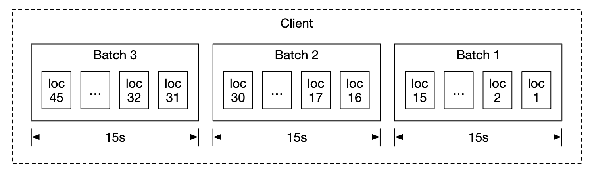
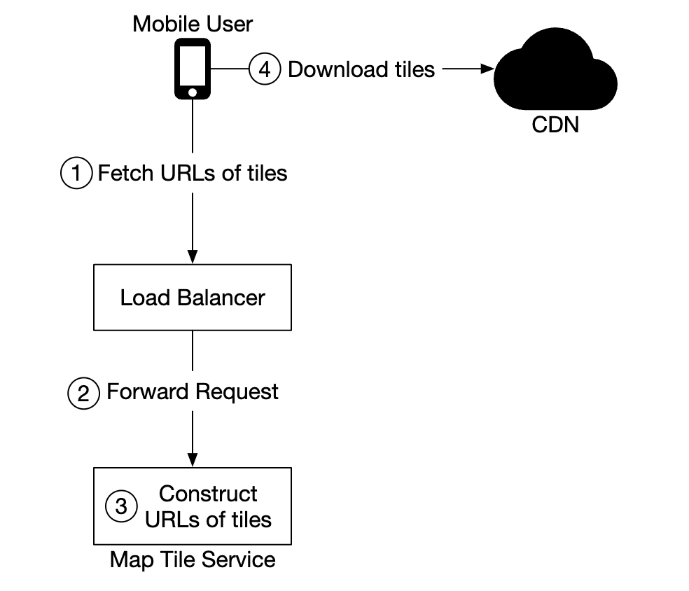
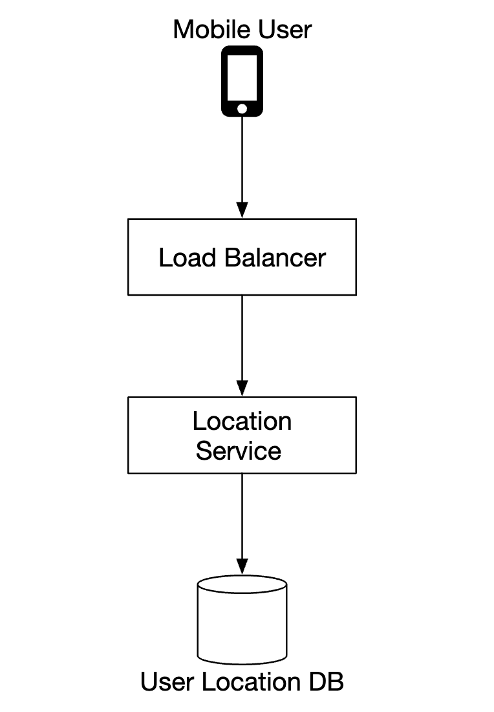
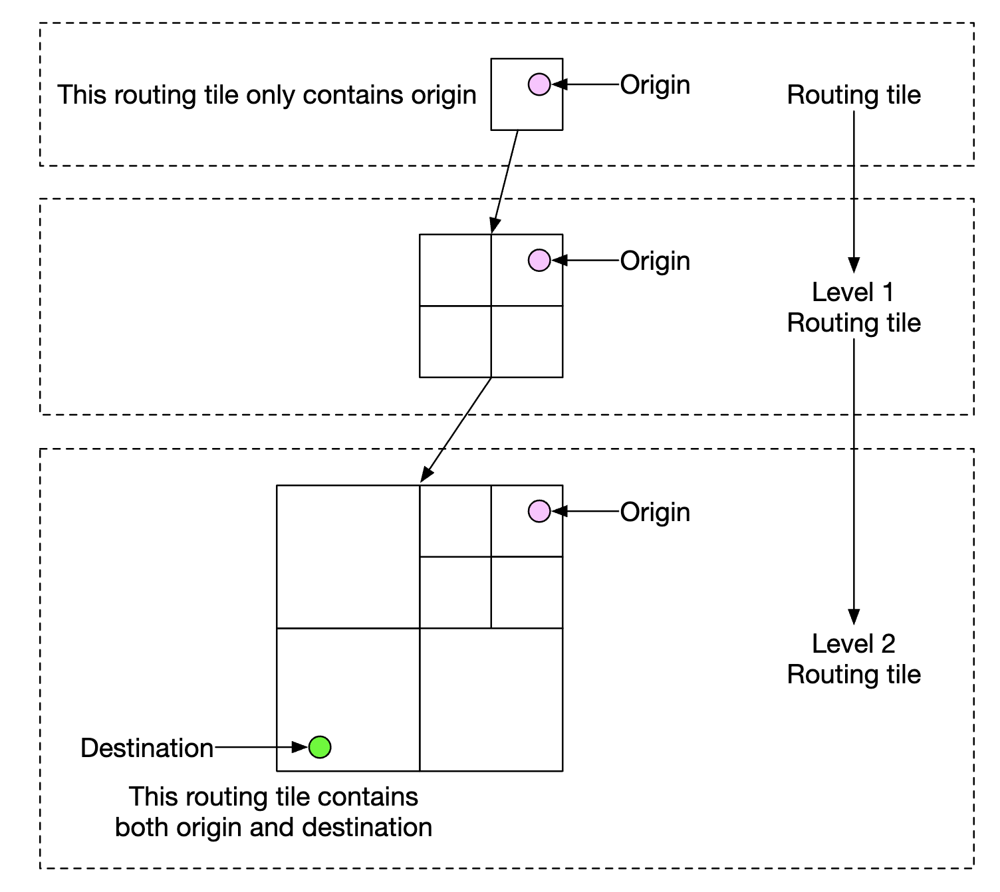

# 第 18 章：设计 Google Maps

## 简介

我们来设计一个简化版的 **Google Maps**。

关于 Google Maps 的一些事实：
 * 2005 年上线
 * 提供多种服务——卫星影像、街道地图、实时路况、路线规划
 * 到 2021 年，日活跃用户 10 亿，覆盖全球 99% 的区域，每天有 2500 万次实时位置信息更新

---

## 第一步：理解问题并明确设计范围

候选人与面试官之间的示例问答：
 * C: 我们要面对多少日活跃用户？
 * I: 10 亿 DAU
 * C: 应该聚焦哪些功能？
 * I: 位置更新、导航、ETA、地图渲染
 * C: 道路数据有多大？我们能拿到吗？
 * I: 我们从各种来源获取了道路数据，是 TB 级的原始数据
 * C: 需要考虑路况吗？
 * I: 需要，为了准确估算时间
 * C: 不同的出行方式呢——步行、骑车、开车？
 * I: 都应该支持
 * C: 多站点导航呢？
 * I: 在本次面试范围内先不聚焦这个
 * C: 商家地点和照片呢？
 * I: 问得好，但不需要考虑

我们聚焦三个关键功能——用户位置更新、导航服务（含 ETA）、地图渲染。

### **非功能需求**

- **准确性 (Accuracy)**：不能给用户指错路
- **流畅导航**：用户应体验流畅的地图渲染
- **数据与电量消耗**：客户端应尽可能少地消耗流量和电量。这对移动设备很重要。
- 通用的可用性和可扩展性要求

### **地图 101**

在进入设计之前，有一些地图相关概念需要先理解。

#### 定位系统

地球是一个绕地轴旋转的球体。位置由纬度（南北方向的位置）和经度（东西方向的位置）定义：

<div style="margin-left:3rem">
    
</div>

#### 从 3D 到 2D

把 3D 空间中的点映射到 2D 平面的过程称为“地图投影 (map projection)”。

投影方式有很多种，各有优缺点。几乎所有投影都会扭曲实际几何形状。

<div style="margin-left:3rem">
    
</div>

Google Maps 选择了墨卡托投影 (Mercator projection) 的改进版，称为“Web 墨卡托 (Web Mercator)”。

#### 地理编码 (Geocoding)

地理编码是把地址转换成地理坐标的过程。

逆过程称为“逆地理编码 (reverse geocoding)”。

实现方式之一是使用插值——利用来自不同来源（例如 GIS）的数据，把街道网络映射到地理坐标空间。

#### 地理哈希 (Geohashing)

地理哈希是一种编码系统，把一块地理区域编码成字母和数字组成的字符串。

它把地球看作一个平面，并递归地将其分成四个象限：

<div style="margin-left:3rem">
    
</div>

#### 地图渲染

地图渲染通过瓦片 (tiling) 实现。不是把整张地图渲染成一张巨大的定制图片，而是把世界切成更小的瓦片。

客户端只下载相关的瓦片，像拼马赛克一样把它们拼接渲染。

不同缩放级别有不同的瓦片。客户端根据缩放级别选择合适的瓦片。

例如，把整个世界缩放到最小，只需要下载一张 256x256 的瓦片，就能表示整个世界。

#### 用于导航算法的道路数据处理

在大多数路径规划算法中，路口表示为节点，道路表示为边：

<div style="margin-left:3rem">
    
</div>

大多数导航算法使用 Dijkstra 或 A* 算法的改进版。

寻路性能对图的大小很敏感。要在规模上工作，不能把整个世界表示成一张图再跑算法。

我们用一种类似瓦片的技术——把世界细分成越来越小的图。

路由瓦片 (routing tiles) 持有对相邻瓦片的引用，算法遍历互联的瓦片时可以拼接成更大的路网图：

<div style="margin-left:3rem">
    
</div>

这种技术让我们显著降低内存带宽，只加载给定起点/终点对所需的瓦片。

但是，对于较长的路线，拼接小而精细的路由瓦片仍然耗时耗内存。取而代之的是使用不同精细度的路由瓦片，算法根据目的地选择合适精细度的瓦片：

<div style="margin-left:3rem">
    
</div>

### **粗略估算**

存储方面，需要存储：
 * 世界地图——估计约 70PB，基于需要存储的所有瓦片，并考虑了大量相似瓦片（例如广袤沙漠）的压缩
 * 元数据——体量可忽略，计算时可以跳过
 * 道路信息——以路由瓦片的形式存储

导航请求的 QPS 估算——10 亿 DAU，每周使用 35 分钟 -> 每天 50 亿分钟。
假设 GPS 更新请求是批量发送的，得出 QPS 为 20 万，峰值负载时为 100 万 QPS

---

## 第二步：提出高层设计并达成共识

<div style="margin-left:3rem">
    
</div>

### **位置服务 (Location service)**

<div style="margin-left:3rem">
    
</div>

它负责记录用户的位置更新：
 * 位置更新每 `t` 秒发送一次
 * 位置数据流可用于长期改善服务，例如提供更准确的 ETA、监控路况数据、检测封路、分析用户行为等

与其一直向服务器发送位置更新，我们可以在客户端批量攒更新，再批量发送：

<div style="margin-left:3rem">
    
</div>

尽管做了这个优化，对于 Google Maps 这种规模的系统，负载仍然很大。因此，我们可以用一个针对大写入量优化的数据库，例如 Cassandra。

我们还可以利用 Kafka 对位置更新做高效的流处理，供后续分析使用。

位置更新请求载荷示例：

```
POST /v1/locations
Parameters
  locs: JSON encoded array of (latitude, longitude, timestamp) tuples.
```

### **导航服务 (Navigation service)**

这个组件负责在合理时间内找到 A 到 B 的快速路线（允许一点延迟）。路线不一定要最快，但准确性很重要。

请求载荷示例：

```
GET /v1/nav?origin=1355+market+street,SF&destination=Disneyland
```

响应示例：

```json
{
  "distance": {"text":"0.2 mi", "value": 259},
  "duration": {"text": "1 min", "value": 83},
  "end_location": {"lat": 37.4038943, "Ing": -121.9410454},
  "html_instructions": "Head <b>northeast</b> on <b>Brandon St</b> toward <b>Lumin Way</b><div style=\"font-size:0.9em\">Restricted usage road</div>",
  "polyline": {"points": "_fhcFjbhgVuAwDsCal"},
  "start_location": {"lat": 37.4027165, "lng": -121.9435809},
  "geocoded_waypoints": [
    {
       "geocoder_status" : "OK",
       "partial_match" : true,
       "place_id" : "ChIJwZNMti1fawwRO2aVVVX2yKg",
       "types" : [ "locality", "political" ]
    },
    {
       "geocoder_status" : "OK",
       "partial_match" : true,
       "place_id" : "ChIJ3aPgQGtXawwRLYeiBMUi7bM",
       "types" : [ "locality", "political" ]
    }
  ],
  "travel_mode": "DRIVING"
}
```

路况变化和重新规划路线暂时不考虑，会在深入设计部分处理。

### **地图渲染**

客户端不可能持有整套地图瓦片数据，因为那是 PB 级的。

需要根据客户端的位置和缩放级别，按需从服务器获取。

什么时候获取新瓦片——用户缩放时，以及导航过程中驶向新瓦片时。

地图瓦片应该怎么提供给客户端？
 * 可以动态构建，但这会给服务器带来巨大负载，也让缓存变得困难
 * 地图瓦片按 geohash 静态提供，客户端可以自己计算。它们可以静态存储并通过 CDN 提供

<div style="margin-left:3rem">
    
</div>

CDN 让用户能从离自己最近的接入点服务器（POP，point-of-presence）获取地图瓦片，以最小化延迟：

<div style="margin-left:3rem">
    
</div>

确定地图瓦片的方案：
 * 地图瓦片的 geohash 可以在客户端计算。如果这样做，就要谨慎，因为这意味着长期锁定这种地图瓦片计算方式，而强制客户端更新很困难
 * 或者提供一个简单的 API，代客户端计算地图瓦片 URL，代价是多一次 API 调用

<div style="margin-left:3rem">
    
</div>

---

## 第三步：深入设计

### **数据模型**

讨论一下我们要处理的不同类型数据的存储方式。

#### 路由瓦片

初始道路数据集来自不同来源。随着时间推移，根据位置更新数据不断改进。

道路数据是非结构化的。我们有一个定期的离线处理流水线，把这些原始数据转换成应用需要的基于图的路由瓦片。

不需要数据库的特性，所以不把这些瓦片存数据库。可以存入 S3 对象存储，并积极缓存。

还可以利用一些库，把邻接表高效压缩成二进制文件。

#### 用户位置数据

用户位置数据对更新路况和做各种分析非常有用。

这类数据的特点是写密集，可以用 Cassandra 存储。

示例行：

<div style="margin-left:3rem">
    
</div>

#### 地理编码数据库

这个数据库存储经纬度对与地点的键值对。

我们可以用 Redis，因为它读取速度快，而我们读频繁、写不频繁。

#### 世界地图的预计算图片

如前所述，我们会预计算地图瓦片图片并存入 CDN。

<div style="margin-left:3rem">
    
</div>

### **服务**

#### 位置服务

针对这个服务，重点讨论数据库设计以及用户位置的存储细节。

<div style="margin-left:3rem">
    
</div>

位置更新的写入负载很重，我们可以用 NoSQL 数据库来承载。用户位置数据经常变化，新更新一到就过时了，所以我们优先保证可用性而非一致性。

我们选择 Cassandra 作为数据库，它很好地满足我们所有需求。

要存储的示例行：

<div style="margin-left:3rem">
    
</div>

 * `user_id` 是分区键，用于快速访问某用户的所有位置更新
 * `timestamp` 是聚簇键，让数据按收到位置更新的时间排序存储

我们还利用 Kafka 把位置更新流式传输给需要位置更新的各个服务，用于各种用途：

<div style="margin-left:3rem">
    
</div>

#### 渲染地图

地图瓦片按不同缩放级别存储。在最低缩放级别，整个世界由一张 256x256 的瓦片表示。

缩放级别每增加一级，地图瓦片数量变为四倍：

<div style="margin-left:3rem">
    
</div>

一个优化是：不在网络上传输完整的图片信息，而是把瓦片表示成矢量（路径和多边形），让客户端动态渲染瓦片。

这能大幅节省带宽。

#### 导航服务

这个服务负责寻找最快的路线：

<div style="margin-left:3rem">
    
</div>

逐个过一下这个子系统中的每个组件。

首先是地理编码服务 (geocoding service)，它把地址解析成经纬度对。

请求示例：

```
https://maps.googleapis.com/maps/api/geocode/json?address=1600+Amphitheatre+Parkway,+Mountain+View,+CA
```

响应示例：

```json
{
   "results" : [
      {
         "formatted_address" : "1600 Amphitheatre Parkway, Mountain View, CA 94043, USA",
         "geometry" : {
            "location" : {
               "lat" : 37.4224764,
               "lng" : -122.0842499
            },
            "location_type" : "ROOFTOP",
            "viewport" : {
               "northeast" : {
                  "lat" : 37.4238253802915,
                  "lng" : -122.0829009197085
               },
               "southwest" : {
                  "lat" : 37.4211274197085,
                  "lng" : -122.0855988802915
               }
            }
         },
         "place_id" : "ChIJ2eUgeAK6j4ARbn5u_wAGqWA",
         "plus_code": {
            "compound_code": "CWC8+W5 Mountain View, California, United States",
            "global_code": "849VCWC8+W5"
         },
         "types" : [ "street_address" ]
      }
   ],
   "status" : "OK"
}
```

路线规划服务 (route planner service) 根据当前路况计算建议路线，优化出行时间。

最短路径服务 (shortest-path service) 对对象存储中的路由瓦片运行 A* 算法的变体，计算最优路径：
 * 它接收起点/终点对，把它们转换成经纬度对，再从中推导出 geohash，从而确定路由瓦片
 * 算法从初始路由瓦片开始遍历，直到找到一条足够好的通往目标瓦片的路径

<div style="margin-left:3rem">
    
</div>

ETA 服务被路线规划器调用，基于机器学习算法，根据路况数据预测 ETA。

排序服务 (ranker service) 负责根据用户传入的过滤条件（例如避开收费路段或高速的选项），对不同的候选路径排序。

更新服务 (updater service) 异步更新一些重要数据库，保持它们最新。

#### 改进——自适应 ETA 与重新规划路线

一个可以做的改进是，根据新到的路况数据自适应地更新正在导航中的路线。

实现方式之一是，把当前正在某条路线上导航的用户存入数据库，记录他们将要经过的所有瓦片。

数据大概长这样：

```
user_1: r_1, r_2, r_3, …, r_k
user_2: r_4, r_6, r_9, …, r_n
user_3: r_2, r_8, r_9, …, r_m
...
user_n: r_2, r_10, r21, ..., r_l
```

如果某个瓦片发生交通事故，我们可以找出所有路径经过该瓦片的用户，为他们重新规划路线。

为了减少数据库中存储的瓦片数量，可以只存储起点路由瓦片，以及不同分辨率层级上的若干路由瓦片，直到包含目标瓦片为止：

```
user_1, r_1, super(r_1), super(super(r_1)), ...
```

<div style="margin-left:3rem">
    
</div>

这样一来，只需检查用户的最终瓦片是否包含事故瓦片，就能判断该用户是否受影响。

我们还可以跟踪导航中用户的所有可能路线，并在有更快的路线可用时通知他们。

#### 下发协议

有几种方案能让服务器主动向客户端推送数据：
 * 移动推送通知不行，因为载荷有限，而且 Web 应用用不了
 * WebSocket 通常比长轮询更好，因为它在服务器上的计算开销更小
 * 也可以用服务器发送事件（SSE，server-sent events），但我们倾向于 WebSocket，因为它支持双向通信，例如在“最后一公里”配送功能中能派上用场

---

## 第四步：总结

这是我们的最终设计：

<div style="margin-left:3rem">
    
</div>

还可以提供的一个附加功能是多站点导航，可以卖给 Uber 或 Lyft 这样的企业客户，用于确定访问一组地点的最优路径。
