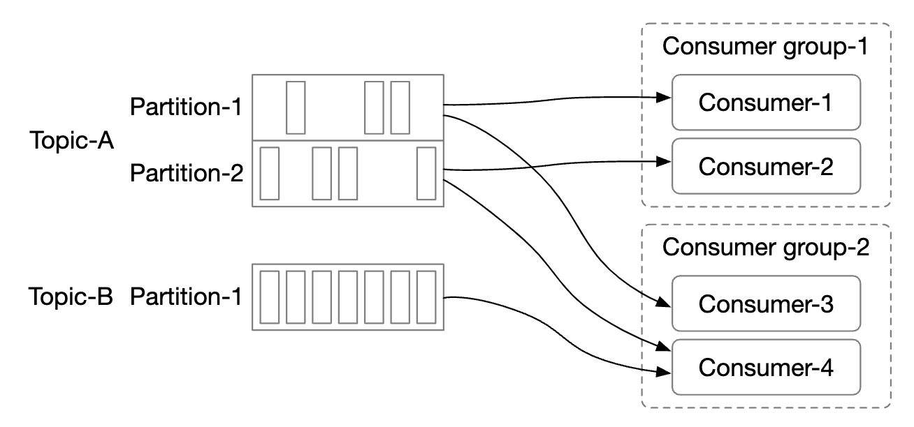
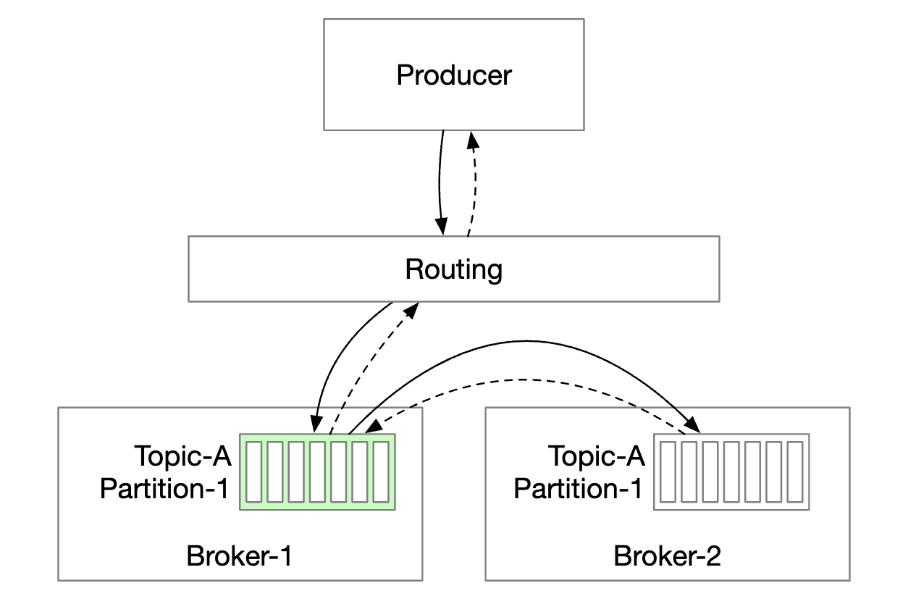
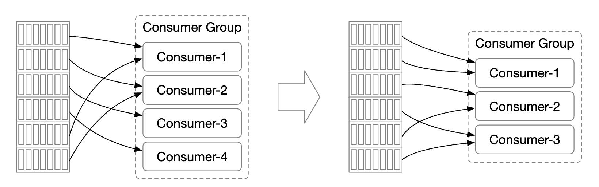
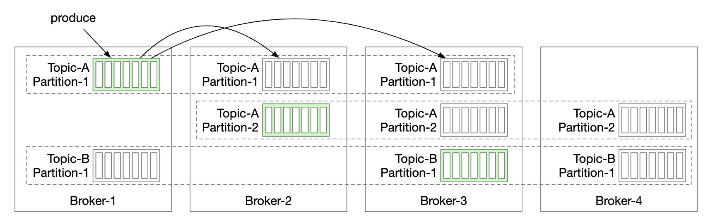
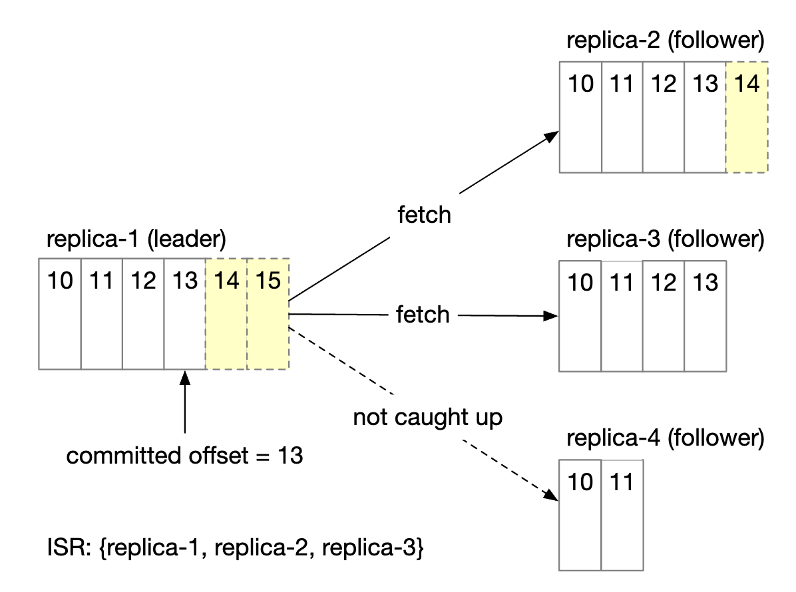
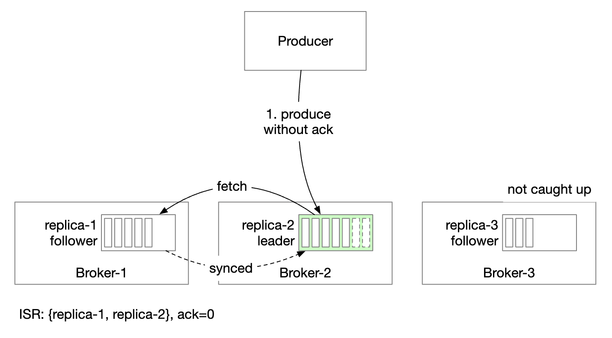

# 第 19 章：分布式消息队列 (Distributed Message Queue)

## 简介

本章我们来设计一个**分布式消息队列 (distributed message queue)**。

消息队列的好处：
- **解耦 (Decoupling)**：消除组件之间的紧耦合。让它们可以独立更新。
- **更好的可扩展性**：生产者和消费者可以根据流量独立扩缩容。
- **更高的可用性**：如果系统的一部分挂了，其他部分仍能继续与队列交互。
- **更好的性能**：生产者生产消息时无需等待消费者的确认。

一些流行的消息队列实现——Kafka、RabbitMQ、RocketMQ、Apache Pulsar、ActiveMQ、ZeroMQ。

严格来说，Kafka 和 Pulsar 不是消息队列。它们是事件流平台 (event streaming platforms)。
不过两者功能趋同，消息队列和事件流平台的界限越来越模糊。

在本章中，我们将构建一个支持长数据保留、消息可重复消费等高级特性的消息队列。

---

## 第一步：理解问题并明确设计范围

消息队列应该支持几个基本功能——生产者生产消息，消费者消费消息。
但在性能、消息投递、数据保留等方面有不同的考虑。

候选人与面试官之间可能的问题：
 * C: 消息的格式和平均大小是什么？只有文本吗？
 * I: 消息只有文本，通常几 KB
 * C: 消息可以被重复消费吗？
 * I: 可以，消息可以被不同消费者重复消费。这是个额外需求，传统消息队列不支持。
 * C: 消息按生产的顺序消费吗？
 * I: 是的，顺序保证应该保留。这是个额外需求，传统消息队列不支持。
 * C: 数据保留的要求是什么？
 * I: 消息需要保留两周。这是个额外需求。
 * C: 想支持多少生产者和消费者？
 * I: 越多越好。
 * C: 想支持什么数据投递语义？最多一次 (at-most-once)、至少一次 (at-least-once)、恰好一次 (exactly-once)？
 * I: 肯定要支持至少一次。理想情况下全都支持，做成可配置的。
 * C: 端到端延迟的吞吐目标是什么？
 * I: 应该支持高吞吐，满足日志聚合这类用例；对传统用例支持低吞吐。

### **功能需求**

 * 生产者向消息队列发送消息
 * 消费者从队列消费消息
 * 消息可以消费一次，也可以重复消费
 * 历史数据可以截断
 * 消息大小在 KB 级别
 * 消息顺序需要保留
 * 数据投递语义可配置——最多一次/至少一次/恰好一次。

### **非功能需求**

- **高吞吐或低延迟**：根据用例可配置
- **可扩展**：系统应该是分布式的，能应对消息量的突然激增
- **持久且可靠**：数据应持久化到磁盘，并在节点间复制

传统消息队列通常不支持数据保留，也不提供顺序保证。这大大简化了设计，我们会讨论这一点。

---

## 第二步：提出高层设计并达成共识

消息队列的关键组件：

    

 * 生产者向队列发送消息
 * 消费者订阅队列并消费订阅的消息
 * 消息队列是中间的服务，把生产者和消费者解耦，让它们可以独立扩展。
 * 生产者和消费者都是客户端，消息队列是服务端。

### **消息模型**

第一种消息模型是点对点 (point-to-point)，常见于传统消息队列：

    

 * 一条消息发送到队列，被恰好一个消费者消费。
 * 可以有多个消费者，但一条消息只被消费一次。
 * 消息被确认为已消费后，就从队列中删除。
 * 点对点模型没有数据保留，但我们的设计里有。

另一种是发布订阅 (publish-subscribe) 模型，在事件流平台中更常见：

    

 * 在这个模型中，消息关联到一个主题 (topic)。
 * 消费者订阅主题，接收发送到该主题的所有消息。

### **主题、分区和 Broker**

如果一个主题的数据量太大怎么办？一种扩展方式是把主题拆成多个分区 (partition)（也就是分片）：

    

 * 发送到主题的消息均匀分布到各个分区
 * 托管分区的服务器称为 broker
 * 每个主题像队列一样用 FIFO 处理消息。分区内的消息顺序得到保留。
 * 消息在分区中的位置称为**偏移量 (offset)**。
 * 每条生产的消息被发送到特定分区。分区键 (partition key) 指定消息应该落到哪个分区。
   * 例如可以用 `user_id` 作为分区键，保证同一用户的消息有序。
 * 每个消费者订阅一个或多个分区。当同一批消息有多个消费者时，它们组成一个消费者组。

### **消费者组**

消费者组 (consumer groups) 是一组协同消费主题消息的消费者：

    

 * 消息按消费者组复制（不是按消费者）。
 * 每个消费者组维护自己的偏移量。
 * 消费者组并行读消息能提高吞吐，但会破坏顺序保证。
 * 缓解方法是：一个组内只允许一个消费者订阅一个分区。
 * 这意味着一个组内的消费者数量不能超过分区数。

### **高层架构**

    

- **客户端**：生产者和消费者。生产者把消息推送到指定主题。消费者组订阅主题的消息。
- **Broker**：持有多个分区。分区持有主题消息的一个子集。
- **数据存储**：把消息存入分区。
- **状态存储**：保存消费者的状态。
- **元数据存储**：存储配置和主题属性
- **协调服务**：负责服务发现（哪些 broker 还活着）和领导者选举（哪个 broker 是领导者，负责分配分区）。

---

## 第三步：深入设计

为了实现高吞吐并满足高数据保留要求，我们做了几个重要的设计决策：
 * 我们选择了一种磁盘数据结构，利用现代 HDD 的特性和现代操作系统的磁盘缓存策略。
 * 消息数据结构是不可变的，避免额外拷贝——在高流量/高并发系统中我们想避免拷贝。
 * 我们的写入围绕批处理设计，因为小 I/O 是高吞吐的敌人。

### **数据存储**

为了给消息找到最好的数据存储，必须先考察消息的特性：
 * 写密集、读密集
 * 没有更新/删除操作。传统消息队列中有“删除”操作，因为消息不保留。
 * 主要是顺序读写的访问模式。

可选方案：
- **数据库**：不理想，典型数据库对写密集和读密集兼顾的系统支持不好。
- **预写日志 (WAL，Write-ahead log)**：只支持追加的纯文本文件，对 HDD 非常友好。
  * 我们把分区切成多个段 (segment)，避免维护过大的单个文件。
  * 老段只读。只有最新段接受写入。

    

WAL 文件配合传统 HDD 效率极高。

有个误解认为 HDD 访问很慢，但这很大程度上取决于访问模式。
当访问模式是顺序访问（如我们这里），HDD 能达到几 MB/s 的读写速度，足以满足需求。
我们还利用了操作系统会积极把磁盘数据缓存在内存中的特性。

### **消息数据结构**

重要的是消息结构在生产者、队列和消费者之间保持一致，避免额外拷贝。这样处理效率高得多。

消息结构示例：

    

消息的键 (key) 指定消息属于哪个分区。映射示例：`hash(key) % numPartitions`。
为了更灵活，生产者可以覆盖默认键，控制消息分发到哪些分区。

消息值 (value) 是消息的载荷。可以是纯文本，也可以是压缩的二进制块。

**注意：** 消息键不像传统 KV 存储那样需要唯一。允许重复键，甚至允许缺失键。

其他消息字段：
- **主题 (Topic)**：消息所属的主题
- **分区 (Partition)**：消息所属分区的 ID
- **偏移量 (Offset)**：消息在分区中的位置。通过 `topic`、`partition`、`offset` 可以定位一条消息。
- **时间戳 (Timestamp)**：消息存储的时间
- **大小 (Size)**：这条消息的大小
- **CRC**：校验和，保证消息完整性

增加额外字段可以支持消息过滤等高级特性。

### **批处理**

批处理对系统性能至关重要。我们在生产者、消费者和消息队列中都用它。

它之所以关键：
 * 让操作系统把消息打包在一起，分摊昂贵的网络往返开销
 * 消息成组顺序写入 WAL，产生大量顺序写和磁盘缓存。

延迟和吞吐之间有个权衡：
 * 批处理程度高 -> 吞吐高，延迟也高。
 * 批处理程度低 -> 吞吐低，延迟也低。

如果系统作为传统消息队列部署，需要低延迟，可以调小批处理大小。

如果为吞吐调优，可能需要增加每个主题的分区数，来弥补较慢的顺序磁盘写吞吐。

### **生产者流程**

如果生产者想向某个分区发送消息，应该连接哪个 broker？

一种方案是引入路由层 (routing layer)，把消息路由到正确的 broker。如果启用了复制，正确的 broker 是领导者副本 (leader replica)：

    

 * 路由层从元数据存储读取复制计划，并在本地缓存。
 * 生产者向路由层发送消息。
 * 消息被转发给 broker 1，它是该分区的领导者
 * 从副本 (follower replicas) 从领导者拉取新消息。收到足够确认后，领导者提交数据并响应生产者。

副本的作用是实现容错。

这个方案可行，但有些缺点：
 * 多了个组件，增加了网络跳数
 * 该设计不利于消息批处理

为了缓解这些问题，可以把路由层嵌入生产者：

    

 * 网络跳数更少，延迟更低
 * 生产者可以控制消息路由到哪个分区
 * 缓冲区让我们能在内存中批量攒消息，一次请求发出更大的批次，提高吞吐。

批处理大小的选择是吞吐和延迟的经典权衡。

    

 * 批处理越大，批次提交前的等待时间越长。
 * 批处理越小，请求发出越早，延迟越低，但吞吐也越低。

### **消费者流程**

消费者指定在分区中的偏移量，收到从该偏移量开始的一批消息：

    

设计消费者时一个重要考虑是用推送 (push) 还是拉取 (pull) 模型：
- **推送模型**：延迟更低，broker 一收到消息就推送给消费者。
  * 但如果消费速度跟不上生产速度，消费者会被压垮。
  * 消费者处理能力各异时很难处理，因为消费速率由 broker 控制。
- **拉取模型**：消费速率由消费者控制。
  * 如果消费慢，消费者不会被压垮，还可以扩容追赶。
  * 拉取模型更适合批处理，因为推送模型下 broker 不知道消费者一次能处理多少消息。
  * 而拉取模型下，消费者可以积极拉取大批量消息。
  * 缺点是延迟更高，以及没有新消息时会有额外的网络调用。后者可以用长轮询缓解。

因此，大多数消息队列（包括我们）选择拉取模型。

    

 * 新消费者订阅主题 A 并加入组 1。
 * 通过对组名哈希找到正确的 broker 节点。这样，同一组的所有消费者都连到同一个 broker。
 * 注意这个消费者组协调器 (consumer group coordinator) 与协调服务（ZooKeeper）不同。
 * 协调器确认消费者已加入组，并把分区 2 分配给该消费者。
 * 分区分配策略有多种——轮询 (round-robin)、范围 (range) 等。
 * 消费者从上次偏移量处拉取最新消息。状态存储保存消费者的偏移量。
 * 消费者处理消息并向 broker 提交偏移量。这两个操作的顺序会影响消息投递语义。

### **消费者再均衡**

消费者再均衡 (consumer rebalancing) 负责决定哪些消费者负责哪些分区。

当消费者加入/离开，或分区增加/删除时，会触发这个过程。

broker 充当协调器，在编排再均衡流程中起重要作用。

    

 * 同一组的所有消费者都连到同一个协调器。协调器通过对组名哈希找到。
 * 消费者列表变化时，协调器为组选出新的领导者。
 * 组领导者计算新的分区分配计划并上报给协调器，协调器广播给其他消费者。

当协调器收不到组内消费者的心跳时，会触发再均衡：

    

看一下消费者加入组时会发生什么：

    

 * 最初组内只有消费者 A，它消费所有分区。
 * 消费者 B 请求加入组。
 * 协调器通知所有组成员：该被动再均衡了——作为对心跳的响应。
 * 所有消费者重新加入组后，协调器选出领导者并把选举结果通知其余成员。
 * 领导者生成分区分配计划并发送给协调器。其他人等待分配计划。
 * 消费者开始从新分配的分区消费。

消费者离开组时的过程：

    

 * 消费者 A 和 B 在同一个组
 * 消费者 B 请求离开组
 * 协调器收到 A 的心跳时，告知它们该再均衡了。
 * 其余步骤相同。

消费者长时间不发送心跳时过程类似：

    

### **状态存储**

状态存储 (state storage) 保存分区与消费者的映射，以及分区上次消费的偏移量。

    

组 1 的偏移量在 6，意味着之前的消息都已消费。如果消费者崩溃，新消费者会从那条消息继续往后消费。

消费者状态的数据访问模式：
 * 读写频繁，但量小
 * 数据更新频繁，但很少删除
 * 随机读写
 * 数据一致性很重要

鉴于这些需求，像 ZooKeeper 这样的快速 KV 存储很理想。

### **元数据存储**

元数据存储 (metadata storage) 保存配置和主题属性——分区数、保留期、副本分布。

元数据不常变，量小，但一致性要求高。
ZooKeeper 是这个存储的好选择。

### **ZooKeeper**

ZooKeeper 对构建分布式消息队列至关重要。

它是一个层级式键值存储，常用作分布式配置、同步服务和命名注册（即服务发现）。

    

有了这个变化，broker 只需维护消息数据。元数据和状态存储放在 ZooKeeper 里。

ZooKeeper 还帮助 broker 副本做领导者选举。

### **复制**

在分布式系统中，硬件故障不可避免。我们可以通过复制实现高可用。

    

 * 每个分区在多个 broker 上复制，但只有一个领导者副本。
 * 生产者向领导者副本发送消息
 * 从副本从领导者拉取复制的消息
 * 足够多的副本同步后，领导者向生产者返回确认
 * 每个分区副本的分布称为副本分布计划。
 * 某分区的领导者创建副本分布计划并存入 ZooKeeper

### **同步副本**

一个需要解决的问题是：如何保持某分区领导者与从副本之间的消息同步。

同步副本 (ISR，In-sync replicas) 是与领导者保持同步的该分区副本。

`replica.lag.max.messages` 定义了一个副本落后领导者多少条消息仍算同步。

    

 * 已提交的偏移量是 13
 * 两条新消息写入领导者，但尚未提交。
 * 一条消息在 ISR 中的所有副本都同步后才算提交
 * 副本 2 和 3 已完全追上领导者，因此在 ISR 中
 * 副本 4 落后了，暂时被移出 ISR

ISR 体现了性能与持久性的权衡。
 * 为了让生产者不丢消息，所有副本同步后才能发确认
 * 但慢副本会让整个分区不可用

确认 (ACK) 处理是可配置的。

`ACK=all` 表示 ISR 中的所有副本都要同步一条消息。消息发送慢，但持久性最高。

    

`ACK=1` 表示领导者收到消息后生产者就收到确认。消息发送快，但持久性低。

    

`ACK=0` 表示生产者发送消息后不等领导者的任何确认。消息发送最快，持久性最低。

    

消费者侧，可以让所有消费者连到分区的领导者，从它读消息：
 * 这是最简单的设计，运维也最容易
 * 分区中的消息只发给组内的一个消费者，限制了到领导者副本的连接数
 * 只要主题不是超热，到领导者副本的连接数通常不高
 * 可以通过增加分区数和消费者数来扩展热点主题
 * 某些场景下，让消费者从 ISR 读也合理，例如它们位于另一个数据中心

ISR 列表由领导者维护，它跟踪自己与每个副本之间的滞后。

### **可扩展性**

评估一下如何扩展系统的各个部分。

#### 生产者

生产者比消费者小得多。增减生产者实例就能轻松扩展。

#### 消费者

消费者组之间相互隔离。可以随意增减消费者组。

再均衡能优雅地处理组内消费者增减的情况。

消费者组和再均衡帮我们实现了可扩展性和容错。

#### Broker

Broker 如何处理故障？

    

 * broker 挂掉后，仍有足够副本避免分区数据丢失
 * 选出新的领导者，broker 协调器把故障 broker 上的分区重新分配到现有副本
 * 现有副本接管新分区，先作为从副本，直到追上领导者并进入 ISR

让 broker 容错的其他考虑：
 * 最小 ISR 数量在延迟和安全性之间权衡。可以根据需求微调。
 * 如果某分区的所有副本都在同一节点上，就是浪费资源。副本应该跨不同的 broker。
 * 如果某分区的所有副本都崩了，数据就永远丢失了。把副本分散到不同数据中心有帮助，但会增加很多延迟。一个变通方案是用[数据镜像 (data mirroring)](https://cwiki.apache.org/confluence/pages/viewpage.action?pageId=27846330)。

新增 broker 时，如何重新分配副本？

    

 * 可以临时允许比配置更多的副本，直到新 broker 追上
 * 追上后，可以删除不再需要的分区副本

#### 分区

新增分区时，通知生产者，并触发消费者再均衡。

在数据存储方面，只把新消息存到新分区，而不去拷贝所有旧消息：

    

减少分区数更复杂：

    

 * 某分区下线后，新消息只发给剩余分区
 * 下线的分区不会立即删除，因为里面的消息仍可消费
 * 预配置的保留期过后，再截断数据并释放存储空间
 * 过渡期间，生产者只向活跃分区发消息，消费者从所有分区读
 * 保留期过期后，消费者再均衡

### **数据投递语义**

讨论一下不同的投递语义。

#### 最多一次 (At-most once)

这种保证下，消息最多投递一次，也可能一次都不投递。

    

 * 生产者异步向主题发送消息。如果投递失败，不重试。
 * 消费者拉取消息后立即提交偏移量。如果消费者在处理消息前崩溃，这条消息就不会被处理。

#### 至少一次 (At-least once)

消息可能被发送多次，不会有消息漏处理。

    

 * 生产者用 `ack=1` 或 `ack=all` 发送消息。遇到问题会一直重试。
 * 消费者拉取消息，处理完后才提交偏移量。
 * 消息可能被投递多次，例如消费者处理完消息但在提交偏移量前崩溃。
 * 因此，这适合数据重复可接受或可去重的用例。

#### 恰好一次 (Exactly once)

对系统来说实现成本极高，但对用户最友好：

    

### **高级特性**

讨论一些面试中可能谈到的高级特性。

#### 消息过滤

有些消费者可能只想消费分区中某种类型的消息。

可以为每种子集消息建单独的主题来实现，但如果系统用例差异太多，成本很高。
 * 同一条消息存到不同主题是浪费资源
 * 生产者现在与消费者紧耦合，每新增一个消费者需求都要改

可以用消息过滤解决。
 * 朴素做法是在消费者侧过滤，但会引入不必要的消费者流量
 * 或者给消息打标签，消费者指定订阅哪些标签
 * 也可以按消息载荷过滤，但对加密/序列化的消息来说难且不安全
 * 对于更复杂的数学公式，broker 可以实现语法解析器或脚本执行器，但对消息队列来说太重了

    

#### 延迟消息与定时消息

有些用例想延迟或定时投递消息。
例如，提交一个 30 分钟后的支付验证检查，触发消费者确认支付是否成功。

可以把消息先发到 broker 的临时存储，到时间再移到分区：

    

 * 临时存储可以是一个或多个特殊的消息主题
 * 定时功能可以用专用延迟队列或[层级时间轮 (hierarchical time wheel)](http://www.cs.columbia.edu/~nahum/w6998/papers/sosp87-timing-wheels.pdf)实现

---

## 第四步：总结

其他可谈的话题：
- **通信协议**：重要考虑——支持所有用例和高数据量，并验证消息完整性。流行协议——AMQP 和 Kafka 协议。
- **重试消费**：如果某条消息暂时处理不了，可以把它发到专用重试主题，稍后重试。
- **历史数据归档**：老消息可以备份到 HDFS 或对象存储（例如 S3）这样的大容量存储。
