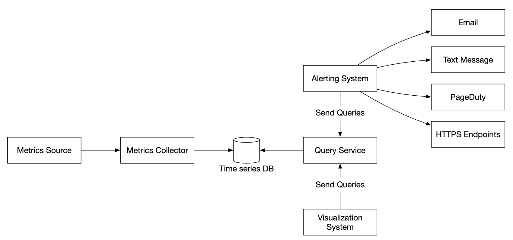
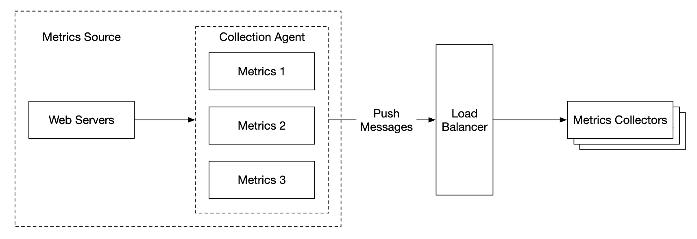

# 第 20 章：指标监控与告警系统 (Metrics Monitoring and Alerting System)

## 简介
本章重点是设计一个高度可扩展的**指标监控与告警系统 (metrics monitoring and alerting system)**，这对保障高可用性和可靠性至关重要。

---

## 第一步：理解问题并明确设计范围
指标监控系统可以指很多不同的东西——例如，当面试官只对基础设施指标感兴趣时，你不想去设计一个日志聚合系统。

先尝试理解问题：
 - C: 我们为谁构建这个系统？为大科技公司的内部监控系统，还是像 DataDog 那样的 SaaS？
 - I: 只供内部使用。
 - C: 想采集哪些指标？
 - I: 运维系统指标——CPU 负载、内存、磁盘空间。还有高级指标如每秒请求数。业务指标不在范围内。
 - C: 被监控的基础设施规模有多大？
 - I: 1 亿日活跃用户，1000 个服务器池，每池 100 台机器
 - C: 数据保留多久？
 - I: 假设保留 1 年。
 - C: 长期存储可以降低指标数据的分辨率吗？
 - I: 新收到的指标保留 7 天。接下来 30 天汇总成 1 分钟分辨率。30 天之后再汇总成 1 小时分辨率。
 - C: 支持哪些告警渠道？
 - I: 邮件、电话、PagerDuty 或 webhook。
 - C: 需要收集错误日志、访问日志这类日志吗？
 - I: 不需要
 - C: 需要支持分布式系统链路追踪吗？
 - I: 不需要

### **高层需求与假设**
被监控的基础设施是大规模的：
 - 1 亿 DAU
 - 1000 个服务器池 * 100 台机器 * 每台机器约 100 个指标 -> 约 1000 万个指标
 - 数据保留 1 年
 - 数据保留策略——原始数据 7 天，1 分钟分辨率 30 天，1 小时分辨率 1 年

可以监控的各类指标：
 - CPU 负载
 - 请求数
 - 内存使用
 - 消息队列中的消息数

### **非功能需求**
 - **可扩展性 (Scalability)**：系统应可扩展，容纳更多指标和告警
 - **低延迟**：仪表盘和告警的查询延迟要低
 - **可靠性 (Reliability)**：系统应高度可靠，避免漏掉关键告警
 - **灵活性 (Flexibility)**：系统应能方便地接入未来的新技术

哪些需求不在范围内？
 - **日志监控**：ELK 技术栈在这类场景非常流行
 - **分布式系统链路追踪**：指收集一个请求在系统内流经多个服务的生命周期数据

---

## 第二步：提出高层设计并达成共识

### **基础知识**
指标监控与告警系统有五个核心组件：

<div style="margin-left:3rem">
    
</div>

 - **数据采集**：从不同来源采集指标数据
 - **数据传输**：把数据从来源传输到指标监控系统
 - **数据存储**：组织并存储流入的数据
 - **告警**：分析流入数据，检测异常并生成告警
 - **可视化**：用图表等形式呈现数据

### **数据模型**
指标数据通常记录为时间序列 (time-series)，包含一组带时间戳的值。
序列可以通过名称和一组可选标签来标识。

示例 1——生产服务器实例 i631 在 20:00 的 CPU 负载是多少？

<div style="margin-left:3rem">
    
</div>

数据可以用下表标识：

<div style="margin-left:3rem">
    
</div>

时间序列由指标名、标签，以及某个特定时间点的单个数据点标识。

示例 2——us-west 区域所有 Web 服务器过去 10 分钟的平均 CPU 负载是多少？

```
CPU.load host=webserver01,region=us-west 1613707265 50

CPU.load host=webserver01,region=us-west 1613707265 62

CPU.load host=webserver02,region=us-west 1613707265 43

CPU.load host=webserver02,region=us-west 1613707265 53

...

CPU.load host=webserver01,region=us-west 1613707265 76

CPU.load host=webserver01,region=us-west 1613707265 83
```

这是我们从存储中拉取来回答该问题的数据示例。
平均 CPU 负载可以通过对各行最后一列的值求平均得出。

上面展示的格式称为行协议 (line protocol)，被市面上很多流行的监控软件使用——例如 Prometheus、OpenTSDB。

每条时间序列的构成：

<div style="margin-left:3rem">
    
</div>

一种直观的数据样子：

<div style="margin-left:3rem">
    
</div>

 - x 轴是时间
 - y 轴是查询的维度——例如指标名、标签等

数据访问模式是写密集、读突发型：我们采集大量指标，但它们不常被访问，只是在例如发生故障时突发访问。

数据存储系统是这个设计的核心。
 - 不推荐用通用数据库来解决这个问题，虽然经过专家级调优也能达到不错的规模。
 - 理论上可以用 NoSQL 数据库，但很难设计出可扩展的模式来高效存储和查询时间序列数据。

有很多专门为存储时间序列数据打造的数据库。其中很多支持自定义查询接口，可以高效查询时间序列数据。
 - OpenTSDB 是分布式时间序列数据库，但它基于 Hadoop 和 HBase。如果没有现成的基础设施，用它会很困难。
 - Twitter 用 MetricsDB，Amazon 提供 Timestream。
 - 最流行的两个时间序列数据库是 InfluxDB 和 Prometheus。
 - 它们专为存储海量时间序列数据设计，都基于内存缓存 + 磁盘存储。

InfluxDB 的规模示例——8 核 32GB 内存的配置下，每秒写入超过 25 万次：

<div style="margin-left:3rem">
    
</div>

不要求你理解指标数据库的内部原理，因为这是小众知识。只有简历上写过才可能被问到。

面试中，理解指标是时间序列数据、知道 InfluxDB 这样的流行时间序列数据库就足够了。

时间序列数据库的一个优点是能按标签高效聚合和分析海量时间序列数据。
例如 InfluxDB 会为每个标签建索引。

但关键是要保持标签的基数 (cardinality) 低——即不要用太多不同的标签。

### **高层设计**

<div style="margin-left:3rem">
    
</div>

 - **指标来源**：可以是应用服务器、SQL 数据库、消息队列等。
 - **指标采集器**：采集指标数据并写入时间序列数据库
 - **时间序列数据库**：以时间序列形式存储指标。提供自定义查询接口来分析海量指标。
 - **查询服务**：方便从时间序列数据库查询和取数。如果数据库接口足够强大，可以完全用它替代。
 - **告警系统**：向各种告警目标发送告警通知。
 - **可视化系统**：以图表形式展示指标。

---

## 第三步：深入设计
深入探讨系统中几个更有意思的部分。

### **指标采集**
指标采集允许偶尔的数据丢失。客户端“发送后不管 (fire and forget)”是可以接受的。

<div style="margin-left:3rem">
    
</div>

指标采集有两种实现方式——拉 (pull) 或推 (push)。

拉模型大概长这样：

<div style="margin-left:3rem">
    
</div>

这个方案中，指标采集器需要维护一份最新的服务和指标端点列表。
可以用 ZooKeeper 或 etcd 做服务发现。

服务发现包含关于何时何地采集指标的配置规则：

<div style="margin-left:3rem">
    
</div>

指标采集流程详解：

<div style="margin-left:3rem">
    
</div>

 - 指标采集器从服务发现获取配置元数据，包括拉取间隔、IP 地址、超时和重试参数。
 - 指标采集器通过预定义的 HTTP 端点（例如 `/metrics`）拉取指标数据。通常由客户端库完成。
 - 或者，指标采集器可以在服务发现上注册变更事件通知，服务端口变化时收到通知。
 - 另一个选择是指标采集器定期轮询指标端点配置的变化。

在我们的规模下，一个指标采集器不够。必须有多个实例。
但它们之间也需要某种同步，避免两个采集器重复采集同一份指标。

一种方案是把采集器和服务器放到一致性哈希环上，每个采集器只关联一组服务器：

<div style="margin-left:3rem">
    
</div>

推模型中，服务主动把指标推送给指标采集器：

<div style="margin-left:3rem">
    
</div>

这种方式下，通常在服务实例旁安装一个采集代理。
代理从服务器采集指标并推送给指标采集器。

<div style="margin-left:3rem">
    
</div>

这种模型下，可以在发送给采集器之前先聚合指标，减少采集器处理的数据量。

反过来，指标采集器在扛不住负载时可以拒绝推送请求。
因此，把采集器放在负载均衡器后面的自动扩缩容组里很重要。

那么哪种更好？两种方式各有权衡，不同系统用不同方式：
 - Prometheus 用拉架构
 - Amazon CloudWatch 和 Graphite 用推架构

推和拉的主要区别：
|                                        | 拉 (Pull)                                                                                                                                                                                                    | 推 (Push)                                                                                                                                                                                                                                    |
|----------------------------------------|---------------------------------------------------------------------------------------------------------------------------------------------------------------------------------------------------------|-----------------------------------------------------------------------------------------------------------------------------------------------------------------------------------------------------------------------------------------|
| 调试方便 | 应用服务器上用于拉取指标的 /metrics 端点可以随时查看指标。甚至可以在你的笔记本上看。拉胜出。                                          | 如果指标采集器收不到指标，问题可能是网络引起的。                                                                                                                                        |
| 健康检查 | 如果应用服务器不响应拉取，可以快速判断应用服务器是否挂了。拉胜出。                                                                           | 如果指标采集器收不到指标，问题可能是网络引起的。                                                                                                                                        |
| 短时任务 |                                                                                                                                                                                                         | 有些批处理任务生命周期很短，来不及被拉取。推胜出。可以在拉模型中引入推送网关来解决 [22]。                                                                 |
| 防火墙或复杂网络 | 让服务器拉取指标要求所有指标端点都可达。这在多数据中心场景可能有问题，可能需要更复杂的网络基础设施。 | 如果指标采集器配了负载均衡器和自动扩缩容组，就可以从任何地方接收数据。推胜出。                                                                                             |
| 性能 | 拉方法通常用 TCP。                                                                                                                                                                         | 推方法通常用 UDP。这意味着推方法的指标传输延迟更低。反方观点是，建立 TCP 连接的开销相比发送指标载荷很小。 |
| 数据真实性 | 要采集指标的应用服务器预先定义在配置文件里。从这些服务器采集的指标保证真实。                                                 | 任何客户端都能向指标采集器推送指标。可以通过白名单限制接受哪些服务器的指标，或要求认证来解决。                                                                   |

没有明确的赢家。大公司可能需要两种都支持。也可能根本装不上推送代理。

### **扩展指标传输流水线**

<div style="margin-left:3rem">
    
</div>

无论用推模型还是拉模型，指标采集器都部署在自动扩缩容组里。

但如果时间序列数据库挂了，仍可能丢数据。为了缓解，可以引入排队机制：

<div style="margin-left:3rem">
    
</div>

 - 指标采集器把指标数据推入 Kafka
 - 消费者或 Apache Storm、Flink、Spark 等流处理服务处理数据并推入时间序列数据库

这个方案有几个优点：
 - Kafka 用作高可靠、可扩展的分布式消息平台
 - 它把数据采集和数据处理解耦
 - 把数据保留在 Kafka 里可以防止数据丢失

Kafka 可以按指标名配置一个分区，这样消费者可以按指标名聚合数据。
要扩展，可以按标签进一步分区，并对指标分类、确定优先采集顺序。

<div style="margin-left:3rem">
    
</div>

用 Kafka 解决这个问题的主要缺点是运维负担。
替代方案是用 [Gorilla](https://www.vldb.org/pvldb/vol8/p1816-teller.pdf) 这样的大规模写入系统。
可以说，用它做排队和用 Kafka 一样可扩展。

### **聚合可以在哪里发生**
指标可以在多个地方聚合。不同选择各有权衡：
 - **采集代理**：客户端采集代理只支持简单的聚合逻辑。例如攒 1 分钟的计数器再发给指标采集器。
 - **写入流水线**：要在写入数据库前聚合，需要 Flink 这样的流处理引擎。这减少了写入量，但会丢失数据精度，因为原始数据没存。
 - **查询侧**：可以在可视化系统跑查询时聚合。没有数据丢失，但查询可能因为大量数据处理而变慢。

### **查询服务**
查询服务与时间序列数据库分离，把可视化和告警系统与数据库解耦，这样可以随意更换数据库而不影响客户端。

可以在这里加一层缓存，减轻时间序列数据库的负载：

<div style="margin-left:3rem">
    
</div>

也可以完全不加查询服务，因为大多数可视化和告警系统都有强大的插件，能与大多数时间序列数据库集成。
选好时间序列数据库的话，可能也不需要自己加缓存层。

大多数时间序列数据库不支持 SQL，纯粹是因为 SQL 不适合查时间序列数据。下面是用 SQL 计算指数移动平均的例子：

```
select id,
       temp,
       avg(temp) over (partition by group_nr order by time_read) as rolling_avg
from (
  select id,
         temp,
         time_read,
         interval_group,
         id - row_number() over (partition by interval_group order by time_read) as group_nr
  from (
    select id,
    time_read,
    "epoch"::timestamp + "900 seconds"::interval * (extract(epoch from time_read)::int4 / 900) as interval_group,
    temp
    from readings
  ) t1
) t2
order by time_read;
```

同样查询用 Flux（InfluxDB 的查询语言）：

```
from(db:"telegraf")
  |> range(start:-1h)
  |> filter(fn: (r) => r._measurement == "foo")
  |> exponentialMovingAverage(size:-10s)
```

### **存储层**
谨慎选择时间序列数据库很重要。

根据 Facebook 公布的研究，约 85% 对运维存储的查询针对的是过去 26 小时的数据。

如果选用的数据库能利用这个特性，对系统性能影响显著。InfluxDB 就是这样的选择之一。

无论选哪个数据库，都可以用一些优化。

数据编码和压缩能显著减小数据体量。好的时间序列数据库通常内置了这些功能。

<div style="margin-left:3rem">
    
</div>

上例中，不用存储完整时间戳，只需存储时间戳的差值。

另一个可用技术是降采样 (down-sampling)——把高分辨率数据转成低分辨率，减少磁盘占用。

可以对老数据降采样，规则可由数据科学家配置，例如：
 - 7 天——不降采样
 - 30 天——降采样到 1 分钟
 - 1 年——降采样到 1 小时

例如，下面是 10 秒分辨率的指标表：
| metric | timestamp            | hostname | Metric_value |
|--------|----------------------|----------|--------------|
| cpu    | 2021-10-24T19:00:00Z | host-a   | 10           |
| cpu    | 2021-10-24T19:00:10Z | host-a   | 16           |
| cpu    | 2021-10-24T19:00:20Z | host-a   | 20           |
| cpu    | 2021-10-24T19:00:30Z | host-a   | 30           |
| cpu    | 2021-10-24T19:00:40Z | host-a   | 20           |
| cpu    | 2021-10-24T19:00:50Z | host-a   | 30           |

降采样到 30 秒分辨率：
| metric | timestamp            | hostname | Metric_value (avg) |
|--------|----------------------|----------|--------------------|
| cpu    | 2021-10-24T19:00:00Z | host-a   | 19                 |
| cpu    | 2021-10-24T19:00:30Z | host-a   | 25                 |

最后，对不再使用的老数据还可以用冷存储。冷存储的成本低得多。

### **告警系统**

<div style="margin-left:3rem">
    
</div>

配置加载到缓存服务器。规则通常用 YAML 格式定义。示例如下：

```
- name: instance_down
  rules:

  # Alert for any instance that is unreachable for >5 minutes.
  - alert: instance_down
    expr: up == 0
    for: 5m
    labels:
      severity: page
```

告警管理器从缓存拉取告警配置。根据配置规则，它还按预定义间隔调用查询服务。
如果某条规则命中，就生成一个告警事件。

告警管理器的其他职责：
 - 过滤、合并和去重告警。例如某实例的告警被多次触发，只生成一个告警事件。
 - 访问控制——把告警管理操作限制在特定人员很重要
 - 重试——管理器保证告警至少被传播一次。

告警存储是像 Cassandra 这样的键值数据库，保存所有告警的状态。它保证通知至少发送一次。
告警触发后，发布到 Kafka。

最后，告警消费者从 Kafka 拉取告警数据，通过不同渠道发送通知——邮件、短信、PagerDuty、webhook。

现实中，告警系统有很多现成方案。在内部自建一套很难说得通。

### **可视化系统**
可视化系统展示一段时间内的指标和告警。下面是用 Grafana 做的仪表盘：

<div style="margin-left:3rem">
    
</div>

高质量的可视化系统很难自建。没有理由不用 Grafana 这样的现成方案。

---

## 第四步：总结
这是我们的最终设计：

<div style="margin-left:3rem">
    
</div>
