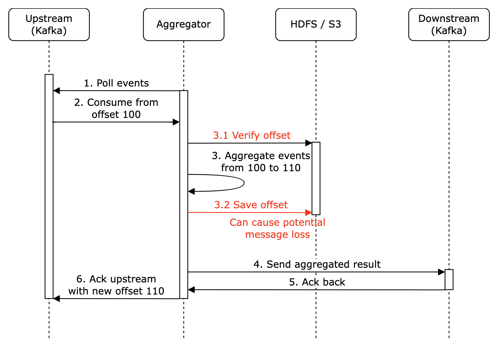
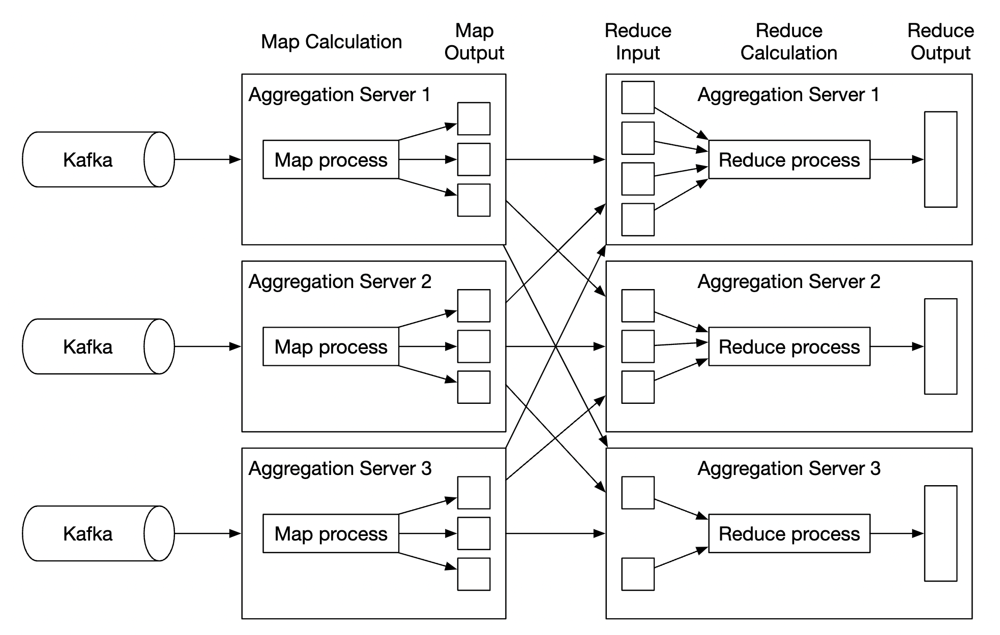
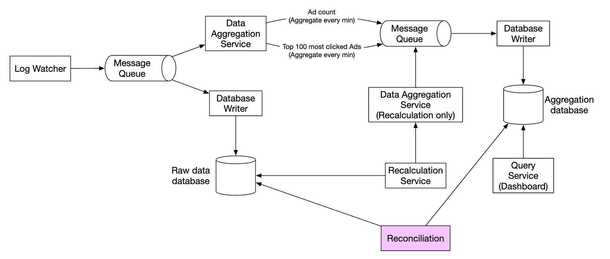

# 第 21 章：广告点击事件聚合 (Ad Click Event Aggregation)

## 简介
**数字广告 (Digital advertising)** 是一个巨大的产业，伴随着 Facebook、YouTube、TikTok 等平台的崛起。

因此，追踪广告点击事件非常重要。在本章中，我们将探讨如何设计一个 Facebook/Google 量级的**广告点击事件聚合 (ad click event aggregation)** 系统。

数字广告有一个称为**实时竞价 (real-time bidding, RTB)** 的流程，数字广告库存在此过程中被买卖：

<div style="margin-left:3rem">
    
</div>

RTB 的速度很重要，因为它通常在一秒钟内完成。
数据的准确性也非常重要，因为它会影响广告主支付的金额。

基于广告点击事件聚合结果，广告主可以做出决策，例如调整目标受众和关键词。

---

## 第一步：理解问题并确定设计范围
 - C：输入数据的格式是什么？
 - I：每天 10 亿次广告点击，广告总数 200 万。广告点击事件数量年增长 30%。
 - C：系统需要支持的最重要的查询有哪些？
 - I：需要考虑的核心查询：
   - 返回广告 X 在过去 Y 分钟内的点击事件数
   - 返回过去 1 分钟内点击量最高的 100 个广告。两个参数都应可配置。聚合每分钟进行一次。
   - 上述查询支持按 `ip`、`user_id`、`country` 进行数据过滤
 - C：需要担心边界情况吗？我能想到的有：
   - 可能有比预期更晚到达的事件
   - 可能有重复事件
   - 系统的不同部分可能宕机，因此需要考虑系统恢复
 - I：这个列表很好，都考虑进去
 - C：延迟要求是什么？
 - I：广告点击聚合的端到端延迟为几分钟。对于 RTB，延迟小于一秒。广告点击聚合有这样的延迟是可以接受的，因为它们通常用于计费和报表。

### **功能需求**
 - 聚合 `ad_id` 在过去 Y 分钟内的点击数
 - 每分钟返回点击量最高的 100 个 `ad_id`
 - 支持按不同属性进行聚合过滤
 - 数据量为 Facebook 或 Google 量级

### **非功能需求**
 - 聚合结果的正确性很重要，因为它用于 RTB 和广告计费
 - 正确处理延迟或重复的事件
 - 健壮性——系统应能容忍部分故障
 - 延迟——端到端延迟最多几分钟

### **粗略估算**
 - 10 亿日活用户 (DAU)
 - 假设每位用户每天点击 1 次广告 -> 每天 10 亿次广告点击
 - 广告点击 QPS = 10,000
 - 峰值 QPS 为平均值的 5 倍 = 50,000
 - 单次广告点击占用 0.1KB 存储。每日存储需求为 100gb
 - 每月存储 = 3tb

---

## 第二步：提出高层设计并达成一致
在本节中，我们讨论查询 API 设计、数据模型和高层设计。

### **查询 API 设计**
API 是客户端与服务器之间的契约。在我们的场景中，客户端是仪表盘用户——数据科学家/分析师、广告主等。

以下是我们的功能需求：
 - 聚合 `ad_id` 在过去 Y 分钟内的点击数
 - 返回过去 M 分钟内点击量最高的 N 个 `ad_id`
 - 支持按不同属性进行聚合过滤

我们需要两个端点来实现这些需求。过滤可以通过其中一个端点的查询参数完成。

**聚合 ad_id 在过去 M 分钟内的点击数**：

```
GET /v1/ads/{:ad_id}/aggregated_count
```

查询参数：
 - from - 起始分钟。默认为 now - 1 min
 - to - 结束分钟。默认为 now
 - filter - 不同过滤策略的标识符。例如 001 表示"非美国点击"。

响应：
 - ad_id - 广告标识符
 - count - 起始与结束分钟之间的聚合计数

**返回过去 M 分钟内点击量最高的 N 个 ad_id**

```
GET /v1/ads/popular_ads
```

查询参数：
 - count - 点击量最高的 N 个广告
 - window - 聚合窗口大小（分钟）
 - filter - 不同过滤策略的标识符

响应：
 - ad_id 列表

### **数据模型**
在我们的系统中，有原始数据和聚合数据。

原始数据如下所示：

```
[AdClickEvent] ad001, 2021-01-01 00:00:01, user 1, 207.148.22.22, USA
```

以下是结构化格式的示例：
| ad_id | click_timestamp     | user  | ip            | country |
|-------|---------------------|-------|---------------|---------|
| ad001 | 2021-01-01 00:00:01 | user1 | 207.148.22.22 | USA     |
| ad001 | 2021-01-01 00:00:02 | user1 | 207.148.22.22 | USA     |
| ad002 | 2021-01-01 00:00:02 | user2 | 209.153.56.11 | USA     |

以下是聚合后的版本：
| ad_id | click_minute | filter_id | count |
|-------|--------------|-----------|-------|
| ad001 | 202101010000 | 0012      | 2     |
| ad001 | 202101010000 | 0023      | 3     |
| ad001 | 202101010001 | 0012      | 1     |
| ad001 | 202101010001 | 0023      | 6     |

`filter_id` 帮助我们实现过滤需求。
| filter_id | region | IP        | user_id |
|-----------|--------|-----------|---------|
| 0012      | US     | *         | *       |
| 0013      | *      | 123.1.2.3 | *       |

为了支持快速返回过去 M 分钟内点击量最高的 N 个广告，我们还将维护这个结构：
| most_clicked_ads   |           |                                                  |
|--------------------|-----------|--------------------------------------------------|
| window_size        | integer   | 聚合窗口大小 (M)，单位为分钟                     |
| update_time_minute | timestamp | 上次更新的时间戳（1 分钟粒度）                   |
| most_clicked_ads   | array     | 以 JSON 格式存储的广告 ID 列表                   |

存储原始数据和存储聚合数据之间各有什么优缺点？
 - 原始数据可以使用完整数据集，支持数据过滤和重新计算
 - 另一方面，聚合数据让我们拥有更小的数据集和更快的查询
 - 原始数据意味着更大的数据存储和更慢的查询
 - 然而聚合数据是派生数据，因此会有一定的数据丢失

在我们的设计中，我们将结合使用这两种方法：
 - 保留原始数据用于调试是个好主意。如果聚合出现 bug，我们可以发现 bug 并回填。
 - 聚合数据也应存储，以获得更快的查询性能。
 - 原始数据可以存放在冷存储中，以避免额外的存储成本。

在选择数据库时，有几个因素需要考虑：
 - 数据是什么样的？是关系型、文档型还是 blob？
 - 工作负载是读多、写多，还是两者兼有？
 - 是否需要事务？
 - 查询是否依赖 SUM 和 COUNT 等 OLAP 函数？

对于原始数据，可以看到平均 QPS 为 10k，峰值 QPS 为 50k，因此系统是写多 (write-heavy) 的。
另一方面，读流量较低，因为原始数据主要用作出现问题时的备份。

关系型数据库可以胜任，但扩展写能力可能比较困难。
或者，我们可以使用 Cassandra 或 InfluxDB，它们对重写负载有更好的原生支持。

另一个选择是使用 Amazon S3 搭配 ORC、Parquet 或 AVRO 等列式数据格式。由于这种方案不太熟悉，我们将采用 Cassandra。

对于聚合数据，工作负载既是读多也是写多，因为聚合数据被仪表盘和告警不断查询。
同时它也是写多，因为聚合服务每分钟聚合数据并写入。
因此，这里我们也使用相同的数据存储（Cassandra）。

### **高层设计**
我们的系统如下所示：

<div style="margin-left:3rem">
    
</div>

数据在输入和输出两侧都作为无界数据流流动。

为了避免同步的 sink（消费者崩溃会导致整个系统停滞），
我们将利用异步处理，使用消息队列 (Kafka) 来解耦消费者和生产者。

<div style="margin-left:3rem">
    
</div>

第一个消息队列存储广告点击事件数据：
| ad_id | click_timestamp | user_id | ip | country |
|-------|-----------------|---------|----|---------|

第二个消息队列包含每分钟聚合的广告点击数：
| ad_id | click_minute | count |
|-------|--------------|-------|

以及每分钟聚合的点击量最高的 N 个广告：
| update_time_minute | most_clicked_ads |
|--------------------|------------------|

第二个消息队列的存在是为了实现端到端精确一次 (exactly-once) 原子提交语义：

<div style="margin-left:3rem">
    
</div>

对于聚合服务，使用 MapReduce 框架是一个不错的选择：

<div style="margin-left:3rem">
    
</div>

<div style="margin-left:3rem">
    
</div>

每个节点只负责一个任务，并将处理结果发送到下游节点。

Map 节点负责从数据源读取数据，然后过滤和转换数据。

例如，Map 节点可以根据 `ad_id` 将数据分配到不同的聚合节点：

<div style="margin-left:3rem">
    
</div>

或者，我们可以将广告分发到不同的 Kafka 分区，让聚合节点在消费者组内直接订阅。
然而，映射节点让我们可以在后续处理之前对数据进行清洗或转换。

另一个原因可能是我们无法控制数据的生产方式，
因此与同一个 `ad_id` 相关的事件可能进入不同的分区。

聚合节点每分钟在内存中按 `ad_id` 统计广告点击事件数。

Reduce 节点收集来自聚合节点的聚合结果，并生成最终结果：

<div style="margin-left:3rem">
    
</div>

这种 DAG 模型使用 MapReduce 范式。它处理大数据，并利用并行分布式计算将其转换为常规规模的数据。

在 DAG 模型中，中间数据存储在内存中，不同节点之间使用 TCP 或共享内存通信。

让我们看看这种模型如何帮助我们实现各种用例。

**用例 1 - 聚合点击数**：

<div style="margin-left:3rem">
    
</div>

 - 广告使用 `ad_id % 3` 进行分区

**用例 2 - 返回点击量最高的 N 个广告**：

<div style="margin-left:3rem">
    
</div>

 - 在这个例子中，我们聚合点击量最高的 3 个广告，但很容易扩展到 Top N
 - 每个节点维护一个堆 (heap) 数据结构，以便快速获取 Top N 广告

**用例 3 - 数据过滤**：
为了支持快速数据过滤，我们可以预定义过滤条件并基于它预先聚合：
| ad_id | click_minute | country | count |
|-------|--------------|---------|-------|
| ad001 | 202101010001 | USA     | 100   |
| ad001 | 202101010001 | GPB     | 200   |
| ad001 | 202101010001 | others  | 3000  |
| ad002 | 202101010001 | USA     | 10    |
| ad002 | 202101010001 | GPB     | 25    |
| ad002 | 202101010001 | others  | 12    |

这种技术称为**星型模式 (star schema)**，在数据仓库中被广泛使用。
过滤字段称为**维度 (dimensions)**。

这种方法有以下好处：
 - 简单易懂、易于构建
 - 当前的聚合服务可以复用，以在星型模式中创建更多维度
 - 基于过滤条件访问数据很快，因为结果是预先计算好的

这种方法的一个局限是会创建更多的桶和记录，尤其是在我们有很多过滤条件时。

---

## 第三步：深入设计
让我们更深入地探讨一些更有趣的话题。

### **流式 vs 批处理**
我们提出的高层架构是一种流处理系统。
以下是三种系统之间的比较：
|                         | 服务（在线系统）              | 批处理系统（离线系统）                     | 流处理系统（近实时系统）   |
|-------------------------|-------------------------------|--------------------------------------------|----------------------------|
| 响应性                  | 快速响应客户端                | 不需要响应客户端                           | 不需要响应客户端           |
| 输入                    | 用户请求                      | 有限大小的有界输入。数据量很大             | 输入无边界（无限流）       |
| 输出                    | 对客户端的响应                | 物化视图、聚合指标等                       | 物化视图、聚合指标等       |
| 性能度量                | 可用性、延迟                  | 吞吐量                                     | 吞吐量、延迟               |
| 示例                    | 在线购物                      | MapReduce                                  | Flink [13]                 |

在我们的设计中，我们混合使用了批处理和流处理。

我们使用流处理来处理到达的数据，并在近实时内生成聚合结果。
另一方面，我们使用批处理来备份历史数据。

同时包含批处理和流处理两条处理路径的系统，这种架构称为 lambda 架构。
一个缺点是你有两条处理路径和两套代码库需要维护。

Kappa 架构是一种替代方案，它将批处理和流处理合并为一条处理路径。
其核心思想是使用单一的流处理引擎。

Lambda 架构：

<div style="margin-left:3rem">
    
</div>

Kappa 架构：

<div style="margin-left:3rem">
    
</div>

我们的高层设计使用 Kappa 架构，因为历史数据的重处理也经过聚合服务。

每当由于例如聚合逻辑的重大 bug 而需要重新计算聚合数据时，我们可以从存储的原始数据重新计算聚合。
 - 重计算服务从原始存储中检索数据。这是一个批处理作业。
 - 检索到的数据被发送到专用的聚合服务，以免影响实时处理的聚合服务。
 - 聚合结果被发送到第二个消息队列，然后我们更新聚合数据库中的结果。

<div style="margin-left:3rem">
    
</div>

### **时间**
我们需要一个时间戳来执行聚合。它可以在两个地方生成：
 - 事件时间 (event time) - 广告点击发生的时间
 - 处理时间 (processing time) - 服务器处理事件时的系统时间

由于使用了异步处理（消息队列）和网络延迟，事件时间和处理时间之间可能存在显著差异。
 - 如果使用处理时间，聚合结果可能不准确
 - 如果使用事件时间，我们必须处理延迟事件

没有完美的解决方案，我们需要权衡：
|                 | 优点               | 缺点                                                 |
|-----------------|--------------------|------------------------------------------------------|
| 事件时间        | 聚合结果更准确     | 客户端的时间可能错误，或者时间戳可能由恶意用户生成   |
| 处理时间        | 服务器时间戳更可靠 | 如果事件迟到，时间戳就不准确                         |

由于数据准确性很重要，我们将使用事件时间进行聚合。

为了缓解延迟事件的问题，可以利用一种称为"水位线 (watermark)" 的技术。

在下面的示例中，事件 2 错过了它需要被聚合的窗口：

<div style="margin-left:3rem">
    
</div>

然而，如果我们有意延长聚合窗口，就可以降低错过事件的可能性。
窗口被延长的部分称为"水位线"：

<div style="margin-left:3rem">
    
</div>

 - 短水位线增加了错过事件的可能性，但降低了延迟
 - 长水位线降低了错过事件的可能性，但增加了延迟

无论水位线有多大，总有可能错过事件。但为这种低概率事件进行优化没有意义。

我们可以在每天结束时进行对账来解决这种不一致。

### **聚合窗口**
有四种窗口函数：
 - 翻滚（固定）窗口 (Tumbling (fixed) window)
 - 跳跃窗口 (Hopping window)
 - 滑动窗口 (Sliding window)
 - 会话窗口 (Session window)

在我们的设计中，我们对广告点击聚合使用翻滚窗口：

<div style="margin-left:3rem">
    
</div>

对过去 M 分钟内点击量最高的 N 个广告的聚合使用滑动窗口：

<div style="margin-left:3rem">
    
</div>

### **投递保证**
由于我们聚合的数据将用于计费，数据准确性是首要任务。

因此，我们需要讨论：
 - 如何避免处理重复事件
 - 如何确保所有事件都被处理

有三种投递保证可供使用——最多一次 (at-most-once)、至少一次 (at-least-once) 和精确一次 (exactly once)。

在大多数情况下，当少量重复可接受时，至少一次就足够了。
但我们的系统不是这种情况，因为几个百分点的差异就可能导致数百万美元的差错。
因此，我们需要使用精确一次投递语义。

### **数据去重**
最常见的数据质量问题之一是数据重复。

它可能来自多种来源：
 - 客户端——客户端可能多次重发同一事件。带有恶意意图的重复事件最好由风控引擎处理。
 - 服务器宕机——聚合服务节点在聚合中途宕机，上游服务未收到确认，因此事件被重发。

以下是由于最后一跳事件确认失败而导致数据重复的示例：

<div style="margin-left:3rem">
    
</div>

在此示例中，offset 100 将被多次处理并发送到下游。

一种缓解方法是尝试将最后看到的 offset 存储在 HDFS/S3 中，但这可能导致结果永远无法到达下游：

<div style="margin-left:3rem">
    
</div>

最后，我们可以在与下游交互时原子地存储 offset。要实现这一点，我们需要实现一个分布式事务：

<div style="margin-left:3rem">
    
</div>

**个人备注**：或者，如果下游系统以幂等 (idempotently) 的方式处理聚合结果，就不需要分布式事务了。

### **扩展系统**
让我们讨论如何随着系统增长而扩展它。

我们有三个独立组件——消息队列、聚合服务和数据库。
由于它们是解耦的，我们可以独立扩展它们。

如何扩展消息队列：
 - 我们不对生产者设限，因此可以轻松扩展
 - 可以通过将消费者分配到消费者组并增加消费者数量来扩展消费者
 - 要实现这一点，我们还需要确保预先创建了足够的分区
 - 此外，当有数千个消费者时，消费者重平衡可能需要一段时间，因此建议在非高峰时段进行
 - 我们也可以考虑按地理区域划分主题，例如 `topic_na`、`topic_eu` 等

<div style="margin-left:3rem">
    
</div>

如何扩展聚合服务：

<div style="margin-left:3rem">
    
</div>

 - Map-Reduce 节点可以通过增加节点轻松扩展
 - 聚合服务的吞吐量可以通过多线程来扩展
 - 或者，我们可以利用 Apache YARN 等资源提供者来实现多进程
 - 方案 1 更简单，但方案 2 在实践中更常用，因为它更具可扩展性
 - 以下是多线程示例：

<div style="margin-left:3rem">
    
</div>

如何扩展数据库：
 - 如果使用 Cassandra，它通过一致性哈希原生支持水平扩展
 - 如果向集群添加新节点，数据会自动在所有（虚拟）节点间重新平衡
 - 采用这种方法，无需手动（重新）分片

<div style="margin-left:3rem">
    
</div>

另一个需要考虑的可扩展性问题是热点问题——如果某个广告更受欢迎并获得更多关注怎么办？

<div style="margin-left:3rem">
    
</div>

 - 在上面的示例中，聚合服务节点可以通过资源管理器申请额外资源
 - 资源管理器分配更多资源，因此原始节点不会过载
 - 原始节点将事件分成 3 组，每个聚合节点处理 100 个事件
 - 结果写回原始聚合节点

处理热点问题的其他更复杂方法：
 - 全局-局部聚合 (Global-Local Aggregation)
 - 分离去重聚合 (Split Distinct Aggregation)

### **容错**
在聚合节点内，我们在内存中处理数据。如果节点宕机，处理过的数据会丢失。

我们可以利用 Kafka 中的消费者 offset，在另一个节点接管后从上次中断的地方继续。
然而，由于我们在聚合过去 M 分钟内点击量最高的 N 个广告，还需要维护一些额外的中间状态。

我们可以在特定分钟为正在进行的聚合制作快照：

<div style="margin-left:3rem">
    
</div>

如果节点宕机，新节点可以读取最新提交的消费者 offset 以及最新快照来继续任务：

<div style="margin-left:3rem">
    
</div>

### **数据监控与正确性**
由于我们聚合的数据非常关键，用于计费，因此必须有严格的监控来确保正确性。

我们可能想监控的一些指标：
 - **延迟**：可以追踪不同事件的时间戳，以了解系统的端到端延迟
 - **消息队列大小**：如果队列大小突然增加，需要添加更多聚合节点。由于 Kafka 通过分布式提交日志实现，我们需要跟踪 records-lag 指标
 - **聚合节点上的系统资源**：CPU、磁盘、JVM 等

我们还需要实现一个对账流程，它是一个在每天结束时运行的批处理作业。
它从原始数据计算聚合结果，并与聚合数据库中存储的实际数据进行比较：

<div style="margin-left:3rem">
    
</div>

### **替代设计**
在通用系统设计面试中，不要求你了解大数据处理中专用软件的内部机制。

解释思考过程并讨论权衡，比了解具体工具更重要，这也是本章涵盖通用解决方案的原因。

一种利用现成工具的替代设计是将广告点击数据存储在 Hive 中，并在其上构建 ElasticSearch 层以实现更快的查询。

聚合通常在 ClickHouse 或 Druid 等 OLAP 数据库中完成。

<div style="margin-left:3rem">
    
</div>

---

## 第四步：总结
我们涵盖的内容：
 - 数据模型和 API 设计
 - 使用 MapReduce 聚合广告点击事件
 - 扩展消息队列、聚合服务和数据库
 - 缓解热点问题
 - 持续监控系统
 - 使用对账确保正确性
 - 容错

广告点击事件聚合是典型的大数据处理系统。

如果你有相关技术的先验知识，理解和设计它会更容易：
 - Apache Kafka
 - Apache Spark
 - Apache Flink
