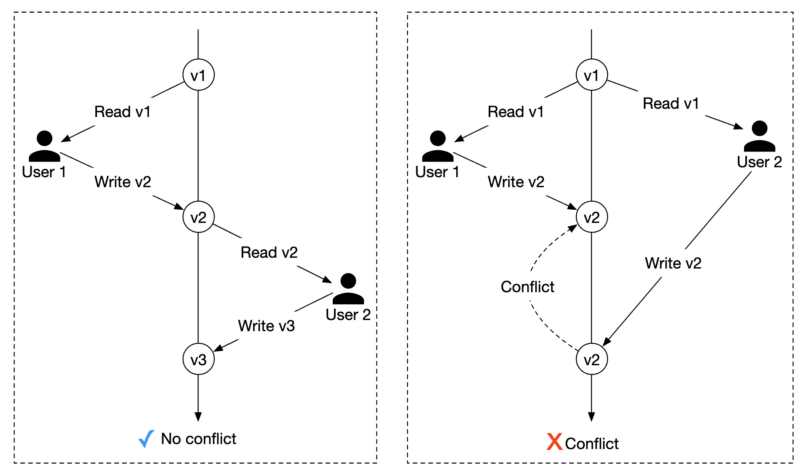

# 第 22 章：酒店预订系统 (Hotel Reservation System)

## 简介
在本章中，我们将设计一个**酒店预订系统 (hotel reservation system)**，类似于万豪国际 (Marriott International)。

也适用于其他类型的系统——Airbnb、航班预订、电影票预订。

---

## 第一步：理解问题并确定设计范围
在深入设计系统之前，我们应该向面试官提问以明确范围：
 - C：系统的规模是多大？
 - I：我们为一个拥有 5000 家酒店和 100 万间客房的酒店连锁打造网站
 - C：客户是预订时付款，还是到达酒店时付款？
 - I：预订时全额付款。
 - C：客户只能通过网站预订酒店客房吗？是否需要支持电话等其他预订方式？
 - I：只能通过网站或 App 预订。
 - C：客户可以取消预订吗？
 - I：可以
 - C：还有其他需要考虑的吗？
 - I：有，我们允许 10% 的超售。酒店会出售比实际更多的房间。酒店这么做是因为预计客户会取消预订。
 - C：由于时间不多，我们将聚焦于——展示酒店相关页面、酒店客房详情页、预订客房、管理后台、支持超售。
 - I：听起来不错。
 - I：还有一件事——酒店价格一直在变。假设酒店客房价格每天变化。
 - C：好的。

### **非功能需求**
 - 支持高并发——在旺季可能有很多客户同时尝试预订同一家酒店。
 - 中等延迟——用户预订时理想情况是低延迟，但系统花几秒钟处理也是可以接受的。

### **粗略估算**
 - 共 5000 家酒店，100 万间客房
 - 假设 70% 的客房被占用，平均入住时长为 3 天
 - 预计每日预订量 - 1mil * 0.7 / 3 = 每天约 240k 预订
 - 每秒预订量 - 240k / 10^5（一日秒数）= ~3。平均预订 TPS 很低。

让我们估算 QPS。如果假设到达预订页有三个步骤，且每个页面的转化率为 10%，
我们可以估算：如果有 3 个预订，那么预订页的浏览量一定有 30 次，酒店客房详情页的浏览量有 300 次。

<div style="margin-left:3rem">
    
</div>

---

## 第二步：提出高层设计并达成一致
我们将探讨——API 设计、数据模型、高层设计。

### **API 设计**
该 API 设计聚焦于支持酒店预订系统所需的核心端点（遵循 RESTful 实践）。

一个完整的系统需要更丰富的 API，支持基于多种条件的客房搜索，但我们不会在本节聚焦于此。
原因是它们在技术上没有挑战性，所以不在范围内。

**酒店相关 API**
 - `GET /v1/hotels/{id}` - 获取酒店的详细信息
 - `POST /v1/hotels` - 新增酒店。仅限运维使用
 - `PUT /v1/hotels/{id}` - 更新酒店信息。仅限运维使用
 - `DELETE /v1/hotels/{id}` - 删除酒店。该 API 仅限运维使用

**客房相关 API**
 - `GET /v1/hotels/{id}/rooms/{id}` - 获取客房的详细信息
 - `POST /v1/hotels/{id}/rooms` - 新增客房。仅限运维使用
 - `PUT /v1/hotels/{id}/rooms/{id}` - 更新客房信息。仅限运维使用
 - `DELETE /v1/hotels/{id}/rooms/{id}` - 删除客房。仅限运维使用

**预订相关 API**
 - `GET /v1/reservations` - 获取当前用户的预订历史
 - `GET /v1/reservations/{id}` - 获取预订的详细信息
 - `POST /v1/reservations` - 新建预订
 - `DELETE /v1/reservations/{id}` - 取消预订

以下是发起预订的请求示例：

```
{
  "startDate":"2021-04-28",
  "endDate":"2021-04-30",
  "hotelID":"245",
  "roomID":"U12354673389",
  "reservationID":"13422445"
}
```

注意，`reservationID` 是用于避免重复预订的幂等键。细节在[并发问题章节](#concurrency-issues)中说明。

### **数据模型**
在选择使用哪种数据库之前，让我们先考虑访问模式。

我们需要支持以下查询：
 - 查看酒店的详细信息
 - 给定日期范围查找可用房型
 - 记录预订
 - 查找预订或历史预订记录

根据估算，我们知道系统规模不大，但需要为流量突增做好准备。

基于这些认识，我们将选择关系型数据库，因为：
 - 关系型数据库擅长处理读多写少的系统。
 - NoSQL 数据库通常为写入优化，但我们知道写入不会太多，因为只有一小部分访问网站的用户会下单预订。
 - 关系型数据库提供 ACID 保证。这对这类系统很重要，没有它们，我们无法防止负余额、重复扣款等问题。
 - 关系型数据库可以轻松建模数据，因为结构非常清晰。

以下是我们的 Schema 设计：

<div style="margin-left:3rem">
    
</div>

大多数字段都是自解释的。唯一值得一提的是 `status` 字段，它表示给定房间的状态机：

<div style="margin-left:3rem">
    
</div>

这个数据模型适用于 Airbnb 这类系统，但不适用于酒店，因为用户预订的不是具体房间，而是房型。
他们预订一种房型，房号在预订时确定。

这个不足将在[改进数据模型](#improved-data-model)一节中解决。

### **高层设计**
我们在这个设计中选择了微服务架构。近年来它大受欢迎：

<div style="margin-left:3rem">
    
</div>

 - **用户**：在手机或电脑上预订酒店客房
 - **管理员**：执行退款/取消付款等管理功能
 - **CDN**：缓存 JS 包、图片、视频等静态资源
 - **公共 API 网关**：全托管服务，支持限流、鉴权等
 - **内部 API**：仅对授权人员可见。通常由 VPN 保护。
 - **酒店服务**：提供酒店和客房的详细信息。酒店和客房数据是静态的，因此可以积极缓存。
 - **房价服务**：提供不同未来日期的房价。关于这个领域一个有趣的点是，价格取决于某天酒店的满房程度。
 - **预订服务**：接收预订请求并预订酒店客房。同时在预订/取消时跟踪客房库存。
 - **支付服务**：处理付款，成功后更新预订状态。
 - **酒店管理服务**：仅对授权人员开放。允许执行管理和查看预订、酒店等的特定管理功能。

服务间通信可以通过 RPC 框架（如 gRPC）实现。

---

## 第三步：深入设计
让我们更深入地探讨：
 - 改进的数据模型
 - 并发问题
 - 可扩展性
 - 解决微服务中的数据不一致

### **改进的数据模型**
如前一节所述，我们需要修改 API 和 Schema，以支持预订房型而非具体房间。

对于预订 API，我们不再预订 `roomID`，而是预订 `roomTypeID`：

```
POST /v1/reservations
{
  "startDate":"2021-04-28",
  "endDate":"2021-04-30",
  "hotelID":"245",
  "roomTypeID":"12354673389",
  "roomCount":"3",
  "reservationID":"13422445"
}
```

以下是更新后的 Schema：

<div style="margin-left:3rem">
    
</div>

 - **room**：包含客房信息
 - **room_type_rate**：包含给定房型的价格信息
 - **reservation**：记录客人预订数据
 - **room_type_inventory**：存储酒店客房的库存数据

让我们看一下 `room_type_inventory` 的列，因为这张表更有意思：
 - **hotel_id**：酒店 ID
 - **room_type_id**：房型 ID
 - **date**：单个日期
 - **total_inventory**：总房间数减去暂时下架的房间数
 - **total_reserved**：给定 (hotel_id, room_type_id, date) 已预订的房间总数

设计这张表还有其他方式，但为每个 (hotel_id, room_type_id, date) 保留一行，
便于预订管理和更简单的查询。

表中的行通过每日 CRON 作业预先填充。

示例数据：
| hotel_id | room_type_id | date       | total_inventory | total_reserved |
|----------|--------------|------------|-----------------|----------------|
| 211      | 1001         | 2021-06-01 | 100             | 80             |
| 211      | 1001         | 2021-06-02 | 100             | 82             |
| 211      | 1001         | 2021-06-03 | 100             | 86             |
| 211      | 1001         | ...        | ...             |                |
| 211      | 1001         | 2023-05-31 | 100             | 0              |
| 211      | 1002         | 2021-06-01 | 200             | 16             |
| 2210     | 101          | 2021-06-01 | 30              | 23             |
| 2210     | 101          | 2021-06-02 | 30              | 25             |

检查某房型可用性的示例 SQL 查询：

```
SELECT date, total_inventory, total_reserved
FROM room_type_inventory
WHERE room_type_id = ${roomTypeId} AND hotel_id = ${hotelId}
AND date between ${startDate} and ${endDate}
```

如何用这些数据检查指定数量客房的可用性（注意我们支持超售）：

```
if (total_reserved + ${numberOfRoomsToReserve}) <= 110% * total_inventory
```

现在让我们估算一下存储量。
 - 我们有 5000 家酒店。
 - 每家酒店有 20 种房型。
 - 5000 * 20 * 2（年）* 365（天）= 7300 万行

7300 万行数据并不多，单台数据库服务器就能处理。
不过，设置读副本（可能跨不同可用区）以实现高可用是有意义的。

后续问题——如果预订数据太大，单台数据库放不下，该怎么办？
 - 只存储当前和未来的预订数据。预订历史可以移到冷存储。
 - 数据库分片——我们可以用 `hash(hotel_id) % servers_cnt` 分片数据，因为查询总是按 `hotel_id` 筛选。

### **并发问题**
另一个需要解决的重要问题是重复预订。

有两个问题需要解决：
 - 同一用户点击"预订"两次
 - 多个用户同时尝试预订同一间房

以下是第一个问题的可视化：

<div style="margin-left:3rem">
    
</div>

解决这个问题有两种方法：
 - 客户端处理——前端可以在点击后禁用预订按钮。但如果用户禁用了 JavaScript，就看不到按钮变灰。
 - 幂等 API——在 API 中添加幂等键，使用户无论调用端点多少次，操作只执行一次：

<div style="margin-left:3rem">
    
</div>

这个流程的工作方式如下：
 - 当你填写资料并进行预订时，会生成一个预订单。预订单使用全局唯一标识符生成。
 - 使用上一步生成的 `reservation_id` 提交预订 1。
 - 如果第二次点击"完成预订"，会发送相同的 `reservation_id`，后端检测到这是重复预订。
 - 通过给 `reservation_id` 列添加唯一约束来避免重复，从而防止数据库中存储多条相同 ID 的记录。

<div style="margin-left:3rem">
    
</div>

如果有多个用户进行相同的预订呢？

<div style="margin-left:3rem">
    
</div>

 - 假设事务隔离级别不是可串行化
 - 用户 1 和用户 2 同时尝试预订同一间房。
 - 事务 1 检查是否有足够的房间——有
 - 事务 2 检查是否有足够的房间——有
 - 事务 2 预订房间并更新库存
 - 事务 1 也预订了房间，因为它看到的 `total_reserved` 仍是 99/100。
 - 两个事务都成功提交了更改

这个问题可以用某种锁机制解决：
 - 悲观锁
 - 乐观锁
 - 数据库约束

以下是我们用来预订房间的 SQL：

```sql
# step 1: check room inventory
SELECT date, total_inventory, total_reserved
FROM room_type_inventory
WHERE room_type_id = ${roomTypeId} AND hotel_id = ${hotelId}
AND date between ${startDate} and ${endDate}

# For every entry returned from step 1
if((total_reserved + ${numberOfRoomsToReserve}) > 110% * total_inventory) {
  Rollback
}

# step 2: reserve rooms
UPDATE room_type_inventory
SET total_reserved = total_reserved + ${numberOfRoomsToReserve}
WHERE room_type_id = ${roomTypeId}
AND date between ${startDate} and ${endDate}

Commit
```

#### 方案 1：悲观锁
悲观锁通过在记录更新期间对其加锁来防止并发更新。

在 MySQL 中可以用 `SELECT... FOR UPDATE` 查询实现，它会锁定查询选中的行，直到事务提交。

<div style="margin-left:3rem">
    
</div>

优点：
 - 防止应用更新正在被修改的数据
 - 易于实现，通过串行化更新避免冲突。在数据争用严重时很有用。

缺点：
 - 当多个资源被锁定时可能发生死锁。
 - 这种方法不可扩展——如果事务持有锁太久，会影响所有其他试图访问该资源的事务。
 - 当查询选中大量资源且事务存活时间长时，影响很严重。

作者由于其可扩展性问题，不推荐这种方法。

#### 方案 2：乐观锁
乐观锁允许多个用户同时尝试更新一条记录。

有两种常见实现方式——版本号和时间戳。推荐使用版本号，因为服务器时钟可能不准确。

<div style="margin-left:3rem">
    
</div>

 - 在数据库表中新增一列 `version`
 - 用户修改数据库行之前，先读取版本号
 - 用户更新行时，版本号加 1 并写回数据库
 - 如果新版本号没有超过旧版本号，数据库校验会阻止插入

乐观锁通常比悲观锁快，因为我们没有锁定数据库。
但当并发很高时性能会下降，因为会导致大量回滚。

优点：
 - 防止应用编辑过期数据
 - 不需要在数据库中获取锁
 - 在数据争用低（即很少发生更新冲突）时是首选方案

缺点：
 - 在数据争用高时性能较差

乐观锁是适合我们系统的好方案，因为预订 QPS 不是特别高。

#### 方案 3：数据库约束
这种方法与乐观锁非常相似，但保护机制用数据库约束实现：

```
CONSTRAINT `check_room_count` CHECK((`total_inventory - total_reserved` >= 0))
```

<div style="margin-left:3rem">
    
</div>

优点：
 - 易于实现
 - 在数据争用小时效果很好

缺点：
 - 与乐观锁类似，在数据争用高时性能较差
 - 数据库约束不像应用代码那样容易做版本控制
 - 并非所有数据库都支持约束

由于易于实现，这也是酒店预订系统的另一个好方案。

### **可扩展性**
通常，酒店预订系统的负载不高。

然而，面试官可能会问，如果系统被 booking.com 这样更大、更受欢迎的旅行网站采用，你会如何应对。
在这种情况下，QPS 可能大 1000 倍。

在这种情况下，重要的是了解瓶颈在哪里。所有服务都是无状态的，因此可以通过复制轻松扩展。

但数据库是有状态的，如何扩展它并不那么直观。

扩展方法之一是实现数据库分片——我们可以将数据拆分到多个数据库，每个数据库包含一部分数据。

我们可以基于 `hotel_id` 分片，因为所有查询都按它过滤。
假设 QPS 为 30,000，将数据库分成 16 个分片后，每个分片处理 1875 QPS，这在单个 MySQL 集群的负载能力范围内。

<div style="margin-left:3rem">
    
</div>

我们还可以通过 Redis 缓存客房库存和预订。设置 TTL，让过期日期的数据过期。

<div style="margin-left:3rem">
    
</div>

我们存储库存的方式基于 `hotel_id`、`room_type_id` 和 `date`：

```
key: hotelID_roomTypeID_{date}
value: the number of available rooms for the given hotel ID, room type ID and date.
```

数据一致性是异步发生的，通过 CDC 流式机制管理——读取数据库变更并应用到另一个系统。
Debezium 是同步数据库变更到 Redis 的流行选择。

使用这种机制，缓存和数据库有可能在一段时间内不一致。
在我们的场景中这没关系，因为数据库会阻止我们做出无效预订。

这会在 UI 上造成一些问题，因为用户需要刷新页面才能看到"没有剩余房间"，
但无论如何都可能发生这种情况，例如用户在预订前犹豫了很久。

缓存优点：
 - 降低数据库负载
 - 高性能，因为 Redis 在内存中管理数据

缓存缺点：
 - 维护缓存与数据库之间的数据一致性很难。我们需要考虑不一致对用户体验的影响。

### **服务间的数据一致性**
单体应用让我们可以使用共享关系型数据库来保证数据一致性。

在我们的微服务设计中，我们采用了混合方法：部分服务是独立的，
但预订和库存 API 由同一服务处理。

这么做是因为我们想利用关系型数据库的 ACID 保证来确保一致性。

然而，面试官可能会挑战这种方法，因为它不是纯粹的微服务架构，每个服务都有专用数据库：

<div style="margin-left:3rem">
    
</div>

这可能导致一致性问题。在单体服务器中，我们可以利用关系型数据库的事务能力来实现原子操作：

<div style="margin-left:3rem">
    
</div>

但当操作跨越多个服务时，保证这种原子性更具挑战性：

<div style="margin-left:3rem">
    
</div>

有一些知名技术可以处理这些数据不一致：
 - **两阶段提交 (Two-phase commit)**：保证跨多个节点原子提交事务的数据库协议。
   但它性能不高，因为单个节点延迟会导致所有节点阻塞该操作。
 - **Saga**：一系列本地事务，如果工作流中任何步骤失败，会触发补偿事务。这是一种最终一致性的方法。

值得注意的是，解决微服务间的数据不一致是一个难题，会提高系统复杂度。
考虑到我们采用了更务实的方法——将相互依赖的操作封装在同一个关系型数据库中，
值得思考这种代价是否值得。

---

## 第四步：总结
我们展示了酒店预订系统的设计。

我们经历的步骤：
 - 收集需求并进行粗略估算，以了解系统规模
 - 在高层设计中展示了 API 设计、数据模型和系统架构
 - 在深入设计中，随着需求变化探讨了替代的数据库 Schema 设计
 - 讨论了竞态条件并提出了方案——悲观锁/乐观锁、数据库约束
 - 通过数据库分片和缓存扩展系统的方法
 - 最后解决了跨多个微服务处理数据一致性问题的方法
