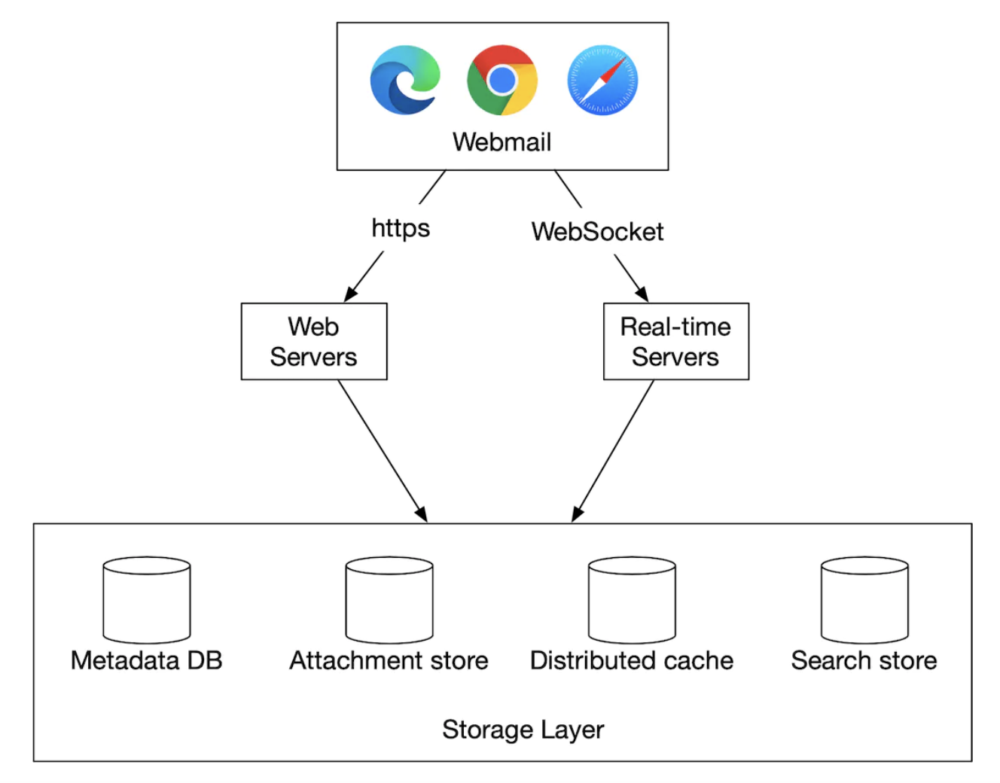
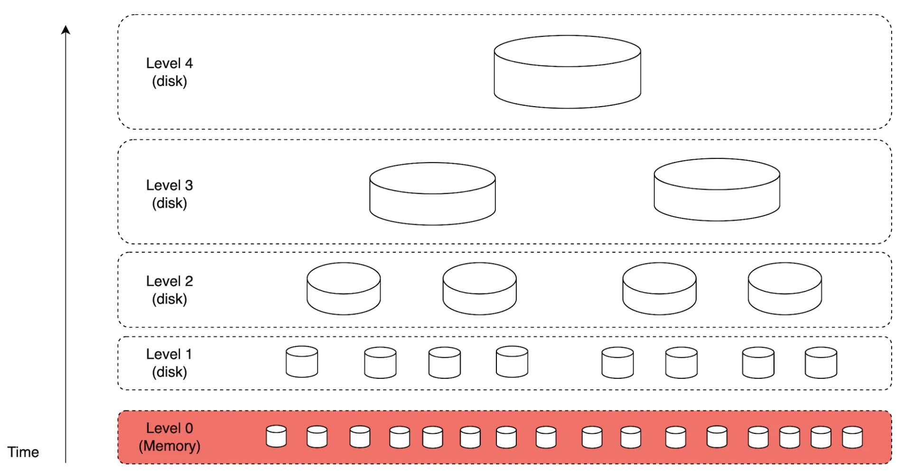

# 第 23 章：分布式邮件服务 (Distributed Email Service)

## 简介

在本章中，我们将设计一个**分布式邮件服务 (distributed email service)**，类似于 **Gmail**。

2020 年，**Gmail** 有 18 亿活跃用户，而 **Outlook** 在全球有 4 亿用户。

---

## 第一步：理解问题并确定设计范围

- C：有多少用户使用该系统？
- I：10 亿用户
- C：我认为以下功能很重要——鉴权、发送/接收邮件、获取邮件、过滤邮件、搜索邮件、反垃圾邮件保护。
- I：列表不错。暂时不用担心鉴权。
- C：用户如何连接邮件服务器？
- I：通常，邮件客户端通过 SMTP、POP、IMAP 连接，但本题我们用 HTTP。
- C：邮件可以有附件吗？
- I：可以

### **非功能需求**

- **可靠性 (Reliability)**——我们不能丢失数据
- **可用性 (Availability)**——我们应该使用副本来防止单点故障。也应能容忍部分系统故障。
- **可扩展性 (Scalability)**——随着用户群增长，系统应能承载
- **灵活性和可扩展性 (Flexibility and extensibility)**——系统应灵活且易于扩展新功能。这也是我们选择 HTTP 而非 SMTP/其他邮件协议的原因之一

### **粗略估算**

- **10 亿用户**
- 假设每人每天发送 10 封邮件 -> **每秒 10 万封邮件**。
- 假设每人每天接收 40 封邮件，每封邮件平均有 50kb 元数据 -> **每年 730pb 存储**。
- 假设 20% 的邮件有存储附件，平均大小为 500kb -> **每年 1,460pb**。

---

## 第二步：提出高层设计并达成一致

### **邮件知识 101**

发送和接收邮件使用了多种协议：
- **SMTP**——在服务器之间发送邮件的标准协议。
- **POP**——从远程邮件服务器接收并下载邮件到本地客户端的标准协议。邮件被取回后会从远程服务器删除。
- **IMAP**——与 POP 类似，用于从远程服务器接收和下载邮件，但会把邮件保留在服务器端。
- **HTTPS**——严格来说不是邮件协议，但可用于基于 Web 的邮件客户端。

除了邮件协议，还有一些 DNS 记录需要为邮件服务器配置——MX 记录：

<div style="margin-left:3rem">
    
</div>

邮件附件以 base64 编码发送，大多数邮件服务通常有 25mb 的大小限制。
这是可配置的，个人账户和企业账户各不相同。

### **传统邮件服务器**

当用户数量有限、连接到单台服务器时，传统邮件服务器工作良好。

<div style="margin-left:3rem">
    
</div>

- Alice 登录 Outlook 邮箱并点击"发送"。邮件通过 SMTP 发送到 Outlook 邮件服务器。
- Outlook 服务器查询 DNS 找到 gmail.com 的 MX 记录，并将邮件传输到其服务器。通信通过 SMTP。
- Bob 通过 IMAP/POP 从 Gmail 服务器取回邮件。

在传统邮件服务器中，邮件存储在本地文件系统上。每封邮件是一个单独的文件。

<div style="margin-left:3rem">
    
</div>

随着规模增长，磁盘 I/O 成为瓶颈。它也不满足我们的高可用性和可靠性要求。
磁盘可能损坏，服务器可能宕机。

### **分布式邮件服务器**

分布式邮件服务器旨在支持现代用例并解决现代可扩展性问题。

这些服务器仍然可以支持 IMAP/POP（用于原生邮件客户端）和 SMTP（用于服务器间邮件交换）。

但对于功能丰富的 Web 邮件客户端，通常使用基于 HTTP 的 RESTful API。

API 示例：
- `POST /v1/messages` - 向 To、Cc、Bcc 头中的收件人发送消息。
- `GET /v1/folders` - 返回邮件账户的所有文件夹

响应示例：

```
[{id: string        Unique folder identifier.
  name: string      Name of the folder.
                    According to RFC6154 [9], the default folders can be one of
                    the following: All, Archive, Drafts, Flagged, Junk, Sent,
                    and Trash.
  user_id: string   Reference to the account owner
}]
```

- `GET /v1/folders/{:folder_id}/messages` - 返回某文件夹下的所有消息，支持分页
- `GET /v1/messages/{:message_id}` - 获取某条消息的所有信息

响应示例：

```
{
  user_id: string                      // Reference to the account owner.
  from: {name: string, email: string}  // <name, email> pair of the sender.
  to: [{name: string, email: string}]  // A list of <name, email> paris
  subject: string                      // Subject of an email
  body: string                         //  Message body
  is_read: boolean                     //  Indicate if a message is read or not.
}
```

以下是分布式邮件服务器的高层设计：

<div style="margin-left:3rem">
    
</div>

- **Webmail**——用户使用 Web 浏览器发送/接收邮件
- **Web 服务器**——面向公众的请求/响应服务，用于管理登录、注册、用户资料等
- **实时服务器**——用于实时向客户端推送新邮件更新。我们使用 WebSocket 进行实时通信，对不支持的老旧浏览器回退到长轮询
- **元数据数据库**——存储邮件元数据，如主题、正文、发件人、收件人等
- **附件存储**——对象存储（例如 Amazon S3），适合存储大文件
- **分布式缓存**——我们可以在 Redis 中缓存最近的邮件以改善用户体验
- **搜索存储**——分布式文档存储，用于支持全文搜索

以下是邮件发送流程：

<div style="margin-left:3rem">
    
</div>

- 用户撰写邮件并点击"发送"。邮件被发送到负载均衡器。
- 负载均衡器对过度发送邮件的行为限流，并路由到其中一台 Web 服务器。
- Web 服务器做基本的邮件校验（例如邮件大小），如果域名与发件人相同则短路出站流程。但先做垃圾邮件检查。
- 如果基本校验通过，邮件被发送到消息队列（附件引用自对象存储）
- 如果基本校验失败，邮件被发送到错误队列
- SMTP 外发 worker 从外发队列拉取消息，做垃圾邮件/病毒检查并路由到目标邮件服务器
- 邮件存储在"已发送邮件"文件夹中

我们还需要监控外发消息队列的大小。队列过大可能意味着有问题：
- 收件人的邮件服务器不可用。我们可以使用指数退避稍后重试发送邮件。
- 消费者不足以处理负载，可能需要扩展消费者。

以下是邮件接收流程：

<div style="margin-left:3rem">
    
</div>

- 收到的邮件到达 SMTP 负载均衡器。邮件被分发到 SMTP 服务器，在那里执行邮件接收策略（例如无效邮件直接丢弃）。
- 如果邮件附件过大，我们可以将其放入对象存储（S3）。
- 邮件处理 worker 做初步检查，然后邮件被转发到存储、缓存、对象存储和实时服务器。
- 离线用户重新上线后通过 HTTP API 获取新邮件。

---

## 第三步：深入设计

让我们更深入地了解一些组件。

### **元数据库**

以下是邮件元数据的一些特征：
- 头通常很小且被频繁访问
- 正文大小从小到大不等，但通常只读一次
- 大多数邮件操作隔离到单个用户——例如取邮件、标记已读、搜索
- 数据新鲜度影响数据使用。用户通常只读最近的邮件
- 数据有高可靠性要求。数据丢失不可接受。

在 Gmail/Outlook 规模下，数据库通常是定制开发的，以减少每秒输入/输出操作数 (IOPS)。

让我们看看有哪些数据库选项：
- **关系型数据库**——我们可以为头和正文建索引，但这些数据库通常针对小块数据优化
- **分布式对象存储**——可以作为备份存储的好选择，但不能高效支持搜索/标记已读等
- **NoSQL**——Gmail 使用 Google BigTable，但它不是开源的

基于以上分析，似乎很少有现有方案能完美满足我们的需求。
在面试场景中，设计一个新的分布式数据库方案不可行，但重要的是提及特征：
- 单列可以是几 MB
- 强数据一致性
- 为减少磁盘 I/O 而设计
- 高可用、容错
- 应易于做增量备份

为了分区数据，我们可以用 `user_id` 作为分区键，让一个用户的数据存储在一个分片上。
这意味着我们无法在多个用户之间共享一封邮件，但这不是本次面试的要求。

让我们定义表：
- 主键由分区键（数据分布）和聚簇键（数据排序）组成
- 需要支持的查询——获取用户的所有文件夹、显示文件夹中的所有邮件、创建/获取/删除邮件、获取已读/未读邮件、获取会话线程（加分项）

下面表格的图例：

<div style="margin-left:3rem">
    
</div>

以下是 folders 表：

<div style="margin-left:3rem">
    
</div>

emails 表：

<div style="margin-left:3rem">
    
</div>

- email_id 是 timeuuid，允许按邮件创建时间戳排序

附件存储在单独的表中，以文件名标识：

<div style="margin-left:3rem">
    
</div>

在传统关系型数据库中支持获取已读/未读邮件很容易，但在 Cassandra 中不行，因为禁止按非分区/聚簇键过滤。
一种变通方法是取回文件夹中的所有邮件并在内存中过滤，但对足够大的应用效果不好。

我们可以做的是将 emails 表反规范化为已读/未读邮件表：

<div style="margin-left:3rem">
    
</div>

为了支持会话线程，我们可以包含一些头，邮件客户端解析这些头并用它们重建会话线程：

```
{
  "headers" {
     "Message-Id": "<7BA04B2A-430C-4D12-8B57-862103C34501@gmail.com>",
     "In-Reply-To": "<CAEWTXuPfN=LzECjDJtgY9Vu03kgFvJnJUSHTt6TW@gmail.com>",
     "References": ["<7BA04B2A-430C-4D12-8B57-862103C34501@gmail.com>"]
  }
}
```

最后，我们的分布式数据库将用可用性换取一致性，因为这是本题的硬性要求。

因此，在故障转移或网络分区发生时，受影响用户的同步/更新操作会短暂不可用。

### **邮件送达率**

搭建一台发送邮件的服务器很容易，但让邮件到达收件人的收件箱很难，因为有垃圾邮件防护算法。

如果我们只是搭建一台新的邮件服务器并开始发邮件，我们的邮件很可能进入垃圾邮件文件夹。

以下是我们可以做的预防措施：
- **专用 IP**——使用专用 IP 发送邮件，否则收件服务器不会信任你
- **分类邮件**——避免从同一服务器发送营销邮件，以免更重要的邮件被归类为垃圾邮件
- **预热 IP 地址**——慢慢预热 IP 地址，与大型邮件服务商建立良好信誉。预热一个新 IP 需要 2 到 6 周
- **快速封禁垃圾邮件发送者**，以免损害你的信誉
- **反馈处理**——与 ISP 建立反馈循环，跟踪投诉率并快速封禁垃圾邮件账户
- **邮件认证**——使用 Sender Policy Framework、DomainKeys Identified Mail 等常见技术对抗钓鱼

你不需要记住所有这些。只需要知道搭建一个好的邮件服务器需要很多领域知识。

### **搜索**

搜索包括基于邮件内容的全文搜索，或基于发件人、收件人、主题、未读等过滤条件的高级查询。

邮件搜索的一个特征是它局限于用户本地，且写多于读，因为每次操作都要重新索引，但用户很少使用搜索标签页。

让我们比较一下 Google 搜索和邮件搜索：

|               | 范围           | 排序                   | 准确性                              |
|---------------|----------------|------------------------|-------------------------------------|
| Google 搜索   | 整个互联网     | 按相关性排序           | 索引需要一些时间，所以不是即时结果。|
| 邮件搜索      | 用户自己的邮箱 | 按时间、日期等属性排序 | 索引应该很快且结果准确。            |

为了实现搜索功能，一种选择是使用 Elasticsearch 集群。我们可以用 `user_id` 作为分区键，将数据分组到同一节点下：

<div style="margin-left:3rem">
    
</div>

变更操作通过 Kafka 异步进行，以将服务与重索引流程解耦。
实际搜索数据是同步进行的。

Elasticsearch 是最流行的搜索引擎数据库之一，对邮件全文搜索支持得很好。

或者，我们可以尝试开发自己的定制搜索方案来满足特定需求。

设计这样的系统不在范围内。构建它的核心挑战之一是针对写多的工作负载进行优化。

为了实现这一点，我们可以用日志结构合并树 (Log-Structured Merge-Trees, LSM) 来组织磁盘上的索引数据。写路径只针对顺序写优化。
这项技术用在 Cassandra、BigTable 和 RocksDB 中。

其核心思想是将数据存储在内存中，直到达到预定义的阈值，然后将其合并到下一层（磁盘）：

<div style="margin-left:3rem">
    
</div>

两种方法的主要权衡：
- Elasticsearch 在一定程度上可扩展，而定制搜索引擎可以针对邮件用例微调，从而进一步扩展
- Elasticsearch 是我们需要与元数据存储一起维护的独立服务。定制方案本身就可以是数据存储
- Elasticsearch 是现成的方案，而定制搜索引擎需要大量工程投入来构建

### **可扩展性和可用性**

由于单个用户的操作不会与其他用户冲突，大多数组件都可以独立扩展。

为了确保高可用，我们还可以使用多数据中心 (multi-DC) 部署，在故障时进行主从切换：

<div style="margin-left:3rem">
    
</div>

---

## 第四步：总结

补充讨论点：
- **容错**——系统的许多部分都可能失败。值得思考如何处理节点故障。
- **合规**——鉴于欧洲的 GDPR 法律，PII 需要以合理的方式存储。
- **安全**——邮件加密、钓鱼防护、安全浏览等。
- **优化**——例如防止不同用户多次发送的相同附件重复存储。
