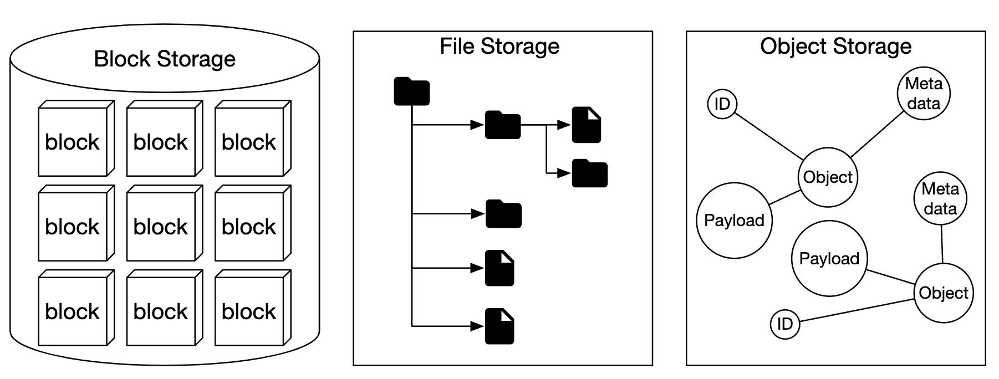
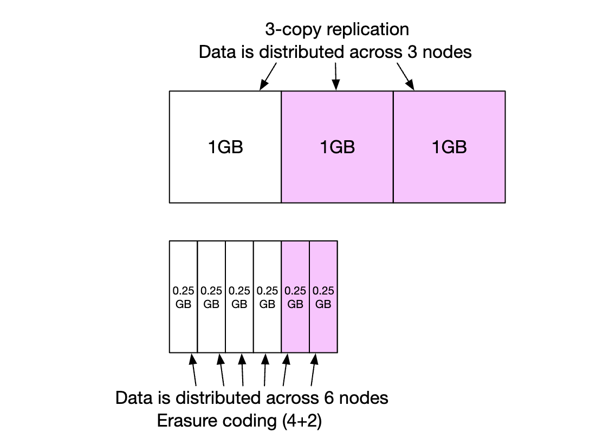

# 第 24 章：类 S3 对象存储 (S3-like Object Storage)

## 简介

在本章中，我们将设计一个**对象存储 (object storage)** 服务，类似于 **Amazon S3**。

存储系统分为三大类：
- **块存储 (Block storage)**
- **文件存储 (File storage)**
- **对象存储 (Object storage)**

**块存储**是 1960 年代出现的设备。HDD 和 SSD 就是这样的例子。
这些设备通常物理连接到服务器，也可以通过高速网络协议进行网络连接。
服务器可以格式化原始块并用作文件系统，也可以将控制权直接交给服务器。

**文件存储**构建在块存储之上。它提供了更高层的抽象，便于管理文件夹和文件。

**对象存储**以性能为代价换取高耐久性、海量规模和低成本。
它面向"冷"数据，主要用于归档和备份。
没有层级目录结构，所有数据以扁平结构存储为对象。
与其他存储类型相比，它相对较慢。大多数云厂商都有对象存储产品——Amazon S3、Google GCS 等。

<div style="margin-left:3rem">
    
</div>

|                 | 块存储                        | 文件存储                              | 对象存储                   |
|-----------------|-------------------------------|---------------------------------------|----------------------------|
| 可变内容        | 是                            | 是                                    | 否（有对象版本控制）       |
| 成本            | 高                            | 中到高                                | 低                         |
| 性能            | 中到高、非常高                | 中到高                                | 低到中                     |
| 一致性          | 强一致性                      | 强一致性                              | 强一致性 [5]               |
| 数据访问        | SAS/iSCSI/FC                  | 标准文件访问、CIFS/SMB 和 NFS         | RESTful API                |
| 可扩展性        | 中等可扩展性                  | 高可扩展性                            | 海量可扩展性               |
| 适用场景        | 虚拟机 (VM)、数据库           | 通用文件系统访问                      | 二进制数据、非结构化数据   |

一些与对象存储相关的术语：
- **存储桶 (Bucket)**——对象的逻辑容器。名称全局唯一。
- **对象 (Object)**——存储在存储桶中的单个数据片段。包含对象数据和元数据。
- **版本控制 (Versioning)**——在同一存储桶中保留同一对象的多个变体的功能。
- **统一资源标识符 (Uniform Resource Identifier, URI)**——每个资源由 URI 唯一标识。
- **服务等级协议 (Service-level Agreement, SLA)**——服务提供商与客户之间的合同。

Amazon S3 Standard-Infrequent Access 存储类的 SLA：
- 跨多个可用区 99.999999999% 的耐久性
- 即使整个可用区被摧毁，数据仍有弹性
- 设计可用性为 99.9%

---

## 第一步：理解问题并确定设计范围

- C：应包含哪些功能？
- I：存储桶创建、对象上传/下载、版本控制、列出存储桶中的对象
- C：典型数据大小是多大？
- I：我们需要高效存储大对象和小对象
- C：一年存储多少数据？
- I：100 PB
- C：我们可以假设数据耐久性为 6 个 9（99.9999%）、服务可用性为 4 个 9（99.99%）吗？
- I：可以，听起来合理

### **非功能需求**

- **100 PB 数据**
- **6 个 9 的数据耐久性**
- **4 个 9 的服务可用性**
- 存储效率。在保持高可靠性和性能的同时降低存储成本

### **粗略估算**

对象存储的瓶颈可能在于磁盘容量或每秒 IO (IOPS)。

假设：
- 20% 小对象（小于 1mb）、60% 中等对象（1-64mb）、20% 大对象（大于 64mb），
- 一块硬盘（SATA，7200rpm）每秒可做 100-150 次随机寻道（100-150 IOPS）

基于这些假设，我们可以估算系统可持久化的对象总数。
- 为简化计算，按每种对象类型的中位数取值——小对象 0.5mb、中等对象 32mb、大对象 200mb。
- 给定 100PB 存储（10^11 MB）且存储使用率为 40%，得到 6.8 亿个对象
- 如果假设元数据为 1kb，那么存储元数据信息需要 0.68tb 空间

---

## 第二步：提出高层设计并达成一致

在深入设计之前，让我们先了解对象存储的一些有趣特性：
- **对象不可变性**——对象存储中的对象是不可变的（其他存储系统不是这样）。我们可以删除或替换它们，但不能更新。
- **键值存储**——对象 URI 就是它的键，我们可以通过 HTTP 调用获取其内容
- **一次写入、多次读取**——数据访问模式是一次写入、多次读取。根据 LinkedIn 的一些研究，95% 的操作是读
- 同时支持小对象和大对象

对象存储的设计哲学与 UNIX 类似——当我们保存文件时，它在称为 inode 的数据结构中创建文件名，文件数据存储在磁盘的不同位置。
inode 包含文件块指针列表，指向磁盘上的不同位置。

访问文件时，我们先从 inode 获取其元数据，再获取文件内容。

对象存储的工作方式类似——元数据存储用于文件信息，内容存储在磁盘上：

<div style="margin-left:3rem">
    
</div>

通过将元数据与文件内容分离，我们可以独立扩展不同的存储：

<div style="margin-left:3rem">
    
</div>

### **高层设计**

<div style="margin-left:3rem">
    
</div>

- **负载均衡器**——将 API 请求分发到服务副本
- **API 服务**——无状态服务器，编排对元数据和对象存储以及 IAM 服务的调用
- **身份与访问管理 (Identity and access management, IAM)**——鉴权、授权、访问控制的中心
- **数据存储**——存储和检索实际数据。操作基于对象 ID (UUID)。
- **元数据存储**——存储对象元数据

### **上传对象**

<div style="margin-left:3rem">
    
</div>

- 通过 HTTP PUT 请求创建名为 "bucket-to-share" 的存储桶
- API 服务调用 IAM 确保用户已授权且有写权限
- API 服务调用元数据存储创建存储桶条目。创建成功后返回成功响应。
- 存储桶创建后，发送 HTTP PUT 创建名为 "script.txt" 的对象
- API 服务验证用户身份并确保用户有写权限
- 校验通过后，对象负载通过 HTTP PUT 发送到数据存储。数据存储持久化它并返回一个 UUID。
- API 服务调用元数据存储创建新条目，包含 object_id、bucket_id 和 bucket_name 等元数据。

对象上传请求示例：

```
PUT /bucket-to-share/script.txt HTTP/1.1
Host: foo.s3example.org
Date: Sun, 12 Sept 2021 17:51:00 GMT
Authorization: authorization string
Content-Type: text/plain
Content-Length: 4567
x-amz-meta-author: Alex

[4567 bytes of object data]
```

### **下载对象**

存储桶没有目录层级，但我们可以通过拼接存储桶名和对象名来创建逻辑层级，以模拟文件夹结构。

获取对象的 GET 请求示例：

```
GET /bucket-to-share/script.txt HTTP/1.1
Host: foo.s3example.org
Date: Sun, 12 Sept 2021 18:30:01 GMT
Authorization: authorization string
```

<div style="margin-left:3rem">
    
</div>

- 客户端向负载均衡器发送 HTTP GET 请求，例如 `GET /bucket-to-share/script.txt`
- API 服务查询 IAM 验证用户有读取存储桶的正确权限
- 校验通过后，从元数据存储检索对象的 UUID
- 根据 UUID 从数据存储检索对象负载并返回给客户端

---

// sprint 1

## 第三步：深入设计

### **数据存储**

以下是 API 服务与数据存储的交互：

<div style="margin-left:3rem">
    
</div>

数据存储的主要组件：

<div style="margin-left:3rem">
    
</div>

数据路由服务提供 RESTful 或 gRPC API 来访问数据节点集群。
它是一个无状态服务，通过增加服务器来扩展。

它的主要职责是：
- 查询放置服务以获取存储数据的最佳数据节点
- 从数据节点读取数据并返回给 API 服务
- 向数据节点写入数据

放置服务决定哪些数据节点应该存储对象。
它维护一个虚拟集群映射，决定集群的物理拓扑。

<div style="margin-left:3rem">
    
</div>

该服务还向所有数据节点发送心跳，以确定是否应将其从虚拟集群中移除。

由于这是关键服务，建议维护 5 或 7 个副本的集群，通过 Paxos 或 Raft 共识算法同步。
例如，7 节点集群可以容忍 3 个节点故障。

数据节点存储实际的对象数据。
通过将数据复制到多个数据节点来保证可靠性和耐久性。

每个数据节点运行一个守护进程，向放置服务发送心跳。

心跳包括：
- 数据节点管理多少个磁盘驱动器（HDD 或 SSD）？
- 每个驱动器存储了多少数据？

#### 数据持久化流程

<div style="margin-left:3rem">
    
</div>

- API 服务将对象数据转发到数据存储
- 数据路由服务将数据发送到主数据节点
- 主数据节点在本地保存数据，并复制到两个从数据节点。复制成功后发送响应。
- 对象的 UUID 返回给 API 服务。

注意事项：
- 给定对象 UUID，其复制组通过一致性哈希确定性选择
- 在步骤 4 中，主数据节点在返回响应之前复制对象数据。这是以更高延迟为代价换取强一致性。

<div style="margin-left:3rem">
    
</div>

#### 数据如何组织

管理数据的一个简单方法是将每个对象存储在单独的文件中。

这可行，但在文件系统中有很多小文件时性能不好：
- HDD 上的数据块被浪费，因为每个文件占用整个块大小。典型块大小为 4kb。
- 文件多意味着 inode 多。操作系统处理不好过多的 inode，还有 inode 数量上限。

这些问题可以通过预写日志 (write-ahead log, WAL) 将许多小文件合并成大文件来解决。一旦文件达到容量（通常几 GB），就创建新文件：

<div style="margin-left:3rem">
    
</div>

这种方法的缺点是文件的写访问需要串行化。多个核心访问同一文件时必须相互等待。
为解决这个问题，我们可以将文件绑定到特定核心以避免锁争用。

#### 对象查找

为了支持在同一文件中存储多个对象，我们需要维护一张表，告诉数据节点：
- `object_id`
- 存储对象的 `filename`
- 对象起始的 `file_offset`
- `object_size`

我们可以把这张表部署在 RocksDB 这样的文件型数据库或传统关系型数据库中。
由于访问模式是低写+高读，关系型数据库效果更好。

应该如何部署？
我们可以将数据库部署在集群中单独扩展，供所有数据节点访问。

缺点：
- 需要积极扩展集群以服务所有请求
- 数据节点与数据库集群之间有额外的网络延迟

另一种方法是利用数据节点只关心与自身相关的数据这一事实，
将关系型数据库部署在数据节点内部。

SQLite 是个好选择，因为它是轻量级的文件型关系型数据库。

#### 更新后的数据持久化流程

<div style="margin-left:3rem">
    
</div>

- API 服务发送请求保存新对象
- 数据节点服务将新对象追加到名为 "/data/c" 的文件末尾
- 在对象映射表中为该对象插入一条新记录

#### 耐久性

数据耐久性是我们设计中的重要需求。为了实现 6 个 9 的耐久性，每个故障场景都需要认真审视。

首先要解决的问题是硬件故障。我们可以通过复制数据节点来降低故障概率。
但除此之外，我们还应该跨不同故障域复制（跨机架、跨数据中心、独立网络等）。
严重事件可能导致同一故障域内的多个硬件同时故障：

<div style="margin-left:3rem">
    
</div>

假设典型 HDD 的年故障率为 0.81%，做三个副本可以达到 6 个 9 的耐久性。

像这样复制数据节点可以获得我们想要的耐久性，但我们也可以利用纠删码来降低存储成本。

纠删码让我们可以使用校验位，在故障时重建丢失的位：

<div style="margin-left:3rem">
    
</div>

想象这些位是数据节点。如果其中两个宕机，可以用剩下的四个恢复。

有不同的纠删码方案。在我们的场景中，可以使用 8+4 纠删码，分布在不同故障域以最大化可靠性：

<div style="margin-left:3rem">
    
</div>

纠删码让我们以访问速度为代价实现低得多的存储成本（改善 50%），因为数据路由服务必须从多个位置收集数据：

<div style="margin-left:3rem">
    
</div>

其他注意事项：
- 复制需要 200% 的存储开销（3 副本的情况），而纠删码只需 50%
- 纠删码[提供 11 个 9 的耐久性](https://github.com/Backblaze/erasure-coding-durability)，而复制是 6 个 9
- 纠删码需要更多计算来计算和存储校验位

总之，复制更适合对延迟敏感的应用，而纠删码在存储成本效率和耐久性方面更有吸引力。
纠删码也更难实现。

#### 正确性验证

如果磁盘完全故障，那么故障很容易检测。但磁盘内存部分损坏时就不那么直观了。

为了检测这种情况，我们可以使用校验和——文件内容的哈希，可用于验证文件的完整性。

在我们的场景中，我们将为每个文件和每个对象存储校验和：

<div style="margin-left:3rem">
    
</div>

在纠删码（8+4）的情况下，我们需要分别获取 8 份数据并验证每份的校验和。

// sprint 2

### **元数据数据模型**

表 Schema：

<div style="margin-left:3rem">
    
</div>

需要支持的查询：
- 按名称查找对象 ID
- 按名称插入/删除对象
- 列出存储桶中具有相同前缀的对象

用户可创建的存储桶数量通常有限，因此 buckets 表很小，可以放入单台数据库服务器。
但我们仍然需要为读吞吐量扩展服务器。

但 object 表可能放不进单台数据库服务器。因此，我们可以通过分片扩展该表：
- 按 bucket_id 分片会导致热点问题，因为一个存储桶可能有数十亿个对象
- 按 bucket_id 分片使负载更均匀分布，但查询会变慢
- 我们选择按 `hash(bucket_name, object_name)` 分片，因为大多数查询基于对象/存储桶名。

即使采用这种分片方案，列出存储桶中的对象仍然会很慢。

### **列出存储桶中的对象**

在单个数据库中，按前缀列出对象（看起来像目录）是这样工作的：

```
SELECT * FROM object WHERE bucket_id = "123" AND object_name LIKE `abc/%`
```

当数据库分片时，这个查询很难满足。为了实现它，我们可以在每个分片上运行查询并在内存中聚合结果。
但这让分页变得困难，因为不同分片包含的结果大小不同，我们需要为每个分片维护单独的 limit/offset。

我们可以利用这样一个事实：对象存储通常不为列出对象优化，因此可以牺牲列出性能。
我们还可以创建一个反规范化的表用于列出对象，按存储桶 ID 分片。
这样列出查询足够快，因为它只访问单个数据库实例。

### **对象版本控制**

版本控制通过增加一个 `object_version` 列实现，其类型为 TIMEUUID，让我们可以基于它排序记录。

每个新版本产生一个新的 `object_id`：

<div style="margin-left:3rem">
    
</div>

删除对象会创建一个新版本，其 `object_id` 特殊，表示对象已被删除。查询它返回 404：

<div style="margin-left:3rem">
    
</div>

### **优化大文件上传**

大文件上传可以通过分块上传优化——将大文件拆成多个块，独立上传：

<div style="margin-left:3rem">
    
</div>

- 客户端调用服务发起分块上传
- 数据存储返回一个 upload ID，唯一标识该上传
- 客户端将大文件拆成多个块，使用 upload id 独立上传
- 块上传后，数据存储返回一个 etag，它是标识该上传块的 md5 校验和
- 所有分块上传完成后，客户端发送完成分块上传请求，包含 upload_id、分块编号和所有 etag
- 数据存储从分块重新组装对象。这个过程可能需要几分钟。之后向客户端返回成功响应。

不再有用的旧分块可以在此时删除。我们可以引入垃圾回收器来处理。

### **垃圾回收**

垃圾回收是回收不再使用的存储空间的过程。数据变成垃圾有几种方式：
- **惰性对象删除**——对象被标记为删除但实际未删除
- **孤儿数据**——例如上传中途失败，旧分块需要删除
- **损坏数据**——校验和验证失败的数据

垃圾回收器还负责回收副本中未使用的空间。
使用复制时，数据从主节点和副本节点都删除。使用纠删码（8+4）时，数据从全部 12 个节点删除。

为了便于删除，我们将使用称为压缩 (compaction) 的过程：
- 垃圾回收器将未删除的对象从 "data/b" 复制到 "data/d"
- 复制完成后使用数据库事务更新 `object_mapping` 表
- 为避免产生太多小文件，压缩只对增长到超过某阈值的文件进行

<div style="margin-left:3rem">
    
</div>

---

## 第四步：总结

我们涵盖的内容：
- 设计类 S3 对象存储
- 比较对象、块、文件存储的区别
- 涵盖了存储桶中对象的上传、下载、列出、版本控制
- 深入设计——数据存储和元数据存储、复制与纠删码、分块上传、分片
