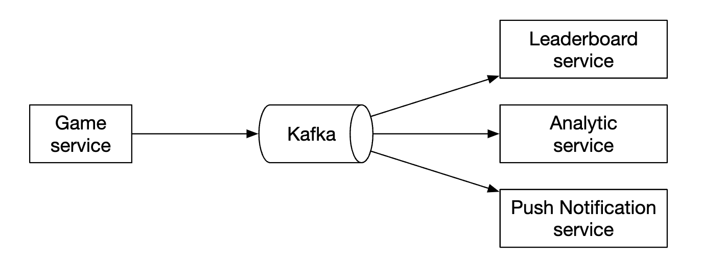
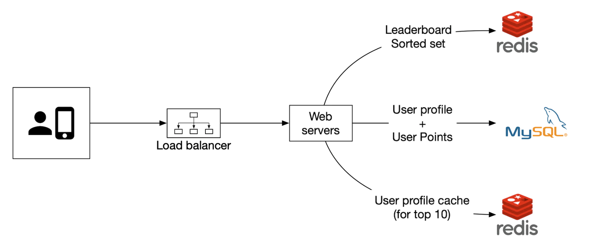
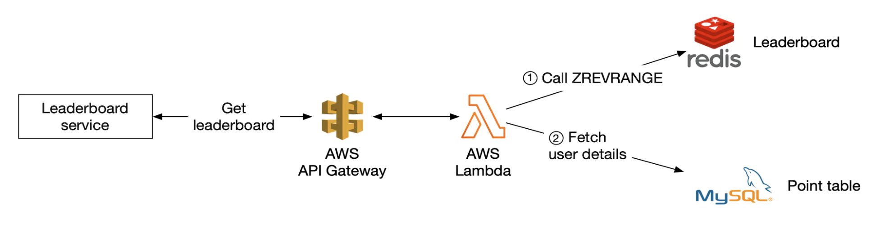
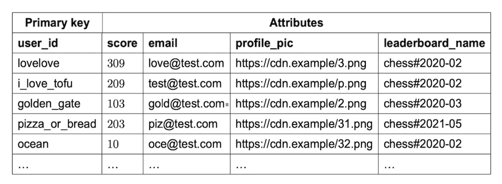
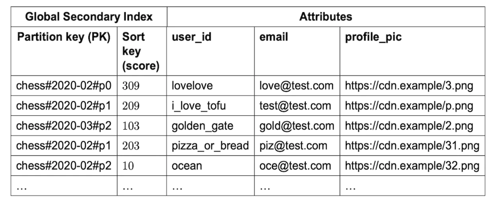

# 第 25 章：实时游戏排行榜 (Real-time Gaming Leaderboard)

## 简介

我们将为一款在线手游设计一个**排行榜 (leaderboard)**：

<div style="margin-left:3rem">
    
</div>

---

## 第一步：理解问题并确定设计范围

- C：排行榜的分数如何计算？
- I：用户每赢一场比赛得一分。
- C：所有玩家都包含在排行榜中吗？
- I：是
- C：排行榜有时间周期吗？
- I：每个月开始新的锦标赛，同时开始新的排行榜。
- C：我们可以假设只关心前 10 名用户吗？
- I：我们要展示前 10 名用户，以及特定用户的位置。如果时间允许，可以讨论在排行榜中展示某用户上下附近的用户。
- C：一个锦标赛有多少用户？
- I：500 万日活用户 (DAU)，2500 万月活用户 (MAU)
- C：一个锦标赛期间平均进行多少场比赛？
- I：每位玩家平均每天玩 10 场
- C：如果两个玩家分数相同，如何确定排名？
- I：这种情况下他们的排名相同。如果时间允许，可以讨论打破平局。
- C：排行榜需要实时吗？
- I：是，我们希望展示实时结果或尽可能接近实时。展示批量处理的历史结果不可接受。

### **功能需求**

- 在排行榜上展示前 10 名玩家
- 展示用户的具体排名
- 展示给定用户上下各 4 名的用户（加分项）

### **非功能需求**

- 分数实时更新
- 分数更新实时反映在排行榜上
- 通用的可扩展性、可用性、可靠性

### **粗略估算**

假设有 5000 万 DAU，如果游戏玩家在 24 小时内均匀分布，平均每秒 50 个用户。
但分布通常不均匀，我们可以估计峰值在线用户为每秒 250 个用户。

用户得分的 QPS——按平均每天 10 场比赛，50 用户/秒 * 10 = 500 QPS。峰值 QPS = 2500。

获取前 10 名排行榜的 QPS——假设用户平均每天打开一次，QPS 为 50。

---

## 第二步：提出高层设计并达成一致

### **API 设计**

我们需要的第一个 API 是更新用户分数：

```
POST /v1/scores
```

这个 API 接收两个参数——`user_id` 和赢得比赛获得的 `points` 分数。

这个 API 只能被游戏服务器访问，不能被终端客户端访问。

下一个 API 用于获取排行榜前 10 名玩家：

```
GET /v1/scores
```

响应示例：

```
{
  "data": [
    {
      "user_id": "user_id1",
      "user_name": "alice",
      "rank": 1,
      "score": 12543
    },
    {
      "user_id": "user_id2",
      "user_name": "bob",
      "rank": 2,
      "score": 11500
    }
  ],
  ...
  "total": 10
}
```

你还可以获取特定用户的分数：

```
GET /v1/scores/{:user_id}
```

响应示例：

```
{
    "user_info": {
        "user_id": "user5",
        "score": 1000,
        "rank": 6,
    }
}
```

### **高层架构**

<div style="margin-left:3rem">
    
</div>

- 玩家赢得比赛时，客户端向游戏服务发送请求
- 游戏服务校验胜利是否有效，并调用排行榜服务更新玩家分数
- 排行榜服务在排行榜存储中更新用户分数
- 玩家调用排行榜服务获取排行榜数据，例如前 10 名玩家和给定玩家的排名

一个曾被考虑的替代设计是客户端直接在排行榜服务中更新自己的分数：

<div style="margin-left:3rem">
    
</div>

这个方案不安全，因为它容易受到中间人攻击。玩家可以放一个代理，随意修改自己的分数。

还有一个注意事项：对于游戏逻辑由服务器管理的游戏，客户端不需要显式调用服务器来记录胜利。
服务器会根据游戏逻辑自动为他们记录。

还有一个考虑：是否应在游戏服务器和排行榜服务之间放一个消息队列。如果其他服务对游戏结果感兴趣，这会很有用，但目前面试中没有这个明确需求，所以设计中不包含：

<div style="margin-left:3rem">
    
</div>

### **数据模型**

让我们讨论存储排行榜数据的选项——关系型数据库、Redis、NoSQL。

NoSQL 方案在深入设计一节讨论。

#### 关系型数据库方案

如果规模不重要、用户不多，关系型数据库能很好地满足我们。

我们可以从一个简单的排行榜表开始，每月一张（个人备注——这不合理。只需加一个 `month` 列，避免每月维护新表的麻烦）：

<div style="margin-left:3rem">
    
</div>

还有一些额外数据要包含，但与我们要运行的查询无关，所以省略了。

当用户赢得一分时会发生什么？

<div style="margin-left:3rem">
    
</div>

如果用户在表中还不存在，我们需要先插入：

```
INSERT INTO leaderboard (user_id, score) VALUES ('mary1934', 1);
```

后续调用只需更新他们的分数：

```
UPDATE leaderboard set score=score + 1 where user_id='mary1934';
```

如何找到排行榜的前几名玩家？

<div style="margin-left:3rem">
    
</div>

我们可以运行以下查询：

```
SELECT (@rownum := @rownum + 1) AS rank, user_id, score
FROM leaderboard
ORDER BY score DESC;
```

但这性能不好，因为它要全表扫描来对数据库表中的所有记录排序。

我们可以通过在 `score` 上加索引并使用 `LIMIT` 操作来优化，避免扫描全部数据：

```
SELECT (@rownum := @rownum + 1) AS rank, user_id, score
FROM leaderboard
ORDER BY score DESC
LIMIT 10;
```

但如果用户不在排行榜顶部，想定位他们的排名，这种方法扩展性不好。

#### Redis 方案

我们想找到一个即使有数百万玩家也能很好工作、无需依赖复杂数据库查询的方案。

Redis 是内存数据存储，因为在内存中工作所以速度快，还有适合我们需求的数据结构——有序集合 (sorted set)。

有序集合是一种类似于编程语言中集合的数据结构，允许你按给定条件保持数据结构有序。
内部实现使用哈希表维护键（user_id）与值（score）之间的映射，以及跳表 (skip list) 按排序顺序将分数映射到用户：

<div style="margin-left:3rem">
    
</div>

跳表如何工作？
- 它是一种支持快速搜索的链表
- 它由排序链表和多级索引组成

<div style="margin-left:3rem">
    
</div>

这种结构让我们在数据集足够大时能快速搜索特定值。
在下面的例子（64 个节点）中，在基础链表中找到给定值需要遍历 62 个节点，而跳表情况下只需 11 个节点：

<div style="margin-left:3rem">
    
</div>

有序集合比关系型数据库性能更好，因为数据始终保持有序，代价是添加和查找操作为 O(logN)。

相比之下，以下是在关系型数据库中查找给定用户排名所需的嵌套查询示例：

```
SELECT *,(SELECT COUNT(*) FROM leaderboard lb2
WHERE lb2.score >= lb1.score) RANK
FROM leaderboard lb1
WHERE lb1.user_id = {:user_id};
```

在 Redis 中操作排行榜需要哪些操作？
- **ZADD**——如果用户不存在则将其插入集合。否则更新分数。时间复杂度 O(logN)。
- **ZINCRBY**——将用户的分数增加给定数量。如果用户不存在，分数从零开始。时间复杂度 O(logN)。
- **ZRANGE/ZREVRANGE**——获取按分数排序的一段用户。可以指定顺序（ASC/DESC）、偏移量和结果大小。时间复杂度 O(logN+M)，其中 M 为结果大小。
- **ZRANK/ZREVRANK**——获取给定用户按 ASC/DESC 顺序的位置（排名）。时间复杂度 O(logN)。

当用户得一分时会发生什么？

```
ZINCRBY leaderboard_feb_2021 1 'mary1934'
```

每月创建新的排行榜，旧的移到历史存储。

当用户获取前 10 名玩家时会发生什么？

```
ZREVRANGE leaderboard_feb_2021 0 9 WITHSCORES
```

结果示例：

```
[(user2,score2),(user1,score1),(user5,score5)...]
```

用户获取自己在排行榜中的位置呢？

<div style="margin-left:3rem">
    
</div>

已知用户在排行榜中的位置后，可以用以下查询轻松实现：

```
ZREVRANGE leaderboard_feb_2021 357 365
```

用户的位置可以用 `ZREVRANK <user-id>` 获取。

让我们看看存储需求：
- 假设最坏情况，某个月全部 2500 万月活用户都参与游戏
- ID 是 24 字符的字符串，分数是 16 位整数，需要 26 字节 * 2500 万 = 约 650MB 存储
- 即使由于跳表开销使存储成本翻倍，现代 Redis 集群也能轻松容纳

另一个要考虑的非功能需求是支持每秒 2500 次更新。这在单台 Redis 服务器的能力范围内。

其他注意事项：
- 我们可以启动 Redis 副本，避免 Redis 服务器崩溃时丢失数据
- 我们仍然可以利用 Redis 持久化，在崩溃时不丢失数据
- 我们需要在 MySQL 中建两张辅助表，用于获取用户名、显示名等用户详情，以及存储例如用户何时赢得比赛
- MySQL 中的第二张表可用于在基础设施故障时重建排行榜
- 作为小的性能优化，我们可以缓存前 10 名玩家的用户详情，因为它们会被频繁访问

---

## 第三步：深入设计

### **用云服务商还是不用**

我们可以选择自己部署和管理服务，或使用云服务商代为管理。

如果选择自己管理服务，我们将用 Redis 存排行榜数据，用 MySQL 存用户资料，如果想扩展数据库，可能还要为用户资料加缓存：

<div style="margin-left:3rem">
    
</div>

或者，我们可以用云产品代为管理很多服务。例如，用 AWS API Gateway 将 API 调用路由到 AWS Lambda 函数：

<div style="margin-left:3rem">
    
</div>

AWS Lambda 让我们无需自己管理或配置服务器即可运行代码。它只在需要时运行并自动扩展。

用户得分示例：

<div style="margin-left:3rem">
    
</div>

用户获取排行榜示例：

<div style="margin-left:3rem">
    
</div>

Lambda 是无服务器架构的一种实现。我们不需要管理扩展和环境搭建。

如果从零开始构建游戏，作者推荐采用这种方法。

### **扩展 Redis**

从存储和 QPS 角度看，500 万 DAU 用单台 Redis 实例就能应付。

但如果想象用户群增长 10 倍到 5 亿 DAU，那么需要 65gb 存储，QPS 达到 250k。

这样的规模需要分片。

一种实现方式是按范围分区数据：

<div style="margin-left:3rem">
    
</div>

在这个例子中，我们按用户分数分片。我们在应用代码中维护 user_id 与分片之间的映射。
可以用 MySQL 或另一个缓存来存这个映射本身。

要获取前 10 名玩家，我们查询分数最高的分片（`[900-1000]`）。

要获取用户的排名，我们需要计算用户在其分片内的排名，再加上其他分片中分数更高的用户数。
后者是 O(1) 操作，因为通过 info keyspace 命令可以快速获取每个分片的总记录数。

或者，我们可以用 Redis Cluster 做哈希分区。它是一个代理，基于类似一致性哈希（但不完全相同）的分区方式将数据分布到 Redis 节点：

<div style="margin-left:3rem">
    
</div>

在这种配置下计算前 10 名玩家有挑战。我们需要获取每个分片的前 10 名玩家，并在应用中合并结果：

<div style="margin-left:3rem">
    
</div>

哈希分区有一些局限：
- 如果需要获取前 K 名用户，K 较大时延迟会增加，因为需要从所有分片获取大量数据
- 分区数增加时延迟增加
- 没有直接的方法确定用户的排名

基于所有这些，作者倾向于对本题使用固定分区。

其他注意事项：
- 最佳实践是为写多的 Redis 节点分配所需内存的两倍，以容纳可能需要的快照
- 我们可以用 Redis-benchmark 工具跟踪 Redis 部署的性能，做出数据驱动的决策

### **替代方案：NoSQL**

另一个值得考虑的替代方案是使用适合以下场景的 NoSQL 数据库：
- 重写
- 在同一分区内按分数有效排序

DynamoDB、Cassandra 或 MongoDB 都很合适。

在本章中，作者决定使用 DynamoDB。它是一个全托管 NoSQL 数据库，提供可靠的性能和很好的可扩展性。
当需要按非主键字段查询时，它还支持全局二级索引。

<div style="margin-left:3rem">
    
</div>

让我们从一张存储象棋游戏排行榜的表开始：

<div style="margin-left:3rem">
    
</div>

这工作良好，但如果需要按分数查询，扩展性不好。因此，我们可以把分数作为排序键：

<div style="margin-left:3rem">
    
</div>

这个设计的另一个问题是我们按月份分区。这导致热点分区，因为最新月份相比其他月份被访问得不均匀。

我们可以用写分片技术，为每个键追加一个分区号，通过 `user_id % num_partitions` 计算：

<div style="margin-left:3rem">
    
</div>

一个重要的权衡是使用多少个分区：
- 分区越多，写可扩展性越高
- 但读可扩展性受损，因为需要查询更多分区来收集聚合结果

使用这种方法需要采用前面看到的"散射-收集 (scatter-gather)"技术，其时间复杂度随分区数增加而增长：

<div style="margin-left:3rem">
    
</div>

要对分区数做出好的评估，需要做一些基准测试。

这种 NoSQL 方法仍有一个主要缺点——很难计算用户的具体排名。

如果规模大到需要分片，我们可以告诉用户他们处于分数的哪个"百分位"。

可以定期运行 cron 作业分析分数分布，基于此确定用户的百分位，例如：

```
10th percentile = score < 100
20th percentile = score < 500
...
90th percentile = score < 6500
```

---

## 第四步：总结

如果时间允许，还可以讨论：
- **更快检索**——我们可以通过 Redis 哈希缓存用户对象，映射为 `user_id -> user object`。相比查询数据库，这能更快检索。
- **打破平局**——当两个玩家分数相同时，可以按最后玩的比赛排序来打破平局。
- **系统故障恢复**——在大规模 Redis 宕机的情况下，我们可以通过遍历 MySQL WAL 条目并用临时脚本重建排行榜
