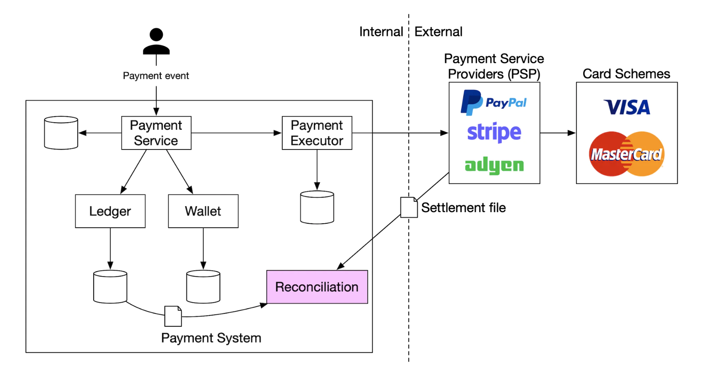

# 第 26 章：支付系统 (Payment System)

## 简介
在本章中，我们将设计一个**支付系统 (payment system)**，它是所有现代**电子商务 (e-commerce)** 的基础。

**支付系统**用于结算金融交易，转移货币价值。

---

## 第一步：理解问题并确定设计范围
 * C：我们在构建什么样的支付系统？
 * I：一个电商系统的支付后端，类似于 Amazon.com。它处理与资金流转相关的一切。
 * C：支持哪些支付方式——信用卡、PayPal、银行卡等？
 * I：现实中系统应支持所有这些方式。为了面试目的，我们用信用卡支付。
 * C：我们自己处理信用卡支付吗？
 * I：不，我们使用 Stripe、Braintree、Square 等第三方服务商。
 * C：我们在系统中存储信用卡数据吗？
 * I：出于合规原因，我们不在系统中直接存储信用卡数据。我们依赖第三方支付处理商。
 * C：应用是全球的吗？需要支持多币种和国际支付吗？
 * I：应用是全球的，但为了面试目的，我们假设只用一种货币。
 * C：每天支持多少笔支付交易？
 * I：每天 100 万笔交易。
 * C：需要支持付款流程，例如每月向收款方付款吗？
 * I：是，需要支持
 * C：还有其他我应注意的吗？
 * I：我们需要支持对账，以修复与内部和外部系统通信中的任何不一致。

### **功能需求**
 * 收款流程——支付系统代表商家从客户那里收款
 * 付款流程——支付系统向全球卖家付款

### **非功能需求**
 * 可靠性和容错。失败的支付需要仔细处理
 * 需要建立内部与外部系统之间的对账

### **粗略估算**
系统需要每天处理 100 万笔交易，即每秒 10 笔交易。

这对任何数据库系统都不是高吞吐量，所以不是本次面试的重点。

---

## 第二步：提出高层设计并达成一致
从高层看，资金流转有三个参与者：

<div style="margin-left:3rem">
    
</div>

### **收款流程**
以下是收款流程的高层概览：

<div style="margin-left:3rem">
    
</div>

 * 支付服务——接收支付事件并协调支付流程。它通常还用第三方服务商做风控检查，检查 AML 违规或犯罪活动。
 * 支付执行器——通过支付服务提供商 (PSP) 执行单个支付订单。一个支付事件可能包含多个支付订单。
 * 支付服务提供商 (PSP)——将钱从一个账户移到另一个账户，例如从买家的信用卡账户到电商网站的银行账户。
 * 卡组织——处理信用卡业务的组织，例如 Visa、MasterCard 等。
 * 分类账——记录所有支付交易的财务账本。
 * 钱包——保存所有商家的账户余额。

以下是收款流程示例：
 * 用户点击"下单"，支付事件被发送到支付服务
 * 支付服务将事件存储在其数据库中
 * 支付服务为该支付事件中的所有支付订单调用支付执行器
 * 支付执行器将支付订单存储在其数据库中
 * 支付执行器调用外部 PSP 处理信用卡支付
 * 支付执行器处理完支付后，支付服务更新钱包，记录卖家有多少钱
 * 钱包服务将更新后的余额信息存储在其数据库中
 * 支付服务调用分类账记录所有资金流转

### **支付服务的 API**
```
POST /v1/payments
{
  "buyer_info": {...},
  "checkout_id": "some_id",
  "credit_card_info": {...},
  "payment_orders": [{...}, {...}, {...}]
}
```

`payment_order` 示例：
```
{
  "seller_account": "SELLER_IBAN",
  "amount": "3.15",
  "currency": "USD",
  "payment_order_id": "globally_unique_payment_id"
}
```

注意事项：
 * `payment_order_id` 被转发给 PSP 用于支付去重，即它是幂等键。
 * amount 字段是 `string`，因为 `double` 不适合表示货币金额。

```
GET /v1/payments/{:id}
```

这个端点基于 `payment_order_id` 返回单个支付的执行状态。

### **支付服务数据模型**
我们需要维护两张表——`payment_events` 和 `payment_orders`。

对于支付，性能通常不是重要因素。但强一致性很重要。

选择数据库的其他考虑：
 * 市场上有充足的 DBA 可雇佣来管理数据库
 * 有被其他大型金融机构使用过的可靠记录
 * 丰富的配套工具
 * 传统 SQL 优于 NoSQL/NewSQL，因为它有 ACID 保证

`payment_events` 表包含：
 * `checkout_id` - string，主键
 * `buyer_info` - string（个人备注——用外键关联另一张表可能更合适）
 * `seller_info` - string（个人备注——同上）
 * `credit_card_info` - 取决于卡服务商
 * `is_payment_done` - boolean

`payment_orders` 表包含：
 * `payment_order_id` - string，主键
 * `buyer_account` - string
 * `amount` - string
 * `currency` - string
 * `checkout_id` - string，外键
 * `payment_order_status` - 枚举（`NOT_STARTED`、`EXECUTING`、`SUCCESS`、`FAILED`）
 * `ledger_updated` - boolean
 * `wallet_updated` - boolean

注意事项：
 * 一个支付事件关联多个支付订单
 * 收款流程不需要 `seller_info`。那是付款流程才需要的
 * 调用相应服务记录支付结果时，`ledger_updated` 和 `wallet_updated` 会被更新
 * 支付状态转换由后台作业管理，它检查在途支付的更新，如果支付在合理时间内未处理则触发告警

### **复式记账分类账系统**
复式记账机制是任何支付系统的关键。它是一种通过始终对两个账户同时应用资金操作来跟踪资金流转的机制：一个账户余额增加（贷记），另一个减少（借记）：

| 账户   | 借 (Debit) | 贷 (Credit) |
|--------|------------|-------------|
| buyer  | $1         |             |
| seller |            | $1          |

所有交易分录的总和始终为零。这种机制提供了系统内所有资金流转的端到端可追溯性。

### **托管支付页面**
为了避免存储信用卡信息和遵守各种繁重的法规，大多数公司更愿意使用 PSP 提供的组件，由 PSP 代为存储和处理信用卡支付：

<div style="margin-left:3rem">
    
</div>

### **付款流程**
付款流程的组件与收款流程非常相似。

主要区别：
 * 钱从电商网站的银行账户移到商家的银行账户
 * 我们可以利用 Tipalti 等第三方应付账款服务商
 * 付款也有很多记账和合规要求需要处理

---

## 第三步：深入设计
本节聚焦于让系统更快、更健壮、更安全。

### **PSP 集成**
如果我们的系统能直接连接银行或卡组织，就可以在没有 PSP 的情况下付款。
这种连接非常罕见和少见，通常只有能证明投资合理的大公司才会做。

如果走传统路线，PSP 有两种集成方式：
 * 通过 API，如果我们的支付系统能收集支付信息
 * 通过托管支付页面，以避免处理支付信息合规问题

以下是托管支付页面的工作流程：

<div style="margin-left:3rem">
    
</div>

 * 用户在浏览器中点击"结算"按钮
 * 客户端携带支付订单信息调用支付服务
 * 支付服务收到支付订单信息后，向 PSP 发送支付注册请求
 * PSP 收到货币、金额、有效期等支付信息，以及用于幂等的 UUID。通常是支付订单的 UUID。
 * PSP 返回一个 token，唯一标识该支付注册。token 存储在支付服务数据库中。
 * token 存储后，用户看到 PSP 托管的支付页面。它用 token 和成功/失败的跳转 URL 初始化。
 * 用户在 PSP 页面填写支付详情，PSP 处理支付并返回支付状态
 * 用户被重定向回 redirectURL。重定向 URL 示例——`https://your-company.com/?tokenID=JIOUIQ123NSF&payResult=X324FSa`
 * 异步地，PSP 通过 webhook 调用我们的支付服务，通知后端支付结果
 * 支付服务基于收到的 webhook 记录支付结果

### **对账**
上一节讲解了支付的顺利路径。不顺利的路径通过后台对账流程检测和调和。

每天晚上，PSP 发送结算文件，我们的系统用它将外部系统状态与内部系统状态对比。

<div style="margin-left:3rem">
    
</div>

这个过程也可用于检测例如分类账与钱包服务之间的内部不一致。

差异由财务团队手动处理。差异处理为：
 * 可分类，因此是已知差异，可用标准流程调整
 * 可分类，但无法自动化。由财务团队手动调整
 * 不可分类。由财务团队手动调查和调整

### **处理支付延迟**
有些情况下，支付可能需要几小时才能完成，虽然通常只需几秒。

这可能发生在：
 * 支付被标记为高风险，需要人工审核
 * 信用卡需要额外保护，例如 3D Secure 认证，需要持卡人提供额外信息才能完成

这些情况的处理方式：
 * 等待 PSP 在支付完成时发送 webhook，如果 PSP 不提供 webhook 则轮询其 API
 * 向用户展示"处理中"状态，并给他们一个可以查看支付更新的页面。我们也可以在支付完成后给他们发邮件

### **内部服务间通信**
服务间通信有两种模式——同步和异步。

同步通信（即 HTTP）适用于小规模系统，但随着规模增长会出现问题：
 * 性能低——随着调用链中涉及的服务增多，请求-响应周期变长
 * 故障隔离差——如果 PSP 或其他服务失败，用户收不到响应
 * 紧耦合——发送方需要知道接收方
 * 难扩展——由于没有缓冲，不易应对流量突增

异步通信可分为两类。

单接收者——多个接收者订阅同一主题，消息只被处理一次：

<div style="margin-left:3rem">
    
</div>

多接收者——多个接收者订阅同一主题，但消息被转发给所有接收者：

<div style="margin-left:3rem">
    
</div>

后一种模型很适合我们的支付系统，因为一笔支付可以触发由不同服务处理的多个副作用。

简而言之，同步通信更简单，但不允许服务自治。
异步通信用简单性和一致性换取可扩展性和弹性。

### **处理失败的支付**
每个支付系统都需要处理失败的支付。以下是我们将采用的一些机制：
 * 跟踪支付状态——每当支付失败，我们可以根据支付状态决定重试/退款。
 * 重试队列——要重试的支付被发布到重试队列
 * 死信队列——彻底失败的支付被推到死信队列，在那里可以调试和检查失败的支付。

<div style="margin-left:3rem">
    
</div>

### **精确一次投递**
我们需要确保支付被精确处理一次，避免向客户重复扣款。

一个操作如果同时满足至少一次和至多一次，就被精确执行一次。

为了实现至少一次保证，我们将使用重试机制：

<div style="margin-left:3rem">
    
</div>

以下是决定重试间隔的一些常见策略：
 * 立即重试——失败后客户端立即发送另一个请求
 * 固定间隔——重试支付前等待固定时间
 * 递增间隔——每次重试之间递增重试间隔
 * 指数退避——后续重试之间重试间隔翻倍
 * 取消——客户端取消请求。发生在错误是终态或达到重试阈值时

经验法则是默认采用指数退避重试策略。好的做法是服务器用 `Retry-After` 头指定重试间隔。

重试的一个问题是服务器可能处理支付两次：
 * 客户端点击"支付按钮"两次，因此被扣款两次
 * 支付被 PSP 成功处理，但下游服务（分类账、钱包）未处理。重试导致支付被 PSP 再次处理

为解决重复支付问题，我们需要使用幂等机制——一个操作应用多次只被处理一次的特性。

从 API 角度看，客户端可以多次调用产生相同结果。
幂等性由请求中的特殊头（例如 `idempotency-key`，通常是 UUID）管理。

<div style="margin-left:3rem">
    
</div>

幂等性可以用数据库的唯一键约束机制实现：
 * 服务器尝试在数据库中插入新行
 * 插入因违反唯一键约束而失败
 * 服务器检测到该错误，转而将已存在的对象返回给客户端

幂等性也在 PSP 侧应用，使用前面讨论的 nonce。PSP 会确保不会两次处理相同 nonce 的支付。

### **一致性**
在支付的生命周期中会调用几个有状态服务——PSP、分类账、钱包、支付服务。

任何两个服务之间的通信都可能失败。
我们可以通过实现精确一次处理和对账，确保所有服务之间的最终数据一致性。

如果使用复制，我们必须处理复制延迟，这可能导致用户在主库和从库之间观察到不一致的数据。

为缓解这一点，我们可以让所有读写都走主库，只将副本用于冗余和故障转移。
或者，我们可以用 Paxos 或 Raft 等共识算法确保副本始终同步。
我们也可以使用 YugabyteDB 或 CockroachDB 等基于共识的分布式数据库。

### **支付安全**
以下是我们可以用来确保支付安全的一些机制：
 * 请求/响应窃听——我们可以用 HTTPS 保护所有通信
 * 数据篡改——强制加密和完整性监控
 * 中间人攻击——使用 SSL 并做证书锁定
 * 数据丢失——跨多个区域复制数据并做数据快照
 * DDoS 攻击——实现限流和防火墙
 * 卡片盗刷——用 token 代替在系统中存储真实卡信息
 * PCI 合规——处理品牌信用卡的组织的安全标准
 * 欺诈——地址验证、卡验证码 (CVV)、用户行为分析等

---

## 第四步：总结
其他讨论点：
 * 监控和告警
 * 调试工具——我们需要能轻松理解支付为何失败的工具
 * 货币兑换——设计国际用支付系统时很重要
 * 地理——不同地区可能有不同的支付方式
 * 现金支付——在印度和巴西等地很常见
 * Google/Apple Pay 集成
