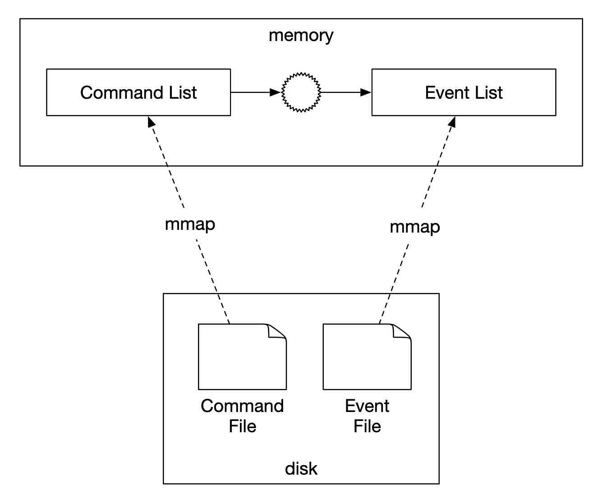

# 第 27 章：数字钱包 (Digital Wallet)

## 简介
**支付平台 (Payment platforms)** 通常有一个**钱包服务 (wallet service)**，允许客户在应用内存储资金，之后再提现。

你也可以用它支付商品和服务，或向使用**数字钱包 (digital wallet)** 服务的其他用户转账。这比通过普通支付通道更快、更便宜。

<div style="margin-left:3rem">
    
</div>

---

## 第一步：理解问题并确定设计范围
 * C：我们只聚焦于数字钱包之间的转账吗？需要支持其他操作吗？
 * I：暂时聚焦于数字钱包之间的转账。
 * C：系统需要支持多少 TPS？
 * I：假设 100 万 TPS
 * C：数字钱包有严格的正确性要求。我们可以假设事务保证足够吗？
 * I：听起来不错
 * C：需要证明正确性吗？
 * I：可以通过对账做到，但那只能发现差异，不能告诉我们差异的根本原因。相反，我们希望能从头开始重放数据来重建历史。
 * C：可以假设可用性要求为 99.99% 吗？
 * I：可以
 * C：需要考虑外汇吗？
 * I：不需要，不在范围内

总结一下我们要支持的内容：
 * 支持两个账户之间的余额转账
 * 支持 100 万 TPS
 * 可靠性为 99.99%
 * 支持事务
 * 支持可重现性

### **粗略估算**
云上配置的传统关系型数据库能支持约 1000 TPS。

为了达到 100 万 TPS，我们需要 1000 个数据库节点。但如果每笔转账有两条腿，实际上需要支持 200 万 TPS。

我们的设计目标之一是提高单节点能处理的 TPS，从而减少数据库节点数。

| 单节点 TPS | 节点数  |
|------------|---------|
| 100        | 20,000  |
| 1,000      | 2,000   |
| 10,000     | 200     |

---

## 第二步：提出高层设计并达成一致

### **API 设计**
本次面试只需支持一个端点：
```
POST /v1/wallet/balance_transfer - 将余额从一个钱包转到另一个钱包
```

请求参数——from_account、to_account、amount（用 string 以免丢失精度）、currency、transaction_id（幂等键）。

响应示例：
```
{
    "status": "success"
    "transaction_id": "01589980-2664-11ec-9621-0242ac130002"
}
```

### **内存分片方案**
我们的钱包应用维护每个用户账户的余额。

一个好的数据结构是 `map<user_id, balance>`，可以用内存 Redis 存储实现。

由于单台 Redis 节点扛不住 100 万 TPS，我们需要将 Redis 集群分区为多个节点。

分区算法示例：
```
String accountID = "A";
Int partitionNumber = 7;
Int myPartition = accountID.hashCode() % partitionNumber;
```

Zookeeper 可用于存储分区数和 Redis 节点地址，因为它是高可用的配置存储。

最后，钱包服务是一个无状态服务，负责执行转账操作。它可以轻松水平扩展：

<div style="margin-left:3rem">
    
</div>

虽然这个方案解决了可扩展性问题，但它无法原子地执行余额转账。

### **分布式事务**
处理事务的一种方法是在标准分片关系型数据库之上使用两阶段提交协议：

<div style="margin-left:3rem">
    
</div>

两阶段提交 (2PC) 协议的工作方式如下：

<div style="margin-left:3rem">
    
</div>

 * 协调者（钱包服务）像往常一样在多个数据库上执行读写操作
 * 当应用准备提交事务时，协调者要求所有数据库准备提交
 * 如果所有数据库都回复"yes"，协调者要求数据库提交事务
 * 否则，要求所有数据库中止事务

2PC 方法的缺点：
 * 由于锁争用，性能不高
 * 协调者是单点故障

### **使用 Try-Confirm/Cancel (TC/C) 的分布式事务**
TC/C 是 2PC 协议的一个变体，使用补偿事务：
 * 协调者要求所有数据库为事务预留资源
 * 协调者收集数据库的回复——如果回复 yes，要求数据库 try-confirm。如果回复 no，要求数据库 try-cancel。

TC/C 与 2PC 的一个重要区别是，2PC 执行单个事务，而 TC/C 中有两个独立事务。

以下是 TC/C 分阶段的工作方式：

| 阶段 | 操作    | A             | C             |
|------|---------|---------------|---------------|
| 1    | Try     | 余额变化：-$1 | 什么都不做    |
| 2    | Confirm | 什么都不做    | 余额变化：+$1 |
|      | Cancel  | 余额变化：+$1 | 什么都不做    |

阶段 1 - try：

<div style="margin-left:3rem">
    
</div>

 * 协调者在 A 的数据库中启动本地事务，将 A 的余额减少 1$
 * C 的数据库收到 NOP 指令，什么都不做

阶段 2a - confirm：

<div style="margin-left:3rem">
    
</div>

 * 如果两个数据库都回复 "yes"，confirm 阶段开始
 * A 的数据库收到 NOP，C 的数据库被指示将 C 的余额增加 1$（本地事务）

阶段 2b - cancel：

<div style="margin-left:3rem">
    
</div>

 * 如果阶段 1 中的任何操作失败，cancel 阶段开始
 * A 的数据库被指示将 A 的余额增加 1$，C 的数据库收到 NOP

以下是 2PC 与 TC/C 的比较：

|      | 第一阶段                           | 第二阶段：成功       | 第二阶段：失败         |
|------|------------------------------------|----------------------|------------------------|
| 2PC  | 事务尚未执行                       | 提交/取消所有事务    | 取消所有事务           |
| TC/C | 所有事务已完成——已提交或已取消     | 如有需要执行新事务   | 回滚已提交的事务       |

TC/C 也称为补偿式分布式事务。高层操作在业务逻辑中处理。

TC/C 的其他特性：
 * 与数据库无关，只要数据库支持事务
 * 分布式事务的细节和复杂度需要在业务逻辑中处理

### **TC/C 故障模式**
如果协调者在执行中途宕机，它需要恢复中间状态。
这可以通过维护阶段状态表来实现，在数据库分片内原子更新：

<div style="margin-left:3rem">
    
</div>

这张表包含：
 * 分布式事务的 ID 和内容
 * try 阶段的状态——未发送、已发送、已收到响应
 * 第二阶段名称——confirm 或 cancel
 * 第二阶段的状态
 * 乱序标志（后面解释）

使用 TC/C 时的一个注意事项是，分布式事务执行期间，账户状态会有短暂的不一致：

<div style="margin-left:3rem">
    
</div>

只要我们总能从这个状态恢复，且用户不能利用中间状态（例如花掉它），这就没问题。
这通过始终先执行扣款、后执行加款来保证。

| Try 阶段选择   | 账户 A | 账户 C |
|----------------|--------|--------|
| 选择 1         | -$1    | NOP    |
| 选择 2（无效） | NOP    | +$1    |
| 选择 3（无效） | -$1    | +$1    |

注意上表中的选择 3 无效，因为在不依赖 2PC 的情况下，无法保证跨不同数据库的事务原子执行。

一个需要处理的边界情况是乱序执行：

<div style="margin-left:3rem">
    
</div>

数据库可能在收到 try 之前先收到 cancel 操作。这个边界情况可以通过在阶段状态表中添加乱序标志来处理。
当收到 try 操作时，我们先检查乱序标志是否设置，如果设置了则返回失败。

### **使用 Saga 的分布式事务**
另一个流行的方法是使用 Saga——在微服务架构中实现分布式事务的标准。

它的工作方式：
 * 所有操作按顺序排列。所有操作在各自的数据库中独立。
 * 操作从第一个执行到最后一个
 * 当某个操作失败时，整个流程用补偿操作从失败点回滚到起点

<div style="margin-left:3rem">
    
</div>

如何协调工作流？有两种方法：
 * 编排 (Choreography)——参与 Saga 的所有服务订阅相关事件并完成自己在 Saga 中的部分
 * 集中编排 (Orchestration)——单个协调者按正确顺序指示所有服务完成工作

编排的挑战是业务逻辑分散在多个服务中，这些服务异步通信。
集中编排能很好地处理复杂度，所以通常是数字钱包系统的首选方法。

以下是 TC/C 与 Saga 的比较：

|                       | TC/C            | Saga               |
|-----------------------|-----------------|--------------------|
| 补偿动作              | 在 Cancel 阶段  | 在回滚阶段         |
| 中心协调              | 是              | 是（集中编排模式） |
| 操作执行顺序          | 任意            | 线性               |
| 并行执行可能性        | 是              | 否（线性执行）     |
| 能否看到部分不一致状态| 是              | 是                 |
| 应用逻辑还是数据库逻辑| 应用            | 应用               |

主要区别是 TC/C 可并行化，所以我们的决策基于延迟要求——如果需要实现低延迟，应采用 TC/C 方法。

无论采用哪种方法，我们仍然需要支持审计和重放历史，以从失败状态恢复。

### **事件溯源**
现实中，数字钱包应用可能被审计，我们必须回答某些问题：
 * 我们知道任何时刻的账户余额吗？
 * 我们如何知道历史和当前余额是正确的？
 * 代码变更后如何证明系统逻辑正确？

事件溯源是一种帮助我们回答这些问题的技术。

它包含四个概念：
 * 命令——来自现实世界的预期动作，例如从账户 A 向 B 转账 1$。需要有全局顺序，因此被放入 FIFO 队列。
   * 命令与事件不同，命令可能失败，由于例如 IO 或非法状态而有随机性。
   * 命令可以产生零个或多个事件
   * 事件生成可能包含随机性，如外部 IO。后面会再讨论
 * 事件——系统中发生的事件的历史事实，例如"从 A 向 B 转账 1$"。
   * 与命令不同，事件是系统中已发生的事实
   * 与命令类似，它们需要排序，因此被放入 FIFO 队列
 * 状态——事件导致的变化。例如账户与余额之间的键值存储。
 * 状态机——驱动事件溯源流程。它主要验证命令并应用事件来更新系统状态。
   * 状态机应是确定性的，因此不应读取外部 IO 或依赖随机性。

<div style="margin-left:3rem">
    
</div>

以下是事件溯源的动态视图：

<div style="margin-left:3rem">
    
</div>

对于我们的钱包服务，命令是余额转账请求。我们可以将它们放入 FIFO 队列，如 Kafka：

<div style="margin-left:3rem">
    
</div>

以下是全貌：

<div style="margin-left:3rem">
    
</div>

 * 状态机从命令队列读取命令
 * 余额状态从数据库读取
 * 命令被验证。如果有效，为每个账户生成两个事件
 * 读取下一个事件并通过更新数据库中的余额（状态）来应用

使用事件溯源的主要优势是可重现性。在这个设计中，所有状态更新操作都保存为所有余额变更的不可变历史。

历史余额总可以通过从头重放事件来重建。
因为事件列表不可变且状态机确定，我们保证能成功重放任何中间状态。

<div style="margin-left:3rem">
    
</div>

本节开头提出的所有审计相关问题都可以通过事件溯源回答：
 * 我们知道任何时刻的账户余额吗？——可以从头重放事件到我们感兴趣的点
 * 我们如何知道历史和当前余额是正确的？——可以通过从头重新计算所有事件来验证正确性
 * 代码变更后如何证明系统逻辑正确？——可以用不同版本的代码对事件运行并验证结果一致

客户端查询余额可以用 CQRS 架构解决——可以有多个只读状态机，基于不可变事件列表负责查询历史状态：

<div style="margin-left:3rem">
    
</div>

---

## 第三步：深入设计
在本节中，我们将探讨一些性能优化，因为我们仍需扩展到 100 万 TPS。

### **高性能事件溯源**
我们要探讨的第一个优化是将命令和事件保存到本地磁盘存储，而不是 Kafka 这样的外部存储。

这避免了网络延迟，而且由于我们只做追加操作，HDD 上该操作通常很快。

下一个优化是在内存中缓存最近的命令和事件，以节省从磁盘加载回来的时间。

在底层，我们可以利用 mmap 命令实现上述优化，它将数据存储在本地磁盘并在内存中缓存：

<div style="margin-left:3rem">
    
</div>

我们能做的下一个优化是用 SQLite 将状态也存储在本地文件系统——SQLite 是基于文件的本地关系型数据库。RocksDB 也是不错的选择。

对于我们的目的，我们选择 RocksDB，因为它使用日志结构合并树 (LSM)，针对写操作优化。
读性能通过缓存优化。

<div style="margin-left:3rem">
    
</div>

为了优化可重现性，我们可以定期将快照保存到磁盘，这样每次都不必从头开始重现给定状态。我们可以将快照作为大二进制文件存储在分布式文件存储中，例如 HDFS：

<div style="margin-left:3rem">
    
</div>

### **可靠的高性能事件溯源**
到目前为止的所有优化都很好，但它们让我们的服务变成有状态的。我们需要引入某种形式的复制来实现可靠性。

在此之前，我们应该分析系统中哪些数据需要高可靠性：
 * 状态和快照总可以通过从事件列表重现来重新生成。因此，我们只需保证事件列表的可靠性。
 * 有人可能认为总可以从命令列表重新生成事件列表，但这不对，因为命令是非确定性的。
 * 结论是我们只需确保事件列表的高可靠性

为了实现事件的高可靠性，我们需要跨多个节点复制该列表。我们需要保证：
 * 没有数据丢失
 * 日志文件内数据的相对顺序在副本间保持一致

为实现这一点，我们可以用 Raft 这样的共识算法。

在 Raft 中，有一个活跃的领导者和被动的跟随者。如果领导者宕机，其中一个跟随者接管。
只要超过半数节点存活，系统就继续运行。

<div style="margin-left:3rem">
    
</div>

采用这种方法，所有节点基于事件列表更新状态。Raft 确保领导者和跟随者有相同的事件列表。

### **分布式事件溯源**
到目前为止，我们设计了一个单节点高性能且可靠的系统。

我们必须解决的一些局限：
 * 单个 Raft 组的容量有限。到某个时候，我们需要分片数据并实现分布式事务
 * 在 CQRS 架构中，请求/响应流程很慢。客户端需要定期轮询系统才能知道钱包何时更新

轮询不是实时的，因此用户可能要等一会儿才知道余额更新。而且，如果轮询频率太高，可能会压垮查询服务：

<div style="margin-left:3rem">
    
</div>

为减轻系统负载，我们可以引入反向代理，它代表用户发送命令并代为轮询响应：

<div style="margin-left:3rem">
    
</div>

这减轻了系统负载，因为我们可以用单个请求为多个用户获取数据，但仍未解决实时接收需求。

我们能做的最后一个改变是让只读状态机在响应可用后将其推送回反向代理。这能给用户更新实时发生的感觉：

<div style="margin-left:3rem">
    
</div>

最后，为了进一步扩展系统，我们可以将系统分片为多个 Raft 组，在其上用编排器通过 TC/C 或 Saga 实现分布式事务：

<div style="margin-left:3rem">
    
</div>

以下是在我们最终系统中余额转账请求的示例生命周期：
 * 用户 A 向 Saga 协调者发送分布式事务，包含两个操作——`A-1` 和 `C+1`。
 * Saga 协调者在阶段状态表中创建记录，跟踪事务状态
 * 协调者确定需要向哪些分区发送命令
 * 分区 1 的 Raft 领导者收到 `A-1` 命令，验证它，将其转换为事件并在 Raft 组中的其他节点间复制
 * 事件结果同步到读取状态机，读取状态机将响应推送回协调者
 * 协调者创建记录表示操作成功，并继续下一个操作——`C+1`
 * 下一个操作与第一个类似执行——确定分区、发送命令、执行、读取状态机推送回响应
 * 协调者创建记录表示操作 2 也成功，最终通知客户端结果

---

## 第四步：总结
以下是我们设计的演进：
 * 我们从使用内存 Redis 的方案开始。这个方案的问题是它不是持久化存储。
 * 我们转向使用关系型数据库，在其上用 2PC、TC/C 或分布式 Saga 执行分布式事务。
 * 接着，我们引入事件溯源使所有操作可审计
 * 我们起初用外部数据库和队列将数据存入外部存储，但那性能不高
 * 我们接着将数据存入本地文件存储，利用追加写操作的性能。我们还用缓存优化读路径
 * 前一种方法虽然性能好，但不持久。因此，我们引入 Raft 共识和复制来避免单点故障
 * 我们还采用 CQRS 和反向代理来代表用户管理事务生命周期
 * 最后，我们将数据分区到多个 Raft 组，用分布式事务机制（TC/C 或分布式 Saga）编排
