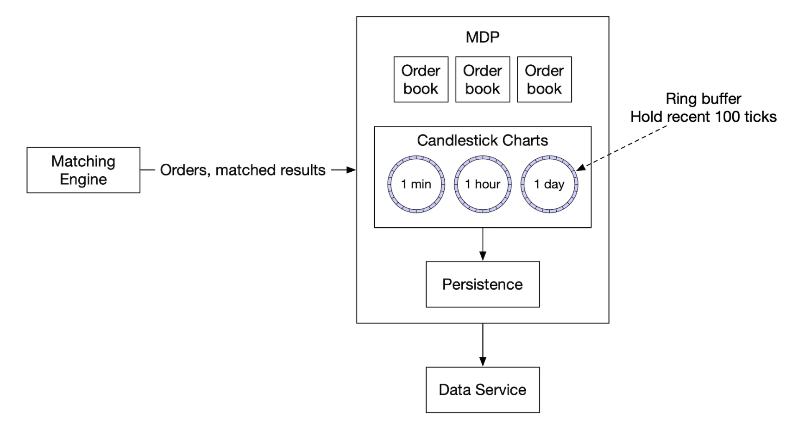

# 第 28 章：证券交易所 (Stock Exchange)

## 简介
在本章中，我们将设计一个**电子证券交易所 (electronic stock exchange)**。

它的基本功能是高效撮合买卖双方。

主要证券交易所包括 **NYSE**、**NASDAQ** 等。

<div style="margin-left:3rem">
    
</div>

---

## 第一步：理解问题并确定设计范围
 * C：我们交易哪些证券？股票、期权还是期货？
 * I：为简单起见，只做股票
 * C：支持哪些订单类型——下单、撤单、改单？限价单、市价单、条件单呢？
 * I：需要支持下单和撤单。订单类型只需考虑限价单。
 * C：系统需要支持盘后交易吗？
 * I：不需要，只做正常交易时段
 * C：能描述一下交易所的基本功能吗？
 * I：客户可以下限价单或撤单，并实时收到撮合成交。他们应能实时看到订单簿。
 * C：交易所的规模是多大？
 * I：数万用户同时交易，约 100 个交易标的。每天数十亿订单。还需要支持合规风控检查。
 * C：什么样的风控检查？
 * I：做简单的风控检查——例如限制用户一天只能交易 100 万股苹果股票
 * C：用户钱包怎么处理？
 * I：需要确保客户下单前有足够资金。待成交订单的资金需要冻结，直到订单终结。

### **非功能需求**
面试官提到的规模暗示我们要设计中小规模交易所。
我们还需要确保灵活性，未来能支持更多标的和用户。

其他非功能需求：
 * 可用性——至少 99.99%。宕机会损害声誉
 * 容错——需要容错和快速恢复机制，以限制生产事故的影响
 * 延迟——往返延迟应在毫秒级，关注 99 分位数。持续过高的 99p 延迟会让一小部分用户体验很差。
 * 安全——我们应有账户管理系统。出于法律合规，需要支持 KYC 验证用户身份。还应防范针对公共资源的 DDoS。

### **粗略估算**
 * 100 个标的，每天 10 亿订单
 * 正常交易时段为 09:30 到 16:00（6.5 小时）
 * QPS = 10 亿 / 6.5 / 3600 = 43000
 * 峰值 QPS = 5*QPS = 215000
 * 开盘时交易量显著更高

---

## 第二步：提出高层设计并达成一致

### **业务知识 101**
让我们讨论一些与交易所相关的基本概念。

经纪商 (broker) 在交易所和终端用户之间起中介作用——Robinhood、Fidelity 等。

机构客户用专门的交易软件大额交易。他们需要特殊对待。
例如大额交易时拆单，避免冲击市场。

订单类型：
 * 限价单——按固定价格买入或卖出。可能无法立即找到对手方，也可能部分成交。
 * 市价单——不指定价格。按当前市场价格立即执行。

价格：
 * 买价 (Bid)——买方愿意买入股票的最高价
 * 卖价 (Ask)——卖方愿意卖出股票的最低价

美国市场有三档行情报价——L1、L2、L3。

L1 行情包含最优买卖价格和数量：

<div style="margin-left:3rem">
    
</div>

L2 包含更多价格档位：

<div style="margin-left:3rem">
    
</div>

L3 显示各档位及每档的排队数量：

<div style="margin-left:3rem">
    
</div>

K 线显示给定区间内的市场开盘价和收盘价，以及最高价和最低价：

<div style="margin-left:3rem">
    
</div>

FIX 是交换证券交易信息的协议，大多数厂商都在用。证券交易示例：
```
8=FIX.4.2 | 9=176 | 35=8 | 49=PHLX | 56=PERS | 52=20071123-05:30:00.000 | 11=ATOMNOCCC9990900 | 20=3 | 150=E | 39=E | 55=MSFT | 167=CS | 54=1 | 38=15 | 40=2 | 44=15 | 58=PHLX EQUITY TESTING | 59=0 | 47=C | 32=0 | 31=0 | 151=15 | 14=0 | 6=0 | 10=128 |
```

### **高层设计**

<div style="margin-left:3rem">
    
</div>

交易流程：
 * 客户通过交易界面下单
 * 经纪商将订单发送到交易所
 * 订单通过客户端网关进入交易所，网关做校验、限流、鉴权等。订单被转发到订单管理器。
 * 订单管理器基于风控管理器设定的规则做风控检查
 * 通过风控检查后，订单管理器验证钱包中有足够资金执行该订单
 * 订单被发送到撮合引擎。找到撮合时，撮合引擎为买卖双方各生成一个成交（称为 fill）。两个订单都被排序以保证确定性。
 * 成交返回给客户端。

行情数据流 (M1-M3)：
 * 撮合引擎生成成交流，发送到行情发布器
 * 行情发布器构建 K 线图并发送到数据服务
 * 行情数据存储在专用存储中用于实时分析。经纪商连接数据服务获取及时的行情数据。

报表流 (R1-R2)：
 * 报表器从订单和成交中收集所有必要的报表字段并写入数据库
 * 报表字段——client_id、price、quantity、order_type、filled_quantity、remaining_quantity

交易流程在关键路径上，其余流程不在，因此延迟要求不同。

#### 交易流程
交易流程在关键路径上，因此应为低延迟高度优化。

撮合引擎是其核心，也称为撮合核心 (cross engine)。主要职责：
 * 为每个标的维护订单簿——某标的的买卖订单列表。
 * 撮合买卖订单——一次撮合产生两个成交（fill），买卖双方各一。这个函数必须快速且准确
 * 将成交流作为行情数据分发
 * 撮合必须按确定性顺序产生。这是高可用的基础

接下来是定序器——它是通过给每个入站订单和出站成交打上序列号 ID，使撮合引擎确定性的关键组件。

<div style="margin-left:3rem">
    
</div>

我们给入站订单和出站成交打时间戳有几个原因：
 * 及时性和公平性
 * 快速恢复/重放
 * 精确一次保证

概念上，我们可以用 Kafka 作为定序器，因为它本质上是入站和出站消息队列。但为了实现更低延迟，我们将自己实现。

订单管理器管理订单状态。它还与撮合引擎交互——发送订单和接收成交。

订单管理器的职责：
 * 将订单送去做风控检查——例如验证用户交易量小于 100 万
 * 对照用户钱包检查订单，验证有足够资金执行
 * 将订单发送到定序器再到撮合引擎。为减少带宽，只将必要的订单信息传给撮合引擎
 * 从定序器接收成交 (fill)，再通过客户端网关发送给经纪商

实现订单管理器的主要挑战是状态转换管理。事件溯源是一个可行的方案（深入设计中讨论）。

最后，客户端网关接收用户订单并发送到订单管理器。其职责：

<div style="margin-left:3rem">
    
</div>

由于客户端网关在关键路径上，它应保持轻量。

可以有多个面向不同客户的客户端网关。例如托管 (colo) 引擎是经纪商租用在交易所数据中心的撮合引擎服务器：

<div style="margin-left:3rem">
    
</div>

#### 行情数据流
行情发布器从撮合引擎接收成交，并基于成交流构建订单簿/K 线图。

这些数据被发送到数据服务，数据服务负责向订阅者展示聚合数据：

<div style="margin-left:3rem">
    
</div>

#### 报表流
报表器不在关键路径上，但仍是重要组件。

<div style="margin-left:3rem">
    
</div>

它负责交易历史、税务报表、合规报表、结算等。
延迟对报表流不是关键要求。准确性和合规更重要。

### **API 设计**
客户通过经纪商与证券交易所交互，下单、查看成交、行情数据、下载历史数据做分析等。

我们在客户端网关和经纪商之间用 RESTful API 通信。

对于机构客户，用专有协议满足其低延迟要求。

创建订单：
```
POST /v1/order
```

参数：
 * symbol——股票代码。String
 * side——买入或卖出。String
 * price——限价单价格。Long
 * orderType——限价或市价（我们的设计只支持限价单）。String
 * quantity——订单数量。Long

响应：
 * id——订单 ID。Long
 * creationTime——订单的系统创建时间。Long
 * filledQuantity——已成功执行的量。Long
 * remainingQuantity——待执行的量。Long
 * status——new/canceled/filled。String
 * 其余属性与输入参数相同

获取成交：
```
GET /execution?symbol={:symbol}&orderId={:orderId}&startTime={:startTime}&endTime={:endTime}
```

参数：
 * symbol——股票代码。String
 * orderId——订单 ID。可选。String
 * startTime——查询起始时间，epoch [11]。Long
 * endTime——查询结束时间，epoch。Long

响应：
 * executions——范围内每次成交的数组（属性见下）。Array
 * id——成交 ID。Long
 * orderId——订单 ID。Long
 * symbol——股票代码。String
 * side——买入或卖出。String
 * price——成交价格。Long
 * orderType——限价或市价。String
 * quantity——成交量。Long

获取订单簿：
```
GET /marketdata/orderBook/L2?symbol={:symbol}&depth={:depth}
```

参数：
 * symbol——股票代码。String
 * depth——每档订单簿深度。Int

响应：
 * bids——价格和数量的数组。Array
 * asks——价格和数量的数组。Array

获取 K 线：
```
GET /marketdata/candles?symbol={:symbol}&resolution={:resolution}&startTime={:startTime}&endTime={:endTime}
```

参数：
 * symbol——股票代码。String
 * resolution——K 线窗口长度（秒）。Long
 * startTime——窗口起始时间，epoch。Long
 * endTime——窗口结束时间，epoch。Long

响应：
 * candles——每根 K 线数据的数组（属性如下）。Array
 * open——每根 K 线的开盘价。Double
 * close——每根 K 线的收盘价。Double
 * high——每根 K 线的最高价。Double
 * low——每根 K 线的最低价。Double

### **数据模型**
我们交易所有三类主要数据：
 * 产品、订单、成交
 * 订单簿
 * K 线图

#### 产品、订单、成交
产品描述交易标的的属性——产品类型、交易代码、UI 显示代码等。

这些数据不常变化，主要用于 UI 渲染。

订单表示买卖指令。成交是向外输出的撮合结果。

以下是数据模型：

<div style="margin-left:3rem">
    
</div>

在我们的三条流程中都会遇到订单和成交：
 * 在关键路径上，它们在内存中处理以获得高性能。它们从定序器存储和恢复。
 * 报表器将订单和成交写入数据库用于报表用例
 * 成交被转发到行情数据以重建订单簿和 K 线图

#### 订单簿
订单簿是某品种按价格档位组织的买卖订单列表。

这个模型的高效数据结构需要满足：
 * 常数查找时间——获取某价格档或价格区间的量
 * 快速添加/执行/取消操作
 * 查询最优买卖价
 * 遍历价格档位

订单簿执行示例：

<div style="margin-left:3rem">
    
</div>

履行这个大订单后，随着买卖价差扩大，价格上涨。

订单簿实现的伪代码示例：
```
class PriceLevel{
    private Price limitPrice;
    private long totalVolume;
    private List<Order> orders;
}

class Book<Side> {
    private Side side;
    private Map<Price, PriceLevel> limitMap;
}

class OrderBook {
    private Book<Buy> buyBook;
    private Book<Sell> sellBook;
    private PriceLevel bestBid;
    private PriceLevel bestOffer;
    private Map<OrderID, Order> orderMap;
}
```

为了更高效的实现，我们可以用双向链表代替标准列表：
 * 下新订单是 O(1)，因为我们在链表尾部添加订单。
 * 撮合订单是 O(1)，因为我们从头部删除订单
 * 撤单意味着从订单簿删除订单。我们利用 `orderMap` 做 O(1) 查找和 O(1) 删除（因为 `Order` 持有对链表中前一个元素的引用）。

<div style="margin-left:3rem">
    
</div>

这个数据结构也用在行情数据服务中重建订单簿。

#### K 线图
K 线数据在行情数据服务中基于某时间区间内的订单处理计算：
```
class Candlestick {
    private long openPrice;
    private long closePrice;
    private long highPrice;
    private long lowPrice;
    private long volume;
    private long timestamp;
    private int interval;
}

class CandlestickChart {
    private LinkedList<Candlestick> sticks;
}
```

避免占用过多内存的一些优化：
 * 用预分配的环形缓冲区保存 K 线以减少分配次数
 * 限制内存中 K 线数量，其余持久化到磁盘

我们将用内存列式数据库（例如 KDB）做实时分析。收盘后，数据持久化到历史数据库。

---

## 第三步：深入设计
现代交易所一个有趣的特点是，与大多数其他软件不同，它们通常把所有东西跑在一台巨型服务器上。

让我们探讨细节。

### **性能**
对交易所来说，所有分位数都有好的整体延迟非常重要。

如何降低延迟？
 * 减少关键路径上的任务数
 * 通过减少网络/磁盘使用和/或缩短任务执行时间，缩短每个任务的耗时

为实现第一个目标，我们把关键路径上所有非必要职责都剥离，甚至日志都去掉以实现最优延迟。

如果遵循原设计，有几个瓶颈——服务间的网络延迟和定序器的磁盘使用。

这样的设计能实现数十毫秒的端到端延迟。我们想要的是数十微秒。

因此，我们将把所有东西放在一台服务器上，进程间通过 mmap 作为事件存储通信：

<div style="margin-left:3rem">
    
</div>

另一个优化是使用应用循环（执行关键任务的 while 循环），绑定到同一 CPU 以避免上下文切换：

<div style="margin-left:3rem">
    
</div>

使用应用循环的另一个副作用是没有锁争用——多个线程争抢同一资源。

现在让我们看看 mmap 如何工作——它是 UNIX 系统调用，将磁盘上的文件映射到应用内存。

一个技巧是在 `/dev/shm` 中创建文件，它代表"共享内存"。因此，我们完全没有磁盘访问。

### **事件溯源**
事件溯源在[数字钱包章节](../chapter28)中有深入讨论。所有细节参考它。

简而言之，我们不存储当前状态，而是存储不可变的状态转换：

<div style="margin-left:3rem">
    
</div>

 * 左侧——传统 Schema
 * 右侧——事件溯源 Schema

目前为止我们的设计如下：

<div style="margin-left:3rem">
    
</div>

 * 外部域用 FIX 协议与客户端网关交互
 * 订单管理器收到新订单事件，验证它并加入内部状态。订单然后被发送到撮合核心
 * 如果订单被撮合，生成 `OrderFilledEvent` 并通过 mmap 发送
 * 其他组件订阅事件存储并完成各自的处理

还有一个优化——所有组件都持有一份订单管理器的副本，它被打包成库以避免管理订单的额外调用

本设计中的定序器不再是事件存储，而是单个写入者，在将事件转发到事件存储之前为其排序：

<div style="margin-left:3rem">
    
</div>

### **高可用**
我们的目标是 99.99% 可用性——每天只有 8.64 秒宕机。

为实现这一点，必须识别交易所架构中的单点故障：
 * 为关键服务（例如撮合引擎）设置待命的备份实例
 * 积极自动化故障检测和故障转移到备份实例

客户端网关等无状态服务可以通过加服务器轻松水平扩展。

对于有状态组件，如果我们不是领导者，可以处理入站事件但不发布出站事件：

<div style="margin-left:3rem">
    
</div>

为检测主副本宕机，我们可以发送心跳检测其是否无功能。

这个机制只在单台服务器边界内有效。
如果想扩展，可以将整台服务器设为热/温备，故障时切换。

为在副本间复制事件存储，我们可以用可靠 UDP 做更快通信。

### **容错**
如果连温备实例都宕机了呢？这是低概率事件，但我们应该做好准备。

大科技公司通过将核心数据复制到多个城市的数据中心来解决这个问题，以应对例如自然灾害。

要考虑的问题：
 * 如果主实例宕机，何时如何切换到备份实例？
 * 如何在备份实例中选出领导者？
 * 需要的恢复时间 (RTO - 恢复时间目标）是多少？
 * 需要恢复哪些功能？系统能在降级条件下运行吗？

应对方法：
 * 系统可能因 bug 宕机（影响主备），我们可以用混沌工程发现边界情况和这类灾难性后果
 * 但起初，我们可以手动执行故障转移，直到充分了解系统的故障模式
 * 可以用领导者选举（例如 Raft）决定主实例宕机时哪个副本成为领导者

跨不同服务器的复制示例：

<div style="margin-left:3rem">
    
</div>

领导者选举任期示例：

<div style="margin-left:3rem">
    
</div>

关于 Raft 如何工作，[看这里](https://thesecretlivesofdata.com/raft/)

最后，我们还要考虑丢失容忍度——在情况危急之前我们能丢失多少数据？
这决定了我们备份数据的频率。

对证券交易所来说，数据丢失不可接受，所以我们必须经常备份数据，并依靠 Raft 复制降低数据丢失概率。

### **撮合算法**
稍微偏题一下，用伪代码看看撮合如何工作：
```
Context handleOrder(OrderBook orderBook, OrderEvent orderEvent) {
    if (orderEvent.getSequenceId() != nextSequence) {
        return Error(OUT_OF_ORDER, nextSequence);
    }

    if (!validateOrder(symbol, price, quantity)) {
        return ERROR(INVALID_ORDER, orderEvent);
    }

    Order order = createOrderFromEvent(orderEvent);
    switch (msgType):
        case NEW:
            return handleNew(orderBook, order);
        case CANCEL:
            return handleCancel(orderBook, order);
        default:
            return ERROR(INVALID_MSG_TYPE, msgType);

}

Context handleNew(OrderBook orderBook, Order order) {
    if (BUY.equals(order.side)) {
        return match(orderBook.sellBook, order);
    } else {
        return match(orderBook.buyBook, order);
    }
}

Context handleCancel(OrderBook orderBook, Order order) {
    if (!orderBook.orderMap.contains(order.orderId)) {
        return ERROR(CANNOT_CANCEL_ALREADY_MATCHED, order);
    }

    removeOrder(order);
    setOrderStatus(order, CANCELED);
    return SUCCESS(CANCEL_SUCCESS, order);
}

Context match(OrderBook book, Order order) {
    Quantity leavesQuantity = order.quantity - order.matchedQuantity;
    Iterator<Order> limitIter = book.limitMap.get(order.price).orders;
    while (limitIter.hasNext() && leavesQuantity > 0) {
        Quantity matched = min(limitIter.next.quantity, order.quantity);
        order.matchedQuantity += matched;
        leavesQuantity = order.quantity - order.matchedQuantity;
        remove(limitIter.next);
        generateMatchedFill();
    }
    return SUCCESS(MATCH_SUCCESS, order);
}
```

这个撮合算法用 FIFO 算法决定撮合某价格档位的哪些订单。

### **确定性**
功能确定性通过我们用的定序器技术保证。

事件实际发生的时间不重要：

<div style="margin-left:3rem">
    
</div>

延迟确定性是我们必须跟踪的。可以基于监控 99 或 99.99 分位数延迟来计算。

导致延迟尖刺的原因有例如 Java 中的垃圾回收事件。

### **行情发布器优化**
行情发布器从撮合引擎接收撮合结果，并基于它们重建订单簿和 K 线图。

我们只保留部分 K 线，因为我们没有无限内存。客户可以选择想要多细粒度的数据。更细粒度的数据可能价格更高：

<div style="margin-left:3rem">
    
</div>

环形缓冲区（即循环缓冲区）是头尾相连的固定大小队列。空间预分配以避免分配。该数据结构也是无锁的。

优化环形缓冲区的另一个技术是填充 (padding)，确保序列号永远不与其他任何东西在同一缓存行。

### **行情数据的分发公平性与组播**
我们需要确保订阅者同时收到数据，因为如果有人先于他人收到数据，就获得了关键的市场洞察，可用来操纵市场。

为实现这一点，我们在向订阅者发布数据时可以用可靠 UDP 组播。

数据可以通过互联网以三种方式传输：
 * 单播——一个源，一个目的地
 * 广播——一个源到整个子网
 * 组播——一个源到不同子网上的一组主机

理论上，用组播所有订阅者应同时收到数据。

但 UDP 不可靠，数据可能到达不了所有人。可以通过重传增强。

### **托管**
交易所为经纪商提供将其服务器托管在与交易所同一数据中心的能力。

这大幅降低延迟，可视为 VIP 服务。

### **网络安全**
DDoS 对交易所是个挑战，因为有些服务面向互联网。我们的选项：
 * 将公共服务和数据与私有服务隔离，让 DDoS 攻击不影响最重要的客户
 * 用缓存层存储不常更新的数据
 * 加固 URL 防御 DDoS，例如用 `https://my.website.com/data/recent` 而不用 `https://my.website.com/data?from=123&to=456`，因为前者更易缓存
 * 需要有效的允许/拒绝名单机制。
 * 限流可用于缓解 DDoS

---

## 第四步：总结
其他有趣的点：
 * 并非所有交易所都依赖把所有东西放在一台大服务器上，但有些仍然这样做
 * 现代交易所更依赖云基础设施和自动做市商 (AMM)，以避免维护订单簿
